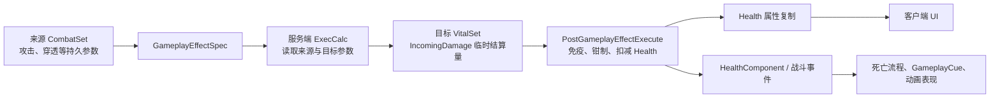

# Lyra AttributeSet 最佳实践总结与 Apex 建议

> 文档性质：外部资料学习总结，不等同于 Apex 已批准的实施 RFC。  
> 阅读材料：本目录中的《UE5:Lyra GAS:AttributeSet 最佳实践 I / II》。  
> 核验基准：`D:/UnrealProject/LyraStarterGame/Source/LyraGame/AbilitySystem/Attributes` 下的 Lyra 5.8 源码。  
> 项目前提：Apex 预计采用多人玩家对抗，当前不考虑 AI；ASC 由 `AApexPlayerState` 持有并使用 Mixed 复制模式。

## 一、先给结论

Lyra 最值得学习的不是“拆成了几个 AttributeSet”，而是下面这组职责边界：

1. **AttributeSet 按数据不变量和结算职责拆分**，不是按技能、英雄或界面随意拆分。
2. **持久状态与临时结算量分开**。`Health` 是状态，`Damage` 是一次结算的临时输入。
3. **来源参数与目标状态分开**。施加方提供伤害/治疗参数，承受方负责免疫、钳制、扣血和死亡边界。
4. **AttributeSet 只负责数值规则和事件出口**。死亡流程、UI、动画、Cue 不直接塞进 AttributeSet。
5. **多人游戏中的运行时改值由服务端权威处理**。复杂伤害使用 ExecCalc；客户端通过属性复制和事件更新表现。

对 Apex 的建议是采用以下结构：

- `UApexAttributeSet`：无具体属性的项目基类，只提供访问宏、类型安全的 ASC 访问和必要的公共事件类型。
- `UApexVitalAttributeSet`：生命、法力以及这些资源的结算规则。
- `UApexCombatAttributeSet`：后续加入伤害公式时，保存攻击、防御、抗性、穿透等持久战斗参数。

第一批只实现 `UApexVitalAttributeSet` 中的 `Health`、`MaxHealth`、`Mana`、`MaxMana`。`UApexCombatAttributeSet` 的字段等伤害模型确定后再加入，不为了“架构完整”预造空属性。

## 二、第一篇文章的核心内容

### 2.1 多个 AttributeSet，而不是一个万能属性表

文章指出，Lyra 使用一个无具体属性的基类和两个派生类：

- `ULyraAttributeSet`：项目公共基类。
- `ULyraHealthSet`：目标承受伤害/治疗所需的状态和结算入口。
- `ULyraCombatSet`：来源施加伤害/治疗时使用的基础参数。

这里应理解为“ASC 可以拥有多个职责明确的 AttributeSet”，不是让一个类进行 C++ 多继承。

### 2.2 基类不保存业务属性

`ULyraAttributeSet` 主要提供：

- `ATTRIBUTE_ACCESSORS`，统一生成 Attribute Getter、数值 Getter、Setter 和初始化函数。
- `GetLyraAbilitySystemComponent()`，从基类得到项目自定义 ASC。
- 公共的原生多播事件类型 `FLyraAttributeEvent`。

这一层的价值是统一项目约定，而不是成为所有属性的堆放处。

### 2.3 HealthSet 的四个属性并非四种生命值

| 属性 | 类别 | 含义 | 是否应长期保存 |
|---|---|---|---|
| `Health` | Stateful Attribute | 当前生命 | 是 |
| `MaxHealth` | Stateful Attribute | 最大生命 | 是 |
| `Damage` | Meta Attribute | 本次待结算伤害 | 否，结算后归零 |
| `Healing` | Meta Attribute | 本次待结算治疗 | 否，结算后归零 |

`Damage` 和 `Healing` 是结算管线的临时输入。它们让 ExecCalc 或 GE 不必直接改写 `Health`，目标侧可以在统一位置完成免疫、扣血、治疗、钳制和事件广播。

### 2.4 AttributeSet 不负责完整死亡逻辑

Lyra 在 `HealthSet` 中检测生命是否首次降到零，并广播 `OnOutOfHealth`。监听该事件的 HealthComponent 再负责进入死亡流程。

因此边界是：

- AttributeSet：判断数值跨越了死亡边界。
- HealthComponent / Ability / Game Rules：决定死亡状态、复活、淘汰和比赛结果。
- GameplayCue / 动画系统：负责受击和死亡表现。

## 三、第二篇文章的核心内容

### 3.1 BaseValue 与 CurrentValue

`FGameplayAttributeData` 同时具有：

- `BaseValue`：基础值或永久值。
- `CurrentValue`：基础值叠加当前有效 Modifier 后的结果。

例如基础移速为 600，持续 Buff 增加 50，则 BaseValue 仍为 600，CurrentValue 为 650；Buff 移除后 CurrentValue 回到 600。

Instant GE 通常修改 BaseValue，Duration / Infinite GE 的持续 Modifier 通常参与 CurrentValue 聚合。文章中“只要使用 GE 都是 stateful Modifier”的说法过于宽泛，不能作为实现规则。

### 3.2 ExecCalc 的作用与限制

`UGameplayEffectExecutionCalculation` 适合处理需要同时读取来源和目标多个属性的复杂公式，例如：

- 来源攻击力和穿透。
- 目标护甲和抗性。
- 技能倍率、暴击或其他上下文参数。
- 最终输出到目标的 `IncomingDamage`。

ExecCalc 很灵活，但通常只在服务端执行，不能依赖它完成本地预测。Apex 初期可以先使用简单 GE 验证技能；当正式伤害公式出现时，再引入 ExecCalc。

### 3.3 HealthSet 的关键回调

| 回调 | 调用阶段 | Lyra 中的职责 | Apex 可学习的用法 |
|---|---|---|---|
| `PreGameplayEffectExecute` | Instant / Periodic GE 即将执行前 | 检查伤害免疫，保存变更前生命值 | 做服务端结算前校验，不承担 UI |
| `PostGameplayEffectExecute` | GE 修改 BaseValue 后 | 将 `Damage/Healing` 转换为 `Health`，归零 Meta Attribute，广播事件 | 统一完成资源结算和语义事件 |
| `PreAttributeBaseChange` | BaseValue 变化前 | 钳制基础值 | 保证基础值合法 |
| `PreAttributeChange` | CurrentValue 变化前 | 钳制当前值 | 保证聚合后的当前值合法 |
| `PostAttributeChange` | 属性变化后 | 最大生命降低时同步压低当前生命；处理脱离死亡状态 | 维护跨属性不变量 |
| `OnRep_*` | 客户端收到属性复制后 | 调用 `GAMEPLAYATTRIBUTE_REPNOTIFY`，再广播客户端事件 | 驱动客户端 UI 和表现更新 |

同一个钳制规则可能需要在多个入口调用，因为 GE 执行、BaseValue 修改和 CurrentValue 聚合并不经过完全相同的回调路径。

### 3.4 CombatSet 不是 Meta AttributeSet

Lyra 的 `BaseDamage`、`BaseHeal` 是施加方的持久属性：

- 它们由 ExecCalc 读取。
- 它们使用 `COND_OwnerOnly` 复制，只让拥有者得到完整数值。
- 它们不像 `Damage`、`Healing` 那样每次结算后清零。

因此它们在用途上接近“计算输入”，但在 GAS 数据模型中仍是 Stateful Attribute，不应与目标侧的 Meta Attribute 混为一谈。

## 四、用一条伤害链路理解三类数据

这条链路里：

- `CombatSet` 保存“我具备多少战斗能力”。
- ExecCalc 计算“这一次最终造成多少效果”。
- Meta Attribute 表示“这一次待结算的结果”。
- `VitalSet` 保存“我当前还剩多少生命和法力”。

## 五、文章中需要谨慎理解的表述

### 5.1 “属性只能由 GE 修改”不是技术上的绝对限制

GAS 提供初始化器、Setter、`ApplyModToAttribute` 等直接修改入口。更准确的工程规则是：

- 正式游戏中的伤害、治疗、消耗和 Buff 尽量通过 GE / ExecCalc 修改。
- 构造默认值、初始化和维护内部不变量可以使用代码入口。
- 不要让任意业务代码绕过 GAS 直接改属性，否则预测、复制、来源追踪和事件语义会变得不一致。

### 5.2 “官方鼓励多继承”应理解为拆分多个 Set

不建议让一个 AttributeSet 使用多个业务基类。正确做法是让 ASC 同时拥有多个职责明确的 AttributeSet 实例。

### 5.3 复杂不等于一开始就使用 ExecCalc

ExecCalc 适合稳定的正式伤害公式，但它不可预测且只在服务端结算。冷启动阶段先用固定数值 GE 验证复制链路是合理的，之后再替换计算层，不应让临时测试参数污染长期 Tag 或配置协议。

## 六、Apex 的推荐拆分

### 6.1 `UApexAttributeSet`

建议职责：

- 统一 `ATTRIBUTE_ACCESSORS`。
- 提供 `GetApexAbilitySystemComponent()`。
- 必要时声明携带 Instigator、Causer、EffectSpec、OldValue、NewValue 的原生事件类型。

不建议职责：

- 不保存 Health、Mana 等具体属性。
- 不处理死亡、UI、动画或技能激活。
- 不预先堆放尚未确定的通用工具函数。

### 6.2 `UApexVitalAttributeSet`

第一批属性：

- `Health`
- `MaxHealth`
- `Mana`
- `MaxMana`

第一批规则：

- `Health`、`Mana` 均钳制在 0 与对应最大值之间。
- `MaxHealth`、`MaxMana` 不小于合理下限。
- 最大值降低时，当前值不能继续高于最大值。
- 四项均正确复制并使用 `GAMEPLAYATTRIBUTE_REPNOTIFY`。
- 先使用 C++ 默认值验证多人复制，Startup GE 留到下一阶段。

后续真正实现伤害与治疗结算时，再按需要加入：

- `IncomingDamage`
- `IncomingHealing`

不要因为“以后可能会用”提前加入 `IncomingManaCost`、护盾或其他 Meta Attribute。法力消耗初期可以由 Cost GE 直接修改 Mana。

### 6.3 `UApexCombatAttributeSet`

这一 Set 在正式伤害模型确定后再建立。候选职责包括：

- 来源侧：物理强度、法术强度、物理穿透、法术穿透。
- 目标侧：护甲、法术抗性。

Lyra 按 Taking / Applying 强调方向；Apex 规模更小，初期不必拆成 OffensiveSet 与 DefensiveSet。将“供战斗公式长期读取的持久参数”集中在一个 CombatSet，等真实复杂度出现后再细分，更容易理解和维护。

`PhysicalDamage` 这类名字容易同时表示“攻击面板”和“某次最终伤害”。正式命名前应区分：

- 持久战斗参数，例如 `PhysicalPower`。
- 一次结算结果，例如 `IncomingDamage`。
- 伤害类别，例如物理/法术，应由伤害规格或稳定的类型标识表达，而不是再造一套含义模糊的 Attribute。

## 七、多人 PvP、无 AI 对设计的影响

1. 所有战斗参与者暂时都走 `PlayerState -> ASC -> AttributeSets` 的同一条生命周期，不需要同时维护 AI 的 Character-owned ASC 分支。
2. 服务端是伤害、治疗、消耗和死亡判定的权威端。
3. `Health` 通常应对相关客户端可见；`Mana` 是否只对拥有者可见属于玩法与 UI 需求，需要在实现复制条件前确认。
4. Mixed 模式控制的是 GameplayEffect 复制细节，不能代替每个 Attribute 自己的复制声明和条件。
5. 客户端 UI 可监听 ASC 的属性变化委托；只有需要 EffectSpec、Instigator 等丰富上下文时，才增加项目自定义事件。
6. GameplayCue 负责多端表现，不应成为修改生命值或决定死亡的权威逻辑入口。

## 八、对当前待确认项的建议

### 已确认

- 第一批仅实现 `Health`、`MaxHealth`、`Mana`、`MaxMana`。
- 冷启动阶段使用 C++ 默认值验证复制；后续再引入 Startup GE。
- 项目面向多人玩家对抗，当前不设计 AI 分支。

### 建议确认

原先的“两层拆分”方向正确，但建议将名称和边界明确为：

- `UApexAttributeSet`：无业务属性的公共基类。
- `UApexVitalAttributeSet`：资源状态及其结算不变量。
- `UApexCombatAttributeSet`：正式伤害公式所需的持久战斗参数，后续创建。

推荐使用 `Vital` 而不是 `Resource`，因为该类以后还会承接 `IncomingDamage`、`IncomingHealing` 等资源结算入口；`Resource` 容易让人误以为它还要管理弹药、充能、技能次数等所有资源。

## 九、落地顺序建议

1. 先实现 `UApexAttributeSet` 与 `UApexVitalAttributeSet`。
2. 验证服务器、拥有客户端、其他客户端看到的四项属性是否符合预期。
3. 再加入最小伤害/治疗 GE 与 `IncomingDamage/IncomingHealing`，验证完整结算链路。
4. 确定正式属性公式后创建 `UApexCombatAttributeSet` 和 ExecCalc。
5. 最后接 HealthComponent、死亡流程、UI 与 GameplayCue，保持数值权威和表现解耦。

