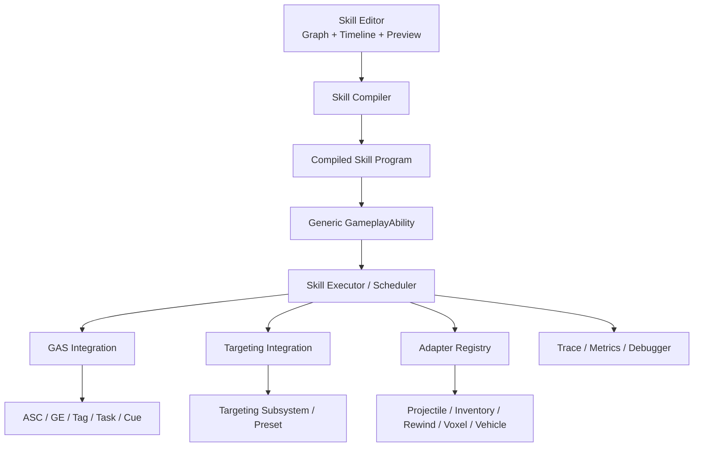
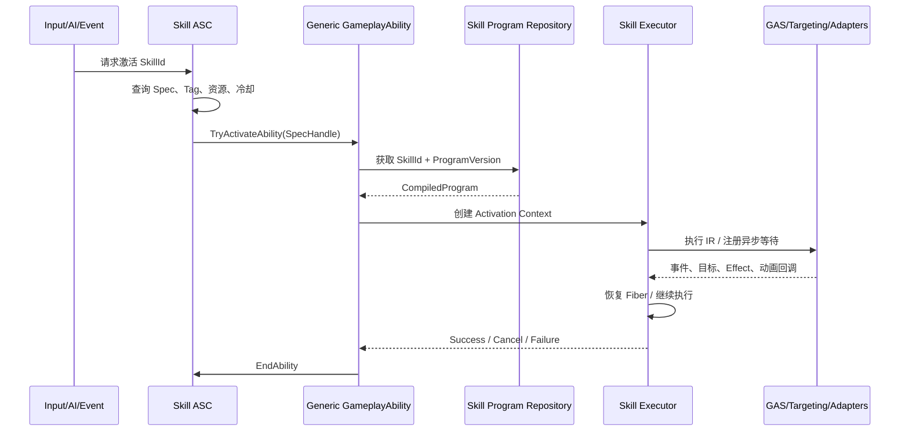
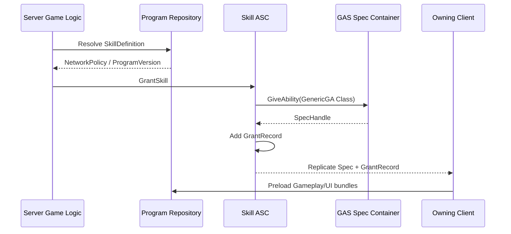
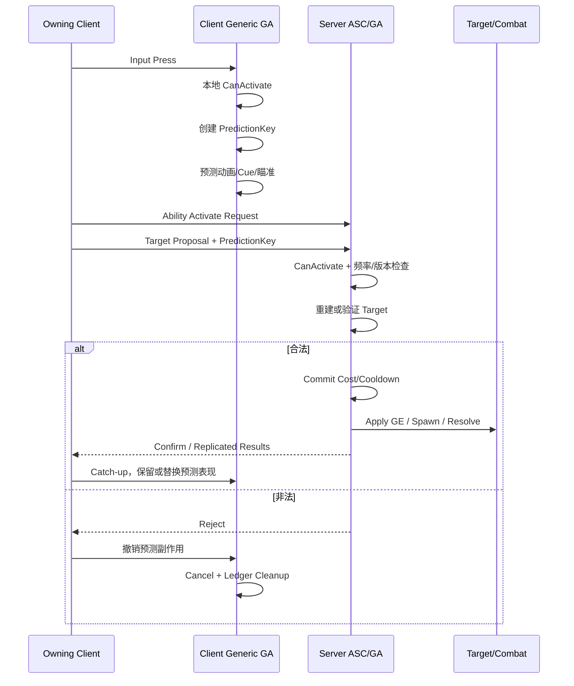

# Unreal Engine GAS 全品类技能系统与技能编辑器设计文档

> **技术路线：强类型 SkillGraph → 编译期 IR → 通用 GameplayAbility 运行时**  
> 文档版本：1.0  
> 设计基线：Unreal Engine 5.8、Gameplay Ability System、Gameplay Tags、Gameplay Tasks、Targeting System  
> 文档状态：可进入架构评审、原型验证与工作拆分  
> 更新日期：2026-06-23

---

## 文档信息

| 项目 | 内容 |
|---|---|
| 目标读者 | 技术总监、主程、系统程序、编辑器程序、网络程序、技术策划、技能策划、TA、QA |
| 核心目标 | 建立一个以 GAS 为执行与联机基础、全部具体技能由专用编辑器制作、可通过节点 SDK 持续扩展新机制的技能平台 |
| 推荐方案 | 方案 D：强类型 SkillGraph 编译为运行时 IR；同时提供方案 B 风格的模板化简化编辑模式 |
| 设计原则 | 数据驱动、编译校验、服务器权威、预测可审计、运行时紧凑、编辑器优先、可扩展而非穷举 |
| 非目标 | 不重写 GAS；不把任意 Blueprint 反射调用当作正式扩展机制；不承诺仅靠数据覆盖未来所有未知世界系统 |
| 重要约束 | 普通技能不写 C++、不写技能蓝图；新增全新机制时只新增可复用节点或适配器，具体技能仍在技能编辑器完成 |

---

## 目录

1. [执行摘要](#1-执行摘要)  
2. [目标、边界与验收标准](#2-目标边界与验收标准)  
3. [关键架构决策](#3-关键架构决策)  
4. [总体架构](#4-总体架构)  
5. [模块与插件设计](#5-模块与插件设计)  
6. [资产与数据模型](#6-资产与数据模型)  
7. [SkillGraph 语言规范](#7-skillgraph-语言规范)  
8. [编译器与运行时 IR](#8-编译器与运行时-ir)  
9. [运行时执行引擎](#9-运行时执行引擎)  
10. [GAS 集成设计](#10-gas-集成设计)  
11. [联机、预测与安全](#11-联机预测与安全)  
12. [目标系统](#12-目标系统)  
13. [技能编辑器](#13-技能编辑器)  
14. [核心节点库](#14-核心节点库)  
15. [外部机制适配器 SDK](#15-外部机制适配器-sdk)  
16. [技能变体、天赋与局内构筑](#16-技能变体天赋与局内构筑)  
17. [复杂技能样例](#17-复杂技能样例)  
18. [性能与资源预算](#18-性能与资源预算)  
19. [测试、验证与持续集成](#19-测试验证与持续集成)  
20. [调试、观测与运营分析](#20-调试观测与运营分析)  
21. [版本、热更新与兼容性](#21-版本热更新与兼容性)  
22. [内容生产与团队协作](#22-内容生产与团队协作)  
23. [迁移方案](#23-迁移方案)  
24. [实施路线图与工作拆分](#24-实施路线图与工作拆分)  
25. [风险与缓解措施](#25-风险与缓解措施)  
26. [验收清单](#26-验收清单)  
27. [建议的 C++ 接口草案](#27-建议的-c-接口草案)  
28. [建议目录与命名规范](#28-建议目录与命名规范)  
29. [配置示例](#29-配置示例)  
30. [术语表](#30-术语表)  
31. [参考资料](#31-参考资料)

---

# 1. 执行摘要

本设计采用以下技术形态：

```text
技能策划编辑 SkillGraph / Stage Timeline
                    │
                    ▼
          Skill Compiler 编译与校验
   类型检查 / 控制流分析 / 网络域分析 / 生命周期分析
                    │
                    ▼
       FCompiledSkillProgram（紧凑、不可变 IR）
                    │
                    ▼
  少量通用 UGameplayAbility + FSkillExecutor
                    │
          ┌─────────┼──────────┐
          ▼         ▼          ▼
         GAS      Targeting   外部适配器
  GE/Tag/Task/Cue  System    Projectile/Rewind/Voxel...
```

## 1.1 最终选择

采用“**方案 D + 方案 B 简化模式**”：

- 底层统一使用强类型 SkillGraph 和编译后的运行时 IR。
- 普通策划默认使用“阶段模板、Recipe、向导式节点”，减少图复杂度。
- 高级技能设计师可以切换到完整 Graph 与并发、分支、子图、同步点能力。
- 程序员维护节点库、编译器、执行器和外部系统适配器。
- 每个具体技能不创建独立 GameplayAbility Blueprint。
- GameplayEffect、GameplayTag、GameplayCue、AbilityTask 等 GAS 原生能力继续承担其最擅长的职责。
- 新机制通过“受约束的原生节点 SDK”接入，而不是开放任意函数调用节点。

## 1.2 核心收益

1. **内容生产统一**：具体技能全部由一个技能编辑器创建、修改、审查和调试。
2. **静态安全**：在保存、提交、Cook 前发现权限错误、无限循环、资源泄漏、非法目标类型等问题。
3. **联机可控**：预测、服务器权威、纯表现和同步点成为图语言的一等概念。
4. **性能可扩展**：运行时执行紧凑 IR，不加载编辑器 Graph，不为每个节点创建 UObject。
5. **机制可持续扩展**：未知新机制通过节点或适配器扩展，不需要推翻资产模型。
6. **可运营**：技能程序具备版本、Hash、依赖、Trace、测试和数据补丁能力。
7. **可迁移**：可逐步承接已有 GameplayAbility、GameplayEffect 和技能蓝图，不要求一次性重写。

## 1.3 设计哲学

“支持市面上所有技能机制”不等于预置一个无限节点列表，而是建立以下能力：

- 常见机制由标准节点覆盖；
- 复杂组合由图语言表达；
- 新世界系统由受约束适配器接入；
- 编译器理解每个节点的副作用、权限、确定性和生命周期；
- 运行时对取消、失败、预测拒绝和 Actor 销毁具备统一清理语义。

---

# 2. 目标、边界与验收标准

## 2.1 功能目标

系统必须支持以下能力族：

| 能力族 | 示例 |
|---|---|
| 激活来源 | 输入、AI、物品、被动、GameplayEvent、受击、击杀、进入区域、装备变化 |
| 激活条件 | GameplayTag、属性、资源、装备、职业、地形、视线、队伍、目标、冷却 |
| 生命周期 | 瞬发、前摇、后摇、吟唱、蓄力、持续、切换、被动、多阶段、组合技 |
| 控制流 | 顺序、分支、选择、循环、并行、竞速、超时、重试、子图 |
| 目标 | 自身、单体、范围、扇形、链式、锁定、地面点、骨骼、组件、轨迹 |
| 数值 | 伤害、治疗、护盾、资源、Buff、Debuff、DOT、叠层、免疫、吸血 |
| 世界行为 | 位移、Root Motion、传送、投射物、陷阱、召唤、建造、地形修改 |
| 表现 | 动画、Niagara、声音、镜头、震动、材质、UI 提示 |
| 联机 | 本地预测、服务器权威、服务器发起、纯表现、校正、版本握手 |
| 变体 | 等级、天赋、符文、装备词条、局内强化、卡牌修改、模式覆盖 |
| 持久化 | 长期 Buff、跨死亡状态、跨地图冷却、存档恢复、重连恢复 |
| 调试 | 单步、断点、网络轨迹、目标可视化、变量查看、效果追踪 |

## 2.2 生产目标

- 95% 以上的普通技能由策划在编辑器内独立完成。
- 新增同类技能不新增 C++ 类。
- 新增一个全新机制时，新增一次可复用节点或适配器，而不是为每个具体技能编码。
- 所有技能资产可被批量搜索、审查、验证、Cook 和自动测试。
- 具体技能不允许依赖隐藏的 Level Blueprint、角色蓝图临时代码或任意反射调用。
- 运行时错误能定位到技能资产、程序版本、激活实例和源图节点。

## 2.3 技术目标

- 使用 GAS 负责 Ability 生命周期、GameplayEffect、Attribute、GameplayTag、GameplayCue 和基础网络预测。
- 运行时不依赖 `UEdGraph`、编辑器节点对象和节点坐标。
- 编译产物不可变、可 Hash、可缓存、可版本化。
- 异步节点必须支持取消；持久对象必须显式声明所有权转移。
- 权威副作用必须在服务器执行。
- 客户端输入和 TargetData 必须视为“提议”，由服务器验证。
- 不以每个图节点一个 RPC 的方式同步。
- 不以每个技能一个独立 GameplayAbility Blueprint 的方式扩张内容规模。

## 2.4 非目标

以下内容不由本系统单独解决，但可以通过适配器集成：

- 完整确定性锁步模拟；
- 格斗游戏级全世界帧回滚；
- FPS 服务器回溯命中历史缓存；
- 体素地形系统；
- 载具物理系统；
- 复杂 AI 决策系统；
- 存档后端和在线服务；
- 反作弊平台；
- 动画资产生产；
- Niagara 或音频内容本身。

## 2.5 验收标准

### 内容侧

- 创建普通伤害技能时不打开 Blueprint 编辑器。
- 创建蓄力、连招、持续光束、链式目标和被动反击时无需新增 C++。
- 技能参数、目标、效果、表现、网络策略均可在技能编辑器内查看。
- 编译错误能跳转到具体节点和属性。
- 技能 Diff 能显示参数、节点、连线和编译程序变化。

### 运行时

- 技能在取消、失败、预测拒绝、角色死亡和世界销毁时无残留句柄。
- 权威伤害不由客户端直接决定。
- 同一激活的非幂等副作用可去重。
- 客户端与服务器程序版本不一致时，可禁止预测或拒绝激活。
- Cook 包不包含源图编辑器对象。
- 可从运行时 Trace 定位回源图节点。

### 工程侧

- 核心 Runtime 模块不依赖 UnrealEd。
- 节点插件可以独立注册、迁移、编译和测试。
- CI 能批量编译所有技能并阻止错误资产提交。
- 程序升级后旧技能资产可通过 Migration 自动升级或明确报错。

---

# 3. 关键架构决策

本章以 ADR（Architecture Decision Record）形式固定核心方向。

## 3.1 ADR-001：SkillGraph 编译为 IR，而非运行时直接解释编辑器节点

**决策**：源资产保存可编辑 Graph；保存或 Cook 时编译为紧凑、不可变的 `FCompiledSkillProgram`。运行时只执行 IR。

**原因**：

- 可在运行前做完整类型、权限、控制流和资源分析；
- 降低运行时 UObject、反射和图遍历开销；
- 支持 Program Hash、版本协商和缓存；
- 支持稳定的调试映射；
- 可对控制流和常量做优化。

**代价**：

- 前期需实现编译器、IR、调试映射和迁移；
- 节点 SDK 比简单 Blueprint 节点更严格；
- 编辑器预览必须走同一编译链路，不能绕过编译器。

## 3.2 ADR-002：少量通用 GameplayAbility，不为每个技能生成 Ability Class

**决策**：按网络执行策略和生命周期保留少量通用原生 Ability，例如：

```text
UGA_Skill_LocalPredicted
UGA_Skill_ServerInitiated
UGA_Skill_ServerOnly
UGA_Skill_Passive
```

技能身份由 `SkillId + ProgramVersion + SpecHandle` 决定。

**原因**：

- 避免数百或数千 Ability Class；
- 避免 Blueprint 继承链和硬引用膨胀；
- 可统一接管激活、执行、取消、Trace 和版本校验；
- 让具体技能彻底数据化。

## 3.3 ADR-003：GAS 原生系统优先，不重复实现 Effect、Tag、Cue

**决策**：

- 持续时间、周期、叠层、属性修改由 GameplayEffect 负责；
- 状态、分类、阻断和事件语义由 GameplayTag 负责；
- 网络化表现由 GameplayCue 负责；
- 异步等待优先复用或封装 AbilityTask；
- Attribute 仍存放在 AttributeSet；
- 复杂结算使用 Modifier Magnitude、Execution Calculation 或项目结算服务。

**原因**：复用 GAS 已有的复制、预测、叠层、Tag 和生命周期能力，减少双重状态源。

## 3.4 ADR-004：技能编辑器采用 Graph + Stage Timeline 双视图

**决策**：

- Graph 表达控制流、目标、条件、效果、并发和子图；
- Stage Timeline 表达动画、命中窗、输入窗、Cue、音效、镜头和 Commit 时间；
- 两者编译为同一 IR；
- 普通用户可使用模板化 Recipe 模式，高级用户可打开完整 Graph。

**原因**：纯 Graph 难以表达时间关系，纯 Timeline 难以表达分支和并发。

## 3.5 ADR-005：禁止“调用任意 Blueprint/C++ 函数”作为正式节点

**决策**：正式内容只能使用注册节点。节点必须声明权限、确定性、副作用、取消、生命周期和版本迁移。

**原因**：

- 任意函数无法做静态网络安全分析；
- 无法保证预测可逆；
- 无法保证资源清理；
- 无法追踪依赖和做稳定热更新；
- 容易让系统退化成隐式 Blueprint。

开发期可提供受开发者开关保护的诊断节点，但不得进入 Shipping Cook。

## 3.6 ADR-006：客户端结果是提议，服务器进行最终裁决

**决策**：

- 客户端可以预测输入响应、动画、瞄准和可撤销表现；
- 资源、伤害、物品、关键 Spawn 和持久世界修改由服务器提交；
- 客户端 TargetData 必须经过服务器重新检查；
- 不可逆副作用不得在未确认的预测路径执行。

## 3.7 ADR-007：变体优先修改参数和预定义扩展槽，不任意改写运行时图

**决策**：

- 等级、装备、天赋等通过 Parameter Overlay 修改暴露参数；
- 流程变化通过预定义 `Extension Slot` 或替换子图；
- 不支持运行时任意插入节点或修改控制流。

**原因**：保持 Program Hash、网络分析和测试结果可控。

---

# 4. 总体架构

## 4.1 分层架构



## 4.2 核心运行流程



## 4.3 领域对象

| 对象 | 生命周期 | 职责 |
|---|---|---|
| `USkillDefinition` | 资产 | 技能身份、激活契约、参数、源图、编译产物 |
| `USkillGraph` | EditorOnly 资产子对象 | 可编辑节点、Pin、连线、注释和布局 |
| `FCompiledSkillProgram` | Cook 后运行时数据 | 指令、常量、变量布局、依赖、能力清单、调试映射 |
| `FSkillGrantRecord` | ASC 持有 | SpecHandle 到 SkillId、版本、覆盖参数的映射 |
| `FSkillActivationContext` | 每次激活 | Avatar、Owner、Spec、PredictionKey、参数快照、目标、随机流 |
| `FSkillExecutor` | 每次激活或池化 | 调度 Fiber、执行指令、管理异步等待和结束 |
| `FSkillResourceLedger` | 每次激活 | 记录需清理或转移的 Effect、Cue、Actor、Task、Delegate 等 |
| `ISkillNodeRuntime` | 节点类型单例或函数表 | 执行某类操作码 |
| `USkillNodeDefinition` | Editor/Compiler | Pin Schema、校验、编译、迁移和可视化元数据 |
| `USkillProgramRepository` | GameInstance/Subsystem | 加载、缓存、版本验证和获取编译程序 |
| `USkillTraceSubsystem` | GameInstance/World | Trace、断点、远程调试和统计 |

## 4.4 数据流

```text
编辑器源数据：
USkillDefinition
 ├─ ActivationContract
 ├─ Parameters
 ├─ SourceGraph [EditorOnly]
 ├─ Timeline [EditorOnly]
 ├─ InlineRecipes
 └─ EditorTests

编译产物：
FCompiledSkillProgram
 ├─ Header
 ├─ InstructionStream
 ├─ ConstantPool
 ├─ VariableLayout
 ├─ EntryTable
 ├─ DependencyManifest
 ├─ CapabilityManifest
 ├─ NetworkManifest
 ├─ DebugMap [Development 可选]
 └─ ContentHash
```

## 4.5 依赖方向

```text
SkillEditor ───────► SkillCompiler ─────► SkillCoreRuntime
     │                     │                     ▲
     └──────────────► SkillNodesCore ────────────┘
                                           ▲
SkillGAS ───────────────────────────────────┤
SkillAdapters.* ────────────────────────────┘
```

硬性规则：

- Runtime 模块不得依赖 `UnrealEd`、`GraphEditor`、`Kismet` 编辑器模块。
- Adapter 依赖 Core 接口，Core 不反向依赖具体游戏系统。
- Editor 可以查询 Runtime 注册表，但 Runtime 不加载 Editor 节点类。
- 编译器可以运行在 Editor 和 Commandlet。
- 测试模块可以依赖全部模块，但不得被 Shipping 依赖。

---

# 5. 模块与插件设计

建议以项目插件 `SkillSystem` 组织，必要时拆分为多个 Game Feature Plugin。

## 5.1 模块清单

### `SkillCoreRuntime`

**类型**：Runtime  
**职责**：

- `USkillDefinition` 和运行时数据结构；
- `FCompiledSkillProgram`；
- 类型系统、值容器、TargetSet；
- `FSkillActivationContext`；
- `FSkillExecutor`、Fiber、Scheduler；
- 节点运行时注册表；
- Resource Ledger；
- Program Repository；
- Trace 事件定义；
- 版本、Hash、序列化。

**依赖**：

```text
Core
CoreUObject
Engine
GameplayTags
StructUtils
DeveloperSettings
```

### `SkillGAS`

**类型**：Runtime  
**职责**：

- 通用 `UGameplayAbility`；
- 自定义 `UAbilitySystemComponent`；
- Ability Spec 与 SkillId 映射；
- GAS Effect、Cue、Task、PredictionKey 集成；
- Commit、目标数据提交、服务器验证；
- 激活组和技能阻断策略；
- GAS 事件桥接。

**依赖**：

```text
SkillCoreRuntime
GameplayAbilities
GameplayTasks
GameplayTags
TargetingSystem
EnhancedInput（可选）
```

### `SkillNodesCore`

**类型**：Runtime  
**职责**：

- 流程节点；
- 条件和数值节点；
- Targeting 节点；
- GameplayEffect 节点；
- GameplayCue 和动画节点；
- 基础 Spawn、位移、事件节点；
- 对应编译描述和运行时 Executor。

**依赖**：

```text
SkillCoreRuntime
SkillGAS
Niagara（按需）
MovieScene（按需）
```

### `SkillCompiler`

**类型**：Developer / EditorAndProgram  
**职责**：

- Graph 规范化；
- 类型检查；
- 控制流构建；
- 网络域和副作用分析；
- 生命周期分析；
- 优化；
- IR 生成；
- DebugMap；
- DDC Key；
- Commandlet 批量编译；
- 节点版本迁移。

### `SkillEditor`

**类型**：Editor  
**职责**：

- 自定义资产编辑器；
- Graph Schema、EdGraph Node、Pin 工厂；
- Stage Timeline；
- Preview World；
- 编译结果；
- Runtime Debugger；
- Diff、查找、依赖分析；
- Recipe 向导；
- 批量编辑工具；
- Data Validation 集成。

### `SkillAdapters.Projectile`

- 投射物请求、对象池、命中事件、归属和预测表现。

### `SkillAdapters.Inventory`

- 物品消耗、掉落、装备、事务和服务器校验。

### `SkillAdapters.ServerRewind`

- 命中历史、时间戳验证、重放 Trace 和权威判定。

### `SkillAdapters.World`

- 建造、可破坏对象、体素、交互物、世界状态持久化。

### `SkillTests`

- Automation Tests；
- 编译器 Golden Tests；
- 网络 PIE 测试；
- 技能语义测试；
- 性能基准和 Soak。

## 5.2 插件目录示意

```text
Plugins/SkillSystem/
├─ SkillSystem.uplugin
├─ Config/
├─ Content/
│  ├─ Core/
│  ├─ Templates/
│  └─ Debug/
└─ Source/
   ├─ SkillCoreRuntime/
   ├─ SkillGAS/
   ├─ SkillNodesCore/
   ├─ SkillCompiler/
   ├─ SkillEditor/
   ├─ SkillAdaptersProjectile/
   ├─ SkillAdaptersInventory/
   ├─ SkillAdaptersServerRewind/
   └─ SkillTests/
```

## 5.3 模块初始化

节点注册必须使用稳定 ID，而不是依赖 C++ 类名：

```cpp
void FSkillNodesCoreModule::StartupModule()
{
    ISkillNodeRegistry::Get().RegisterNode(
        FSkillNodeTypeId(TEXT("Core.Flow.Branch")),
        MakeUnique<FSkillNode_Branch>()
    );
}
```

稳定 ID 规则：

```text
<组织或项目>.<领域>.<节点名>
例如：
Core.Flow.Sequence
Core.Target.Acquire
Core.GAS.ApplyEffect
Project.Rewind.ValidateHitscan
Project.World.ModifyVoxel
```

节点 C++ 类重命名不得改变稳定 ID。删除节点前必须提供迁移或明确的阻断错误。

---

# 6. 资产与数据模型

## 6.1 主资产：`USkillDefinition`

推荐使用 `UPrimaryDataAsset` 作为技能主资产，以便获得稳定 `PrimaryAssetId`、Asset Manager 加载和 Asset Bundle 管理能力。

```cpp
UCLASS(BlueprintType)
class SKILLCORE_API USkillDefinition : public UPrimaryDataAsset
{
    GENERATED_BODY()

public:
    UPROPERTY(EditDefaultsOnly, Category="Identity")
    FGameplayTag SkillTag;

    UPROPERTY(EditDefaultsOnly, Category="Identity")
    FText DisplayName;

    UPROPERTY(EditDefaultsOnly, Category="Identity")
    FText Description;

    UPROPERTY(EditDefaultsOnly, Category="Identity")
    TSoftObjectPtr<UTexture2D> Icon;

    UPROPERTY(EditDefaultsOnly, Category="Identity")
    FGameplayTagContainer CategoryTags;

    UPROPERTY(EditDefaultsOnly, Category="Activation")
    FSkillActivationContract Activation;

    UPROPERTY(EditDefaultsOnly, Category="Parameters")
    TArray<FSkillParameterDefinition> Parameters;

    UPROPERTY(EditDefaultsOnly, Category="Variants")
    TArray<FSkillExtensionSlotDefinition> ExtensionSlots;

#if WITH_EDITORONLY_DATA
    UPROPERTY()
    TObjectPtr<USkillGraph> SourceGraph;

    UPROPERTY()
    FSkillStageTimeline SourceTimeline;

    UPROPERTY()
    TArray<FSkillEditorTestCase> EditorTests;
#endif

    UPROPERTY()
    FCompiledSkillProgram CompiledProgram;
};
```

## 6.2 身份与稳定引用

技能必须同时具备以下标识：

| 标识 | 用途 | 稳定性 |
|---|---|---|
| `FPrimaryAssetId` | Asset Manager、加载和资源引用 | 资产重命名时需迁移 |
| `SkillTag` | 语义查询、UI、事件和配置 | 应长期稳定 |
| `ProgramVersion` | 编译程序协议版本 | 每次不兼容改动递增 |
| `ContentHash` | 客户端/服务器一致性 | 内容变化自动改变 |
| `SchemaVersion` | 源资产结构版本 | 用于 Migration |
| `NodeLibraryVersion` | 节点库 ABI/语义版本 | 插件发布时维护 |

推荐原则：

- 存档、网络和后端使用 `SkillTag` 或业务稳定 ID；
- 本地资产加载使用 `FPrimaryAssetId`；
- 激活实例同时记录 `SkillId + ProgramVersion + ContentHash`；
- 不把资产路径作为唯一业务 ID；
- 不把显示名作为任何逻辑标识。

## 6.3 激活契约 `FSkillActivationContract`

激活契约应在不执行主图的情况下被 UI、AI 和服务器查询。

```cpp
USTRUCT(BlueprintType)
struct FSkillActivationContract
{
    GENERATED_BODY()

    UPROPERTY(EditDefaultsOnly)
    FGameplayTagQuery OwnerRequiredTags;

    UPROPERTY(EditDefaultsOnly)
    FGameplayTagQuery OwnerBlockedTags;

    UPROPERTY(EditDefaultsOnly)
    FGameplayTagQuery SourceRequiredTags;

    UPROPERTY(EditDefaultsOnly)
    FGameplayTagQuery TargetRequiredTags;

    UPROPERTY(EditDefaultsOnly)
    TArray<FSkillResourceRequirement> ResourceRequirements;

    UPROPERTY(EditDefaultsOnly)
    FSkillCooldownDefinition Cooldown;

    UPROPERTY(EditDefaultsOnly)
    TArray<FSkillTriggerDefinition> Triggers;

    UPROPERTY(EditDefaultsOnly)
    ESkillNetworkPolicy NetworkPolicy = ESkillNetworkPolicy::LocalPredicted;

    UPROPERTY(EditDefaultsOnly)
    ESkillInstancingPolicy InstancingPolicy = ESkillInstancingPolicy::PerExecution;

    UPROPERTY(EditDefaultsOnly)
    FGameplayTag ActivationGroup;

    UPROPERTY(EditDefaultsOnly)
    FGameplayTagContainer CancelAbilitiesWithTags;

    UPROPERTY(EditDefaultsOnly)
    FGameplayTagContainer BlockAbilitiesWithTags;

    UPROPERTY(EditDefaultsOnly)
    bool bRequiresExplicitTarget = false;

    UPROPERTY(EditDefaultsOnly)
    bool bRecheckAtCommit = true;
};
```

### 激活检查分层

```text
CanDisplay
    角色是否拥有技能，UI 是否显示

CanPlan
    AI/UI 是否可以预估使用；允许使用缓存和近似信息

CanActivate
    GAS 激活前的快速本地/服务器检查

CanCommit
    扣费和正式副作用前的权威复核

CanContinue
    吟唱、持续或多阶段技能运行中的持续条件
```

`CanActivate` 不等于 `Commit`。例如地面选点技能可以先进入瞄准，再在确认目标后扣费。

## 6.4 参数系统

### 参数定义

```cpp
USTRUCT(BlueprintType)
struct FSkillParameterDefinition
{
    GENERATED_BODY()

    UPROPERTY(EditDefaultsOnly)
    FName Name;

    UPROPERTY(EditDefaultsOnly)
    FSkillValueType Type;

    UPROPERTY(EditDefaultsOnly)
    FInstancedStruct DefaultValue;

    UPROPERTY(EditDefaultsOnly)
    FText DisplayName;

    UPROPERTY(EditDefaultsOnly)
    FText Tooltip;

    UPROPERTY(EditDefaultsOnly)
    FGameplayTagContainer SemanticTags;

    UPROPERTY(EditDefaultsOnly)
    ESkillParameterExposure Exposure;

    UPROPERTY(EditDefaultsOnly)
    FSkillParameterConstraint Constraint;
};
```

### 参数来源优先级

运行时使用不可变的 `FSkillParameterSnapshot`。建议覆盖顺序如下，后者覆盖前者：

```text
1. SkillDefinition 默认值
2. SkillLevelProfile 等级值
3. 游戏模式覆盖
4. 装备/天赋/符文 Modifier
5. 临时局内 Modifier
6. FGameplayAbilitySpec 或授予记录覆盖
7. 本次激活合法的动态输入
```

严禁运行过程中从多个外部对象随意读取同名变量。激活时应创建快照，除非参数明确标记为 `LiveBinding`。

### 参数类型

第一版建议支持：

```text
Bool
Int32
Float
Name
GameplayTag
GameplayTagContainer
Vector
Rotator
Transform
ObjectSoftRef
ClassSoftRef
CurveFloatSoftRef
GameplayEffectClass
TargetingPreset
SkillAssetRef
Enum
Struct（白名单）
```

不建议提供任意 UObject 强引用类型。

### 参数约束

- 数值最小值、最大值和单位；
- 可否为负；
- 是否允许运行时覆盖；
- 是否可被客户端提供；
- 是否影响权威结果；
- 是否可在热更新中修改；
- 是否参与 Program Hash；
- 是否需要预加载。

## 6.5 目标集合 `FSkillTargetSet`

所有目标节点统一输出强类型 TargetSet，而不是混用 Actor 数组、HitResult 和位置数组。

```cpp
UENUM()
enum class ESkillTargetKind : uint8
{
    Actor,
    HitResult,
    Location,
    Component,
    Bone,
    Area,
    Custom
};

USTRUCT()
struct FSkillTargetItem
{
    GENERATED_BODY()

    ESkillTargetKind Kind;
    TWeakObjectPtr<AActor> Actor;
    TWeakObjectPtr<UPrimitiveComponent> Component;
    FHitResult Hit;
    FTransform Transform;
    FGameplayTag TargetRole;
    float Score = 0.f;
    int32 StableOrder = INDEX_NONE;
    FInstancedStruct CustomData;
};

USTRUCT()
struct FSkillTargetSet
{
    GENERATED_BODY()

    TArray<FSkillTargetItem> Items;
    FSkillTargetSource Source;
    uint32 ValidationFlags = 0;
    uint64 SnapshotId = 0;
};
```

设计要求：

- 目标集合保留来源和验证状态；
- 目标顺序必须稳定；
- 链式技能保留已访问集合；
- 客户端 TargetSet 序列化为受限 TargetData，不直接复制任意对象；
- 服务器重新生成或验证关键字段；
- 长时间技能可选择 Snapshot 或 Refresh 策略。

## 6.6 Effect Recipe

技能编辑器可支持两种效果来源：

1. 引用共享 `UGameplayEffect`；
2. 编辑内嵌 `FSkillEffectRecipe`，编译时生成或解析为运行时 Effect 描述。

```cpp
USTRUCT()
struct FSkillEffectRecipe
{
    GENERATED_BODY()

    EGameplayEffectDurationType DurationPolicy;
    FSkillMagnitude Duration;
    FSkillMagnitude Period;
    TArray<FSkillModifierRecipe> Modifiers;
    FGameplayTagContainer GrantedTags;
    FGameplayTagRequirements ApplicationRequirements;
    FSkillStackingRecipe Stacking;
    TSoftClassPtr<UGameplayEffectExecutionCalculation> Execution;
    TArray<FSkillCueRecipe> Cues;
};
```

建议：

- 可复用、复杂、需要策划独立维护的效果保存为正式 GE 资产；
- 简单即时伤害、治疗或资源变化可使用共享 GE + SetByCaller；
- 编译生成的 GE 使用稳定命名，不在每次编译创建随机路径；
- 不复制 GAS 已有的叠层、持续、周期和免疫系统。

## 6.7 Presentation 数据

表现与权威逻辑分离，但通过语义事件关联。

```text
GameplayCue.Skill.Fire.Cast
GameplayCue.Skill.Fire.Travel
GameplayCue.Skill.Fire.Impact
GameplayCue.Skill.Fire.Fail
GameplayCue.Skill.Fire.Interrupted
```

表现数据可以包含：

- Montage 或动画片段；
- Niagara；
- 音效与 MetaSound；
- 镜头震动、镜头模式；
- 材质参数；
- 控制器震动；
- UI 浮字和屏幕提示；
- 本地预测时的替身表现；
- 服务器确认后的升级表现。

逻辑图只发出语义 Cue，不直接散落创建 Niagara Component。

## 6.8 子图资产

`USkillSubGraph` 用于复用通用片段：

```text
DamagePipeline
ProjectileImpact
StandardMeleeHit
ApplyCrowdControl
PlayCastPresentation
ServerValidatedGroundTarget
```

子图必须：

- 显式声明输入、输出和错误出口；
- 显式声明副作用能力；
- 禁止不受限递归；
- 编译时内联或生成 Call 指令；
- 参与依赖 Hash；
- 支持独立测试；
- 具备版本与迁移。

## 6.9 Asset Bundle 与软引用

建议的 Bundle：

| Bundle | 内容 | 何时加载 |
|---|---|---|
| `UI` | 图标、描述辅助资源 | 技能栏或图鉴显示 |
| `Gameplay` | GE、TargetingPreset、子图 | 授予或准备激活 |
| `Presentation` | Montage、Niagara、音频 | 角色进入战斗或技能预加载 |
| `Server` | 服务器专用逻辑资源 | Dedicated Server |
| `EditorPreview` | 预览场景、测试 Actor | 仅编辑器 |

加载策略：

- 技能授予时加载 `Gameplay`；
- 高频技能提前加载 `Presentation`；
- 低频大资源可在激活前异步加载，但编辑器必须提示潜在首用延迟；
- Dedicated Server 不加载纯表现资源；
- 编译器输出完整 Dependency Manifest；
- 运行时不得因隐藏硬引用拉入整套角色或特效包。

## 6.10 Cook 后数据

Shipping Cook 默认剥离：

- `USkillGraph`；
- 编辑器节点 UObject；
- 节点坐标和注释；
- Timeline 编辑器轨道；
- Preview 配置；
- 详细断点元数据；
- 编辑器测试场景。

保留：

- `FCompiledSkillProgram`；
- 必要的简化 DebugMap（可通过配置关闭）；
- 依赖清单；
- Program Hash；
- 运行时显示和 UI 数据；
- 必要的安全与版本元数据。

---

# 7. SkillGraph 语言规范

## 7.1 语言定位

SkillGraph 是领域专用语言，不是通用编程语言。它只允许表达技能所需的：

- 控制流；
- 异步等待；
- 目标查询；
- 数值计算；
- GAS 副作用；
- 表现；
- 外部机制适配；
- 网络同步。

禁止：

- 任意内存访问；
- 任意对象反射；
- 任意 Blueprint 函数调用；
- 未声明副作用；
- 无界循环；
- 不可取消的长期异步任务；
- 不可追踪的全局变量写入。

## 7.2 节点契约

每种节点必须实现以下契约：

```cpp
struct FSkillNodeDescriptor
{
    FSkillNodeTypeId StableTypeId;
    int32 SchemaVersion;
    FText DisplayName;
    FText Description;
    FGameplayTagContainer Categories;
    TArray<FSkillPinDescriptor> Pins;
    FSkillNodeCapabilities Capabilities;
    FSkillNodeCostEstimate Cost;
};

class ISkillNodeDefinition
{
public:
    virtual const FSkillNodeDescriptor& GetDescriptor() const = 0;
    virtual void Validate(const FSkillNodeValidationContext&, FSkillDiagnosticSink&) const = 0;
    virtual void Compile(const FSkillNodeCompileContext&, FSkillIRBuilder&) const = 0;
    virtual bool Migrate(FSkillSerializedNode&, int32 FromVersion, int32 ToVersion) const = 0;
};
```

### 必须声明的能力标记

| 标记 | 含义 |
|---|---|
| `Pure` | 无副作用，可常量折叠或重排 |
| `Deterministic` | 相同输入和种子得到相同输出 |
| `Predictable` | 可在客户端预测执行 |
| `ServerOnly` | 只能在 Authority 域执行 |
| `Cosmetic` | 只影响本地或复制表现 |
| `Reversible` | 预测拒绝时可以撤销 |
| `Persistent` | 生命周期可能超过 Ability |
| `Latent` | 会挂起当前 Fiber |
| `RequiresTick` | 需要逐帧更新 |
| `ExternalSystem` | 调用 GAS 外部系统 |
| `ConsumesResource` | 产生不可重复资源消耗 |
| `SpawnsObject` | 创建 Actor、Component 或句柄 |
| `SendsNetworkData` | 创建同步点或网络载荷 |
| `ThreadSafeCompile` | 可并行编译 |
| `EditorPreviewable` | 支持预览世界执行 |

## 7.3 Pin 类型系统

### 基础类型

```text
Exec
Bool
Int
Float
Name
String（仅非 Shipping 逻辑或本地表现）
GameplayTag
GameplayTagContainer
Vector
Rotator
Transform
ActorRef
ComponentRef
HitResult
TargetItem
TargetSet
EffectSpec
ActiveEffectHandle
SkillHandle
EventPayload
AsyncHandle
Struct<T>
Array<T>
Optional<T>
```

### 类型规则

- 禁止 `ActorRef` 隐式转换成 `TargetSet`；
- `HitResult` 转 `ActorRef` 需要显式节点；
- `Float` 到 `Int` 需要显式舍入策略；
- `TargetSet<Actor>` 与 `TargetSet<Location>` 不隐式混用；
- `AuthorityValue<T>` 不得直接流入 Predicted 节点；
- `ClientProposal<T>` 必须经过 Validate 节点后才能进入权威副作用；
- `SoftAssetRef<T>` 必须经过加载或预加载证明才能在同步执行节点使用；
- Optional 值必须经 `IsSet` 或提供默认值。

## 7.4 执行 Pin 与数据 Pin

- 执行 Pin 决定控制流；
- 数据 Pin 构成 SSA 风格或显式变量数据流；
- 节点不得通过隐藏全局状态输出结果；
- Latent 节点必须声明完成、取消、超时和失败出口；
- 纯数据节点可按需求值或编译为表达式；
- 副作用节点严格按执行流发生。

## 7.5 变量作用域

| 作用域 | 生命周期 | 示例 |
|---|---|---|
| Constant | Program | 节点常量、资产引用 |
| Parameter | 激活快照 | Damage、Radius、Duration |
| Activation Local | 本次激活 | CurrentTarget、ChargeTime |
| Fiber Local | 并发分支 | BranchIndex、LoopCounter |
| Stage Local | 阶段 | ComboWindowResult |
| Persistent State | 跨激活 | Toggle 是否开启、连击层数 |
| External State | 外部系统 | Inventory、World、Quest |

规则：

- `Activation Local` 在并发分支写入时需通过冲突分析；
- `Persistent State` 必须由专门 State Store 提供，不存放于临时 Ability 实例；
- 外部状态写入必须通过适配器；
- 禁止节点任意读写 Actor 成员变量；
- 变量必须具有默认初始化或在所有路径上赋值。

## 7.6 Entry 节点

一个技能可有多个入口，但每个入口都拥有明确触发语义：

```text
OnActivate
OnGranted
OnRemoved
OnInputPressed
OnInputReleased
OnGameplayEvent(Tag)
OnOwnerTagAdded(Tag)
OnOwnerTagRemoved(Tag)
OnAttributeThreshold
OnDamageResolved
OnKill
OnTargetDeath
OnPersistentResume
```

注意：

- `OnGranted`、`OnRemoved` 通常为服务器入口；
- 被动入口必须配置频率限制和重入策略；
- 多入口共享状态时需要明确并发策略；
- `OnActivate` 必须存在于主动技能；
- 不同入口可编译到 EntryTable 的不同 PC。

## 7.7 控制流节点语义

### Sequence

按顺序执行子分支。任何分支失败时按节点策略：

```text
FailFast
ContinueOnFailure
CollectResults
```

### Branch / Switch

条件必须为确定值。权威结果分支不能依赖未经验证的客户端值。

### Fork

创建多个 Fiber。必须配置：

```text
JoinAll
JoinAny
Race
Detached
```

`Detached` 仅允许用于已完成所有权转移的持久行为。

### JoinAll

等待全部分支结束。编译器检查：

- 是否存在永不完成的分支；
- 是否有取消传播；
- 是否有共享变量写冲突。

### Race

第一个完成的分支胜出，其他分支收到取消。所有分支必须可取消。

### Timeout

包装 Latent 子流程；超时后取消内部任务并走 Timeout 出口。

### Loop

只允许：

- 静态最大次数；
- 有界集合迭代；
- 受编译器认可的超时循环。

禁止无界 `while(true)`。

### Retry

必须配置：

- 最大次数；
- 间隔或退避；
- 仅允许重试幂等或可去重操作；
- 权威消耗操作默认不可重试。

### SubGraph

显式输入、输出、错误出口和能力清单。

## 7.8 异步节点语义

所有 Latent 节点返回统一 `FSkillAsyncHandle`，并注册到 Resource Ledger。

状态机：

```text
Created → Active → Completed
                 ├→ Failed
                 ├→ TimedOut
                 └→ Cancelled
```

要求：

- 完成回调最多触发一次；
- 取消必须幂等；
- 回调到达时先检查 Activation 是否仍有效；
- 回调必须携带 ActivationId 和 NodeExecutionId；
- Actor 销毁时取消；
- 预测拒绝时取消预测域异步任务；
- 不得捕获易失 UObject 裸指针；
- Targeting Handle、Delegate Handle、Timer Handle 必须进入 Ledger。

## 7.9 并发与共享状态

并发模型使用轻量 Fiber，不创建线程。所有 Gameplay 逻辑默认在 Game Thread 调度。

冲突规则：

- 两个 Fiber 同时写同一 Activation Local：编译错误；
- 一个写、一个读且无同步关系：编译警告或错误；
- 使用 `Atomic Accumulate`、`Merge Results`、`Join Output` 可显式解决；
- 外部系统事务由适配器保证串行或幂等；
- Cosmetic 分支不得阻塞权威分支，除非经过显式同步点；
- Prediction 和 Authority Fiber 之间不能共享未经复制的可变引用。

## 7.10 取消与失败传播

取消原因使用稳定枚举或 GameplayTag：

```text
Skill.Cancel.Input
Skill.Cancel.OwnerDead
Skill.Cancel.Interrupted
Skill.Cancel.PredictionRejected
Skill.Cancel.TargetInvalid
Skill.Cancel.ResourceLost
Skill.Cancel.Timeout
Skill.Cancel.VersionMismatch
Skill.Cancel.WorldTearDown
```

传播规则：

1. 外部取消进入根 Activation；
2. 根向所有非 Detached Fiber 传播；
3. Latent 节点执行幂等 Cancel；
4. Resource Ledger 逆序清理；
5. 已转移所有权资源不自动销毁；
6. 执行可选 `OnCancel` 清理图，但其预算和权限受限；
7. 调用 `EndAbility`；
8. 输出 Trace 和统计。

失败与取消分开：

- Failure：业务条件失败，可被图捕获；
- Cancel：生命周期被外部终止；
- Fatal：程序或节点契约错误，Development 中确保，Shipping 中安全结束并上报。

## 7.11 确定性随机

每次激活创建随机上下文：

```text
Seed = Hash(
    MatchSeed,
    OwnerStableId,
    SkillId,
    ActivationSequence,
    ServerSalt
)
```

节点必须声明随机策略：

| 策略 | 用途 |
|---|---|
| `DeterministicShared` | 客户端与服务器需要同结果的预测分支 |
| `ServerAuthoritative` | 暴击、掉落等安全敏感结果 |
| `CosmeticLocal` | 纯表现随机 |
| `ProvidedSeed` | 外部回放或测试 |

每个随机节点使用稳定 `NodeGuid + Iteration` 派生子流，避免新增无关随机节点改变全图结果。

## 7.12 时间语义

时间源必须显式：

```text
GameTime
UnpausedGameTime
RealTime
ServerTime
AnimationTime
FixedSimulationTick
```

权威持续时间优先基于服务器时间或 GAS Effect 时间。纯表现可使用本地时间。

## 7.13 Stage Timeline

Stage 是图中的复合节点，内部 Timeline 可包含：

| Track | 功能 |
|---|---|
| Animation | Montage、Section、PlayRate、Blend |
| Logic Marker | 触发命中、Commit、Spawn、目标刷新 |
| Hit Window | 开启/关闭碰撞或 Trace |
| Input Window | 连招、取消、蓄力释放 |
| GameplayCue | Burst、Looping、Remove |
| Audio | 本地或网络语义音效 |
| Camera | 镜头模式、震动、FOV |
| Movement | Root Motion、位移曲线 |
| Cancel Window | 可被哪些技能或输入取消 |
| Invulnerability | 通过 Tag/GE 表达的窗口 |
| Sync Marker | 预测与权威对齐点 |

Timeline 编译为时间调度指令，而不是在运行时读取编辑器轨道。

## 7.14 图规范

- 一个源节点必须有稳定 `FGuid`；
- 复制节点生成新 Guid；
- 节点显示名可变，TypeId 不变；
- 连线顺序必须可序列化且稳定；
- 入口和出口节点有唯一约束；
- 图中所有执行路径必须可终止或明确转移为 Persistent；
- 注释不参与 Program Hash；
- 影响语义的节点属性参与 Hash；
- 编辑器布局不参与 Hash；
- 禁止依赖 TMap 非稳定迭代顺序生成 IR。

---

# 8. 编译器与运行时 IR

## 8.1 编译阶段

```mermaid
flowchart LR
    A[Load Source Asset] --> B[Migrate]
    B --> C[Normalize Graph]
    C --> D[Schema & Type Check]
    D --> E[Build CFG/Data Flow]
    E --> F[Authority & Prediction Analysis]
    F --> G[Lifetime & Cancellation Analysis]
    G --> H[Determinism & Security Analysis]
    H --> I[Lower to IR]
    I --> J[Optimize]
    J --> K[Emit Program/DebugMap/Manifest]
    K --> L[Hash + DDC + Save]
```



## 8.2 编译输入与输出

输入：

- SkillDefinition；
- SourceGraph；
- Stage Timeline；
- 参数定义；
- 子图；
- 节点注册表；
- 项目编译设置；
- 目标平台；
- Build Configuration；
- 可用适配器和版本。

输出：

```cpp
USTRUCT()
struct FCompiledSkillProgram
{
    GENERATED_BODY()

    FSkillProgramHeader Header;
    TArray<FSkillInstruction> Instructions;
    TArray<FSkillConstant> ConstantPool;
    FSkillVariableLayout Variables;
    TArray<FSkillEntryPoint> EntryPoints;
    FSkillDependencyManifest Dependencies;
    FSkillCapabilityManifest Capabilities;
    FSkillNetworkManifest Network;
    FSkillProgramBudget Budget;
    FSkillDebugMap DebugMap;
};
```

## 8.3 Program Header

```cpp
USTRUCT()
struct FSkillProgramHeader
{
    GENERATED_BODY()

    uint32 Magic;
    uint16 IRVersion;
    uint16 SchemaVersion;
    uint32 NodeLibraryVersion;
    FPrimaryAssetId SkillId;
    FGameplayTag SkillTag;
    FGuid ProgramVersion;
    FSHAHash ContentHash;
    uint32 InstructionCount;
    uint32 ConstantCount;
    uint32 MaxFiberCount;
    uint32 MaxStackDepth;
    uint32 RequiredRuntimeFeatures;
};
```

## 8.4 指令格式

推荐固定头 + 可变 Operand 区，或使用紧凑 tagged union。第一版优先可调试性，后续再压缩。

```cpp
UENUM()
enum class ESkillOpCode : uint16
{
    Nop,
    Jump,
    JumpIfFalse,
    Switch,
    CallSubProgram,
    Return,
    Fork,
    JoinAll,
    Race,
    CancelFiber,
    LoadConstant,
    Move,
    Convert,
    Compare,
    Math,
    BeginScope,
    EndScope,
    WaitTime,
    WaitEvent,
    WaitInput,
    AcquireTargets,
    ValidateTargets,
    Commit,
    MakeEffectSpec,
    ApplyEffect,
    RemoveEffect,
    SendGameplayEvent,
    ExecuteCue,
    PlayMontage,
    SpawnRequest,
    AdapterCall,
    EndSuccess,
    EndFailure
};

USTRUCT()
struct FSkillInstruction
{
    GENERATED_BODY()

    ESkillOpCode Op;
    uint16 Flags;
    uint32 OperandOffset;
    uint16 OperandCount;
    uint16 DebugNodeIndex;
};
```

复杂节点可以 Lower 为多个基本指令，也可以调用注册的高层原生操作码。选择原则：

- 高频、稳定节点使用专用 OpCode；
- 低频项目节点使用 `AdapterCall(NodeTypeId, PayloadIndex)`；
- 纯计算尽量 Lower 为通用表达式指令；
- 不把 UObject 指针写进 IR；
- Asset 使用 SoftObjectPath、PrimaryAssetId 或 Cook 后索引；
- NodeTypeId 和 Payload Schema 参与版本验证。

## 8.5 常量池

可包含：

```text
Float / Int / Bool
GameplayTag / TagContainer / TagQuery
Vector / Rotator / Transform
SoftObjectPath / SoftClassPath
PrimaryAssetId
Curve 引用
TargetingPreset 引用
GameplayEffect Class
FInstancedStruct 节点只读 Payload
预编译公式字节码
```

常量池去重必须使用稳定序列化，不能依赖内存地址。

## 8.6 变量布局

变量编译为槽位：

```cpp
struct FSkillVariableSlot
{
    FName DebugName;
    FSkillValueType Type;
    uint32 Offset;
    uint16 Alignment;
    ESkillVariableLifetime Lifetime;
    uint16 Flags;
};
```

运行时可采用：

- 小型固定 Header；
- 对齐的 byte buffer；
- 非平凡对象使用句柄表；
- TargetSet 使用池化容器；
- Fiber Local 独立小帧；
- Debug 构建保留变量名，Shipping 可剥离。

## 8.7 控制流图分析

编译器构建 CFG 并检查：

- 不可达节点；
- 无出口 SCC；
- 无界循环；
- 所有路径变量初始化；
- Success、Failure、Cancel 路径；
- Latent 节点恢复点；
- Fork/Join 配对；
- Race 分支可取消性；
- Detached 分支所有权转移；
- 子图递归和最大深度；
- Entry 之间共享状态冲突。

## 8.8 类型与数据流分析

检查：

- Pin 类型；
- Optional 使用；
- TargetSet Kind；
- Authority taint；
- ClientProposal taint；
- 软引用加载状态；
- 参数覆盖合法性；
- 数据生命周期；
- Fiber 共享读写；
- 未使用输出；
- 过大的复制 Payload；
- 不稳定对象引用。

## 8.9 网络域污点分析

为值和执行路径标记来源：

```text
TrustedAuthority
PredictedDeterministic
ClientProposal
CosmeticLocal
ReplicatedConfirmed
Unknown
```

示例规则：

```text
Client Trace → ClientProposal<HitResult>
ClientProposal<HitResult> → ApplyDamage       // 编译错误
ClientProposal<HitResult> → ServerValidate
ServerValidate → TrustedAuthority<HitResult>
TrustedAuthority<HitResult> → ApplyDamage     // 合法
```

权威节点包括：

- 资源扣除；
- GameplayEffect 权威应用；
- 物品变化；
- 持久 Actor Spawn；
- 世界状态变化；
- 奖励、掉落；
- 服务器存档；
- 关键传送。

## 8.10 生命周期分析

资源类型和默认清理：

| 资源 | 默认清理 |
|---|---|
| Active GE Handle | 按节点策略移除 |
| Added Loose Tag | 移除 |
| GameplayCue Handle | Remove |
| Spawned transient Actor | Destroy/ReturnToPool |
| Persistent Actor | 必须 Ownership Transfer |
| Timer | Clear |
| Delegate | Unbind |
| Targeting Handle | Release |
| AbilityTask | EndTask |
| Root Motion Source | Remove |
| Camera Override | Pop |
| Input Capture | Release |
| Async Asset Load | Cancel 或放弃回调 |
| Adapter Transaction | Rollback/Commit |

编译器检查每个资源的：

```text
Acquire → Use → Release
              └→ TransferOwnership
```

所有退出边都必须覆盖。对 `OnCancel` 手工清理只作为补充，不作为资源正确性的唯一保障。

## 8.11 副作用和幂等分析

每个副作用节点声明：

- 是否幂等；
- 是否可撤销；
- 是否需要去重键；
- 是否需要事务；
- 是否允许重试；
- 是否只可服务器执行；
- 是否允许预测；
- 是否生成持久状态。

非幂等操作默认生成：

```text
EffectExecutionKey =
    Hash(ActivationId, NodeGuid, FiberId, Iteration, TargetStableId)
```

服务器和适配器可用此键去重。

## 8.12 预算分析

编译器估算：

- 最大 Fiber 数；
- 最大循环次数；
- 最大指令数；
- 每帧潜在指令数；
- 最大 TargetSet；
- 最大网络 Payload；
- 最大并行异步请求；
- 最大生成 Actor 数；
- 最大持久对象数；
- 预加载资源体积标签；
- 是否存在 Tick 节点。

超过项目阈值：

- Warning：允许保存，但 CI 可配置为失败；
- Error：禁止 Cook；
- Override：必须附带审查说明和负责人。

## 8.13 优化

第一阶段可实现：

- 常量折叠；
- 死节点删除；
- 不可达分支删除；
- Jump threading；
- 常量池去重；
- 纯表达式合并；
- 子图内联；
- Target Query 公共子表达式复用；
- 无效 Move 消除；
- 变量槽复用；
- Timeline marker 合并。

后续可实现：

- 指令 Super-Op；
- 热路径 Profile Guided 优化；
- 特定平台压缩；
- 多技能共享只读程序段。

优化不得改变：

- 随机节点稳定子流；
- 网络同步点；
- Trace 所需的节点语义；
- GameplayCue 顺序；
- 权威副作用顺序。

## 8.14 DebugMap

```cpp
struct FSkillDebugNodeMap
{
    FGuid SourceNodeGuid;
    FSkillNodeTypeId NodeType;
    uint32 FirstInstruction;
    uint32 LastInstruction;
    FText DisplayName;
};

struct FSkillDebugPinMap
{
    FGuid SourceNodeGuid;
    FName PinName;
    uint16 VariableSlot;
};
```

Development 构建用于：

- 运行节点高亮；
- 断点；
- 变量查看；
- 网络轨迹对齐；
- 错误跳转；
- 性能热点回源；
- Program Diff。

## 8.15 DDC 与增量编译

DDC Key 至少包含：

```text
Skill Source Semantic Hash
SubGraph Hashes
Node Type Versions
Compiler Version
IR Version
Target Platform
Build Configuration
Feature Flags
Relevant Project Settings
```

不应包含：

- 节点屏幕坐标；
- 注释文本；
- 编辑器面板布局；
- 无关缩略图。

## 8.16 编译诊断格式

```cpp
struct FSkillDiagnostic
{
    ESkillDiagnosticSeverity Severity;
    FName RuleId;
    FText Message;
    FPrimaryAssetId AssetId;
    FGuid NodeGuid;
    FName PinName;
    FString SuggestedFix;
};
```

示例：

```text
SKNET001 Error:
ApplyEffect 位于 Predicted 执行域，但该 Effect 修改权威属性。
请移动到 Authority 分支，或在 ServerValidate/SyncPoint 后执行。

SKLIFE004 Error:
SpawnPersistentActor 的输出在所有退出路径上均未 TransferOwnership。
取消技能时该 Actor 的生命周期不明确。

SKFLOW012 Error:
Loop 最大迭代次数为空，且退出条件不受编译器证明。

SKDATA018 Warning:
TargetSet 可能包含 128 个目标，超过项目推荐值 32。

SKASSET005 Warning:
Montage 未包含在 Presentation Asset Bundle，首次激活可能阻塞加载。
```

## 8.17 Cook 规则

Cook 前必须：

- 所有技能编译成功；
- 所有 Required Adapter 可用；
- 所有 Soft Reference 可解析；
- Program Hash 可生成；
- 无开发诊断节点；
- 无过期 Schema；
- 无禁止 Shipping 节点；
- 权威安全规则全部通过；
- 必须测试用例通过到项目规定等级。

Cook 可选择：

```text
Development:
保留完整 DebugMap、节点名、Trace 字符串

Test:
保留简化 DebugMap、RuleId、AssetId

Shipping:
保留最小 NodeIndex、Program Hash、错误码
```

---

# 9. 运行时执行引擎

## 9.1 运行时设计目标

- 不加载源 Graph；
- 不为每个节点创建 UObject；
- 事件驱动，避免每技能 Tick；
- 每次激活状态紧凑；
- 所有异步操作可取消；
- 取消、失败、预测拒绝和世界销毁共享清理路径；
- 调试信息可追溯到源节点；
- 允许单帧预算和防失控保护；
- 允许项目节点通过注册表扩展；
- 同一 Program 可被多个角色并发执行。

## 9.2 通用 GameplayAbility

建议至少提供：

```cpp
UCLASS(Abstract)
class UGA_SkillProgramBase : public UGameplayAbility
{
    GENERATED_BODY()

public:
    virtual bool CanActivateAbility(...) const override;
    virtual void ActivateAbility(...) override;
    virtual void CancelAbility(...) override;
    virtual void EndAbility(...) override;

protected:
    TUniquePtr<FSkillExecutor> Executor;
};

UCLASS()
class UGA_Skill_LocalPredicted : public UGA_SkillProgramBase {};

UCLASS()
class UGA_Skill_ServerInitiated : public UGA_SkillProgramBase {};

UCLASS()
class UGA_Skill_ServerOnly : public UGA_SkillProgramBase {};

UCLASS()
class UGA_Skill_Passive : public UGA_SkillProgramBase {};
```

每个通用 Ability CDO 配置对应的：

- `NetExecutionPolicy`；
- `NetSecurityPolicy`；
- Instancing Policy；
- Replication Policy；
- 默认激活组；
- 是否支持本地输入预测。

具体 SkillDefinition 不生成子类。

## 9.3 授予记录

```cpp
USTRUCT()
struct FSkillGrantRecord : public FFastArraySerializerItem
{
    GENERATED_BODY()

    FGameplayAbilitySpecHandle SpecHandle;
    FPrimaryAssetId SkillId;
    FGuid ProgramVersion;
    FSHAHash ContentHash;
    int32 SkillLevel = 1;
    FGameplayTag InputTag;
    FInstancedStruct ParameterOverrides;
    FGameplayTagContainer DynamicTags;
    uint32 GrantFlags = 0;
};
```

由自定义 ASC 维护 Fast Array 或与 Spec 容器同步的映射。

要求：

- 只由服务器授予和撤销；
- 客户端可查询但不能权威修改；
- SpecHandle 不作为长期存档 ID；
- SkillId 和版本必须在激活前可解析；
- GrantRecord 变化时更新 UI 和预加载；
- Dynamic Tags 用于运行时分类，但不替代技能主身份。

## 9.4 激活上下文

```cpp
struct FSkillActivationContext
{
    FSkillActivationId ActivationId;
    FPrimaryAssetId SkillId;
    FGameplayAbilitySpecHandle SpecHandle;
    FGameplayAbilityActivationInfo AbilityActivationInfo;
    FPredictionKey PredictionKey;

    TWeakObjectPtr<UAbilitySystemComponent> OwnerASC;
    TWeakObjectPtr<AActor> OwnerActor;
    TWeakObjectPtr<AActor> AvatarActor;
    TWeakObjectPtr<AController> Controller;

    const FCompiledSkillProgram* Program = nullptr;
    TSharedPtr<const FSkillParameterSnapshot> Parameters;

    FSkillRandomContext Random;
    FSkillTargetSet InitialTargets;
    FGameplayEventData TriggerEvent;

    ESkillExecutionRole Role;
    ESkillActivationState State;
    double StartServerTime;
    uint32 ActivationSequence;
};
```

## 9.5 ActivationId

`ActivationId` 用于 Trace、去重、异步回调和资源所有权。建议包含：

```text
OwnerNetId / ASC Stable Id
AbilitySpecHandle
ActivationSequence
PredictionKey（如有）
ServerAssignedSequence（确认后）
```

本地预测阶段可使用临时 ID，服务器确认后建立映射。不得仅使用 UObject 地址。

## 9.6 Executor

```cpp
class FSkillExecutor
{
public:
    bool Initialize(const FSkillActivationContext& InContext);
    void Start(FName EntryPoint);
    void RequestCancel(FGameplayTag Reason);
    void ResumeFiber(FSkillFiberId Fiber, const FSkillAsyncResult& Result);
    void TickBudgeted(float DeltaTime);
    void Shutdown();

private:
    FSkillActivationContext Context;
    FSkillExecutionMemory Memory;
    TArray<FSkillFiber> Fibers;
    FSkillScheduler Scheduler;
    FSkillResourceLedger Ledger;
    FSkillTraceWriter Trace;
};
```

Executor 生命周期：

```text
Constructed
→ Loading（通常应在激活前完成）
→ Initialized
→ Running
→ Waiting / Running
→ Completing
→ Cleanup
→ Ended
```

## 9.7 Fiber

```cpp
struct FSkillFiber
{
    FSkillFiberId Id;
    uint32 ProgramCounter;
    uint32 ParentFiber;
    uint16 FrameIndex;
    ESkillFiberState State;
    FSkillAsyncHandle WaitingHandle;
    FSkillCancelToken CancelToken;
    uint32 InstructionBudgetRemaining;
};
```

Fiber 不是线程，仅是可暂停的执行游标。

调度原则：

- 同一激活内稳定顺序；
- 同优先级按 FiberId 排序；
- 单帧超过预算则延后；
- 权威关键操作不能因 Cosmetic 分支耗尽预算；
- Resume 事件进入队列，避免回调中重入 Executor；
- 结束时拒绝所有晚到回调。

## 9.8 Scheduler

Scheduler 处理：

- Ready Fiber 队列；
- 延时恢复；
- 事件恢复；
- 网络确认恢复；
- Targeting 回调；
- Adapter 回调；
- 单帧指令预算；
- 优先级；
- Race 取消；
- Join 完成。

建议优先级：

```text
CriticalAuthority
Authority
Prediction
Gameplay
Cosmetic
Telemetry
```

这不是线程优先级，只是同一 Game Thread 内的恢复顺序。

## 9.9 指令执行循环

伪代码：

```cpp
void FSkillExecutor::RunFiber(FSkillFiber& Fiber)
{
    while (Fiber.State == ESkillFiberState::Ready)
    {
        if (!Scheduler.ConsumeInstructionBudget(Fiber))
        {
            Scheduler.Defer(Fiber.Id);
            return;
        }

        const FSkillInstruction& Inst =
            Context.Program->Instructions[Fiber.ProgramCounter];

        Trace.OnInstructionBegin(Fiber, Inst);

        FSkillOpResult Result = DispatchInstruction(Fiber, Inst);

        Trace.OnInstructionEnd(Fiber, Inst, Result);

        switch (Result.Kind)
        {
        case ESkillOpResult::Continue:
            Fiber.ProgramCounter = Result.NextPC;
            break;
        case ESkillOpResult::Yield:
            Fiber.State = ESkillFiberState::Waiting;
            Fiber.WaitingHandle = Result.AsyncHandle;
            return;
        case ESkillOpResult::Complete:
            CompleteFiber(Fiber, Result.Status);
            return;
        case ESkillOpResult::Fatal:
            FailActivation(Result.Error);
            return;
        }
    }
}
```

## 9.10 Resource Ledger

```cpp
class FSkillResourceLedger
{
public:
    FSkillResourceToken Add(FSkillOwnedResource&& Resource);
    bool Release(FSkillResourceToken Token);
    bool Transfer(FSkillResourceToken Token, const FSkillOwnershipTarget& Target);
    void Cleanup(ESkillCleanupReason Reason);

private:
    TArray<FSkillOwnedResource> Resources;
};
```

每项记录：

```text
ResourceType
Handle
OwningNodeExecutionId
CleanupPolicy
PredictionPolicy
AuthorityDomain
TransferState
DebugName
```

清理顺序默认逆序，支持显式优先级。例如先停止输入捕获，再停止 Montage，再移除 Root Motion。

## 9.11 所有权转移

持久资源不能依赖已结束 Ability：

```text
Spawn Trap
→ Register in Ledger
→ Initialize Trap
→ TransferOwnership(
      Target = WorldPersistentSkillObjectSubsystem,
      LifetimePolicy = UntilTriggeredOrExpired
  )
→ Ability End
```

可转移到：

- ASC Persistent State Store；
- World Skill Object Subsystem；
- Summon Manager；
- Projectile Manager；
- Inventory Transaction；
- Quest/World State；
- 外部适配器自有 Manager。

转移失败时，原 Ledger 仍负责清理。

## 9.12 Persistent Skill State

开关光环、跨激活连击、下一次技能强化等状态不能依赖临时 Executor。

```cpp
USTRUCT()
struct FSkillPersistentStateKey
{
    FPrimaryAssetId SkillId;
    FGameplayTag StateTag;
    FObjectKey SourceObject;
};

class USkillPersistentStateComponent : public UActorComponent
{
    TMap<FSkillPersistentStateKey, FInstancedStruct> States;
};
```

要求：

- 服务器为权威；
- 需要客户端展示的状态明确复制；
- 状态有版本；
- Skill 被移除时触发清理策略；
- 跨死亡、跨 Pawn 或跨地图行为显式配置；
- 不保存裸 Actor 指针到长期状态。

## 9.13 Tick 策略

默认无 Tick。以下行为使用事件或专门系统：

| 需求 | 推荐方式 |
|---|---|
| 等待时间 | Timer / Scheduler 时间堆 |
| 等待 Tag | ASC Tag Delegate |
| 等待属性 | Attribute Change Delegate |
| 等待 Montage | AbilityTask / Anim Delegate |
| 周期伤害 | GameplayEffect Period |
| 投射物飞行 | Projectile 系统 |
| 光束持续检测 | 专用 Beam Adapter 或限频 Targeting |
| 持续区域 | Area Effect Actor/Subsystem |
| 每帧 Root Motion | GAS Root Motion Task / Movement |
| 大量被动监听 | 集中事件路由器 |

`RequiresTick` 节点必须：

- 声明频率；
- 声明最大持续时间；
- 受预算统计；
- 支持取消；
- 在编辑器显示高成本标记。

## 9.14 错误处理

### Development

- `ensure` 契约问题；
- 输出完整 Asset、NodeGuid、ActivationId；
- 可自动暂停 PIE；
- 可将 Trace 导出。

### Shipping

- 不崩溃优先；
- 安全取消技能；
- 清理 Ledger；
- 上报紧凑错误码；
- 对重复错误限流；
- 权威端记录安全相关错误；
- 不把敏感内部信息发给客户端。

## 9.15 执行预算默认值

以下是建议的项目初始值，需通过真实项目 Profile 调整：

```text
MaxInstructionsPerActivationPerFrame = 256
MaxFibersPerActivation = 16
MaxSubGraphDepth = 8
MaxLoopIterations = 64
MaxTargetsPerSet = 64
MaxConcurrentAsyncOps = 16
MaxSpawnRequestsPerActivation = 32
MaxRuntimeSecondsWithoutExplicitPersistentTransfer = 30
```

这类阈值属于防失控护栏，不是性能承诺。

---

# 10. GAS 集成设计

## 10.1 职责边界

| 能力 | GAS | Skill System |
|---|---|---|
| Ability 授予/撤销 | 主责 | 记录 SkillId 和版本 |
| 激活生命周期 | 主责 | 执行编译程序 |
| 网络执行策略 | 主责 | 图内进一步区分执行域 |
| 预测键 | 主责 | 节点副作用绑定和撤销 |
| Attribute | 主责 | 读取、计算和驱动 |
| GameplayEffect | 主责 | 编辑 Recipe、创建 Spec、应用 |
| GameplayTag | 主责 | 统一语义、条件、事件 |
| GameplayCue | 主责 | 由图触发语义 Cue |
| AbilityTask | 主责 | 包装成 Latent 节点 |
| 复杂控制流 | 弱 | SkillGraph 主责 |
| 静态网络分析 | 无 | Compiler 主责 |
| 统一技能编辑器 | 无 | SkillEditor 主责 |
| 外部系统接入 | 部分 | Adapter SDK 主责 |

## 10.2 自定义 ASC

```cpp
UCLASS()
class USkillAbilitySystemComponent : public UAbilitySystemComponent
{
    GENERATED_BODY()

public:
    FGameplayAbilitySpecHandle GrantSkill(
        const FPrimaryAssetId& SkillId,
        int32 Level,
        FGameplayTag InputTag,
        const FSkillGrantOptions& Options);

    void RemoveSkill(FGameplayAbilitySpecHandle Handle);

    bool TryActivateSkillByTag(FGameplayTag SkillTag);
    bool TryActivateSkillByInputTag(FGameplayTag InputTag);

    const FSkillGrantRecord* FindSkillRecord(
        FGameplayAbilitySpecHandle Handle) const;

    FOnSkillGrantChanged& OnSkillGrantChanged();

private:
    FSkillGrantRecordContainer GrantedSkills;
};
```

## 10.3 授予流程



## 10.4 通用 Ability Class 选择

```cpp
TSubclassOf<UGameplayAbility> SelectGenericAbilityClass(
    const FSkillActivationContract& Contract)
{
    switch (Contract.NetworkPolicy)
    {
    case ESkillNetworkPolicy::LocalPredicted:
        return UGA_Skill_LocalPredicted::StaticClass();
    case ESkillNetworkPolicy::ServerInitiated:
        return UGA_Skill_ServerInitiated::StaticClass();
    case ESkillNetworkPolicy::ServerOnly:
        return UGA_Skill_ServerOnly::StaticClass();
    case ESkillNetworkPolicy::Passive:
        return UGA_Skill_Passive::StaticClass();
    default:
        return UGA_Skill_ServerOnly::StaticClass();
    }
}
```

## 10.5 CanActivate

执行顺序：

```text
1. GrantRecord 存在
2. Program 已加载且版本可接受
3. GAS 原生 Tag Requirements
4. Activation Group / Block / Cancel 规则
5. 冷却查询
6. 资源“可支付”检查
7. 必需的 Source/Avatar/Controller
8. 可选目标预检查
9. 项目模式规则
10. 安全频率限制
```

失败返回结构化原因：

```cpp
struct FSkillActivationFailure
{
    FGameplayTag Reason;
    FText UserMessage;
    float RemainingCooldown;
    FGameplayTag MissingResource;
    float RequiredAmount;
    float CurrentAmount;
};
```

UI 查询使用相同服务，避免 UI 和服务器规则分叉。

## 10.6 Commit

`Commit` 是显式节点，而不是默认在 Ability 开头执行。

Commit 类型：

```text
CommitAll
CommitCostOnly
CommitCooldownOnly
ReserveCost
ConfirmReservedCost
RefundReservedCost
CustomTransaction
```

典型技能：

```text
瞬发：
Activate → CommitAll → ApplyEffect

地面选点：
Activate → Aim → ConfirmTarget → ServerValidate → CommitAll → Spawn

蓄力：
Activate → ReserveCost → Charge
→ Release → ConfirmReservedCost → Fire
→ Cancel → RefundReservedCost

持续技能：
Activate → CommitInitial
→ Loop: CommitPeriodicCost / Wait
→ ResourceLost → End
```

Commit 必须在服务器复核。预测客户端可做 UI 预扣或可撤销本地反馈，但不能成为最终资源真相。

## 10.7 GameplayEffect Spec

节点执行建议：

```text
MakeEffectSpec
  输入：GE/Recipe、Level、Source、Context
  设置：SetByCaller、DynamicTags、Duration Override
  输出：EffectSpec

ApplyEffect
  输入：EffectSpec、TargetSet
  输出：ActiveEffectHandles / PerTargetResults
```

EffectContext 扩展建议包含：

```text
SkillId
ProgramVersion
ActivationId
SourceNodeId
TargetSnapshotId
HitResult
DamageCategory
Prediction/Authority Flags
Optional Combat Transaction Id
```

## 10.8 伤害/治疗管线

不要把所有战斗公式堆进图。推荐三层：

```text
SkillGraph
  决定何时、对谁、使用什么基础参数

GameplayEffect / Execution
  处理属性捕获、抗性、增益、减益、暴击等结算

Combat Resolution Service（项目可选）
  处理命中、格挡、护盾层、伤害路由、日志、击杀归因
```

图输出参数，例如：

```text
BaseDamage
DamageTypeTag
ScalingCoefficient
CanCrit
PoiseDamage
HitDirection
```

结算服务返回：

```text
AppliedDamage
ShieldAbsorbed
WasCritical
WasBlocked
WasFatal
ResolvedTags
```

然后通过 Typed Gameplay Event 继续触发被动和表现。

## 10.9 GameplayTag 规范

建议分层：

```text
Ability.Skill.*
Ability.Category.*
Ability.State.*
Ability.Block.*
Ability.Cancel.*
Skill.Event.*
Skill.Target.*
Skill.Damage.*
Skill.Element.*
Skill.Cost.*
Skill.Cooldown.*
Skill.Failure.*
GameplayCue.Skill.*
Status.*
State.*
```

规则：

- Tag 是语义，不是随意字符串；
- 重要 Tag 由中央字典管理；
- 不把技能数值编码进 Tag；
- 不用 Loose Tag 替代长期应由 GE 管理的状态；
- Tag Query 优先于手写多层布尔条件；
- 事件 Tag 与状态 Tag 分离；
- 临时 Tag 的添加和移除进入 Ledger。

## 10.10 Typed Gameplay Event

事件使用 GameplayTag 路由，但 Payload 必须有明确类型 ID。

```cpp
USTRUCT()
struct FSkillTypedEvent
{
    GENERATED_BODY()

    FGameplayTag EventTag;
    FSkillEventTypeId PayloadType;
    FInstancedStruct Payload;
    FSkillActivationId SourceActivation;
    FSkillNodeExecutionId SourceNode;
    double ServerTime;
};
```

常用事件：

```text
Skill.Event.Cast.Start
Skill.Event.Cast.Commit
Skill.Event.Projectile.Spawned
Skill.Event.Hit.Resolved
Skill.Event.Damage.Resolved
Skill.Event.Target.Killed
Skill.Event.Skill.Interrupted
Skill.Event.Effect.Applied
Skill.Event.Summon.Died
```

事件总线要求：

- 支持 Owner、Target、World 范围；
- 被动监听可用 Tag Query；
- 防重入和最大链深度；
- 事件 Payload Schema 校验；
- Authority 事件不能由客户端伪造；
- 高频事件支持聚合或限流。

## 10.11 GameplayCue

Cue 节点类型：

```text
ExecuteCue：一次性
AddCue：持续
RemoveCue：移除
LocalPredictedCue：可预测表现
ConfirmedCue：服务器确认后表现
```

Cue 资源句柄进入 Ledger。持续 Cue 必须有 Remove 或随 GE 生命周期绑定。

Cue 参数建议：

```text
Instigator
EffectCauser
SourceObject
Location / Normal
TargetAttachComponent / Socket
Magnitude / NormalizedMagnitude
GameplayEffectContext
SkillId / ActivationId（自定义扩展或 SourceObject）
```

## 10.12 Montage 与动画

优先封装 GAS Montage Task，节点支持：

- Montage；
- Section；
- PlayRate；
- Root Motion Scale；
- Blend In/Out；
- GameplayTag 标记；
- Anim Notify / Gameplay Event 恢复；
- 中断、取消和完成出口；
- 预测 Montage；
- 模拟代理表现策略。

动画不是权威时间的唯一来源。关键伤害或 Commit 必须有服务器可验证的时序规则。

## 10.13 激活组

建议参考互斥组概念：

```text
Independent
ExclusiveReplaceable
ExclusiveBlocking
Movement
WeaponAction
Ultimate
Interaction
```

每个技能声明：

- 所属组；
- 激活时取消哪些组；
- 激活时阻断哪些组；
- 哪些 Cancel Window 可被打断；
- 是否可被更高优先级替换。

组规则在 ASC 层执行，图内只控制阶段性窗口。

## 10.14 冷却

冷却建议使用 GE 和 Tag。支持：

```text
独立技能冷却
共享组冷却
充能次数
全局冷却
命中后开始冷却
结束后开始冷却
按蓄力比例计算冷却
取消返还部分冷却
服务器持久冷却
```

UI 查询统一通过 Skill Query Service，避免直接猜测 GE。

---

# 11. 联机、预测与安全

## 11.1 执行域

编辑器显示四类域：

| 域 | 位置 | 可做什么 |
|---|---|---|
| `Predicted` | Owning Client + Server | 可确定、可撤销的输入响应和表现 |
| `Authority` | Server | 权威属性、资源、物品、关键 Spawn、世界修改 |
| `Cosmetic` | Client/Simulated Proxy | Niagara、声音、镜头、非权威动画 |
| `Sync` | Client ↔ Server | 目标提交、确认、拒绝、阶段对齐 |

节点属性面板必须显示域和原因。跨域连线必须经过编译器认可的桥接节点。

## 11.2 预测策略

可预测：

- 输入反馈；
- 动画启动；
- 本地瞄准；
- 轨迹预览；
- 可撤销 GameplayCue；
- 可撤销 Root Motion；
- UI 资源预扣；
- 确定性的纯计算；
- 本地投射物替身。

不可直接预测或必须服务器最终确认：

- 最终伤害和治疗；
- 物品增减；
- 掉落；
- 关键持久 Actor；
- 世界建造和地形修改；
- 服务端奖励；
- 安全敏感随机；
- 目标死亡；
- 存档状态；
- 其他玩家的权威位移。

## 11.3 本地预测激活时序



## 11.4 同步点

只在语义边界同步，不按节点同步：

```text
ActivateRequest
TargetProposal
ChargeRelease
ComboInput
CommitRequest
ServerValidationResult
AuthoritativeImpact
PersistentObjectCreated
SkillEnd
```

每个同步点定义：

- 方向；
- Reliability；
- Payload Schema；
- 最大字节；
- 频率限制；
- PredictionKey；
- 去重键；
- 超时；
- 校验逻辑；
- 失败策略。

## 11.5 TargetData 验证

服务器按技能类型采用不同策略：

### 重新计算

适合：

- 服务器可获得完整输入；
- 范围查询；
- 自动锁定；
- 附近目标；
- 队伍和 Tag 筛选。

### 容差验证

适合：

- 地面点；
- 方向；
- 蓄力时间；
- 客户端瞄准结果。

检查：

```text
距离
视角夹角
时间戳
移动速度
碰撞通道
视线
导航可达
技能范围
目标状态
服务器历史
```

### Server Rewind

适合高精度 Hitscan，由独立 Rewind Adapter 完成。普通 GAS PredictionKey 不等价于世界历史回滚。

## 11.6 网络载荷

禁止直接发送：

- 任意 UObject；
- 客户端自定义结构；
- 完整大型 TargetSet；
- 任意字符串；
- 未限制数组；
- 客户端计算的最终伤害。

建议载荷：

```text
Skill Spec Handle
Activation Sequence
PredictionKey
Entry/SyncPoint Id
Quantized Aim Direction
Quantized Location
Client Timestamp
Target Net IDs（有限数量）
Compact Hit Proposal
Input State
Checksum
```

服务器从 Skill Program 知道 Payload Schema。

## 11.7 去重

非幂等操作使用：

```text
FSkillExecutionKey {
    ActivationId,
    NodeExecutionId,
    Iteration,
    TargetId,
    SyncSequence
}
```

服务器保存短期去重窗口。适配器必须声明是否自行去重。

典型需要去重：

- Commit；
- Apply Damage；
- Spawn；
- Inventory Consume；
- Reward；
- Persistent State Write；
- Gameplay Event 到后端。

## 11.8 预测撤销

可撤销资源必须注册 PredictionKey：

```text
Predicted GameplayCue
Predicted Montage
Local Projectile Proxy
UI Reservation
Predicted Root Motion
Temporary Target Indicator
Local Camera Mode
```

预测拒绝时：

1. PredictionKey 回调触发；
2. Executor 标记 `PredictionRejected`；
3. 取消预测 Fiber；
4. Ledger 清理可撤销资源；
5. 本地状态恢复；
6. 可播放失败反馈；
7. 不撤销服务器已经确认的权威结果。

## 11.9 模拟代理

模拟代理不执行完整权威图，通常通过：

- GameplayCue 复制；
- Montage 复制；
- Actor/Projectile 复制；
- 状态 Tag/GE；
- 简化的 Cosmetic Entry；
- 服务器发送紧凑表现事件。

禁止让每个模拟代理重跑复杂 Targeting 和战斗计算。

## 11.10 版本握手

连接或技能授予时可维护：

```text
SkillRegistryVersion
NodeLibraryVersion
CriticalSkillHashes
ContentPatchId
```

激活时策略：

| 状态 | 行为 |
|---|---|
| Hash 一致 | 正常预测 |
| 客户端旧参数但协议兼容 | 服务器策略决定是否允许 |
| 关键 Program Hash 不一致 | 禁止本地预测，回退 ServerInitiated |
| IR/节点 ABI 不兼容 | 拒绝进入匹配或要求更新 |
| 缺少适配器 | 禁止激活并记录配置错误 |

## 11.11 反作弊与安全校验

服务器必须验证：

- Skill 是否已授予；
- SpecHandle 是否属于该 ASC；
- 当前 Program 版本；
- 激活频率；
- 输入状态；
- 冷却；
- 资源；
- Tag；
- 目标范围和可见性；
- 目标队伍；
- 时间戳窗口；
- 蓄力时长；
- 连招窗口；
- 请求 Payload 大小；
- 重复执行键；
- 外部事务权限。

客户端不得：

- 指定最终伤害；
- 指定掉落；
- 指定服务器随机结果；
- 指定任意 GE Class；
- 指定任意 Adapter Type；
- 指定未经 Program 白名单的资产；
- 触发未授予 Entry。

## 11.12 RPC 策略

- 优先复用 GAS 激活与复制事件能力；
- 自定义 Payload 使用聚合的 Skill RPC，不按节点创建 RPC；
- 高频输入可使用序列号和最新状态覆盖；
- 关键 Commit/Inventory 使用 Reliable；
- 瞄准更新等高频状态可 Unreliable；
- 对 Reliable 队列设置速率和大小保护；
- 所有 RPC 参数在进入 Executor 前验证。

## 11.13 网络断线与重连

技能分类：

```text
Ephemeral：断线后无需恢复
Reconstructable：可由 GE/Actor/状态重建
Persistent：需要后端或服务器状态恢复
```

重连时：

- 活跃 GE 由 ASC 复制；
- 持久召唤/陷阱由世界对象复制；
- 持续技能是否恢复由产品规则决定；
- 临时 Executor 不序列化；
- 必要时从 Persistent State 重新启动专用 Entry；
- 预测中的技能直接丢弃并以服务器状态为准。

---

# 12. 目标系统

## 12.1 目标管线

优先接入 UE Targeting System：

```text
Source Context
→ Selection
→ Filter
→ Score
→ Sort
→ Limit
→ Transform
→ Validate
→ TargetSet
```

SkillGraph 中 `AcquireTargets` 节点引用 TargetingPreset，或使用内联的受限 Recipe。

## 12.2 Targeting Request

```cpp
struct FSkillTargetingRequest
{
    FPrimaryAssetId SkillId;
    FSkillActivationId ActivationId;
    FSkillTargetSource Source;
    TSoftObjectPtr<UTargetingPreset> Preset;
    FInstancedStruct DynamicParameters;
    ESkillTargetingExecutionMode Mode;
    ESkillTargetSnapshotPolicy SnapshotPolicy;
    FSkillTargetingBudget Budget;
};
```

执行模式：

```text
Immediate
Async
ContinuousLimitedRate
ClientPreview
ServerAuthority
ServerValidateProposal
```

## 12.3 Source Context

目标来源可以是：

- Avatar；
- Weapon；
- Socket；
- Camera；
- Controller Aim；
- Initial Target；
- Previous Chain Target；
- Projectile Impact；
- Ground Point；
- Summon；
- 自定义 Adapter Source。

Source 必须显式，避免节点通过全局猜测。

## 12.4 标准选择任务

```text
Self
ProvidedActors
SphereOverlap
CapsuleOverlap
BoxOverlap
Cone
LineTrace
SphereTrace
MultiTrace
ScreenRay
NavmeshArea
NearestByTag
ActorsWithASC
Components
Socket/Bone
ProjectilePathPrediction
CustomAdapterQuery
```

## 12.5 标准 Filter

```text
ValidObject
Alive
Team
GameplayTagQuery
Class/Interface
Distance
LineOfSight
FacingAngle
HeightDifference
NavReachable
NotPreviouslyVisited
HasAttribute
HasGameplayEffect
OwnerRelation
CustomAdapterFilter
```

## 12.6 Score 与排序

Score 组件：

```text
Distance
Angle
HealthPercent
Threat
MissingHealth
TagWeight
RecentHit
ScreenCenter
DesignerCurve
RandomDeterministic
CustomAdapterScore
```

排序必须稳定。相同 Score 时使用稳定 Actor ID 或原始索引，避免客户端与服务器顺序分歧。

## 12.7 Snapshot 策略

| 策略 | 语义 |
|---|---|
| `SnapshotOnAcquire` | 获取后固定 |
| `ValidateOnUse` | 使用前检查目标仍合法 |
| `RefreshOnUse` | 每次使用重新查询 |
| `TrackActor` | 跟踪 Actor，但位置实时 |
| `TrackLocation` | 固定世界位置 |
| `ServerSnapshot` | 以服务器确认快照为准 |

例如：

- 火球锁定目标：TrackActor + ValidateOnUse；
- 地面 AOE：TrackLocation；
- 光束：RefreshOnUse 或 ContinuousLimitedRate；
- 链式闪电：每次迭代刷新候选，Visited 集合固定。

## 12.8 Target Actor 使用原则

不默认每次激活 Spawn `AGameplayAbilityTargetActor`。推荐：

- 无 Actor Targeting Request；
- 角色共享瞄准组件；
- Reticle Manager；
- TargetingSubsystem；
- 必须使用 Actor 时对象池化；
- 编辑器预览与运行时查询共用任务语义。

## 12.9 服务器验证策略表

| 类型 | 客户端 | 服务器 |
|---|---|---|
| 自动锁定 | 可预览 | 重新计算 |
| 地面点 | 提交量化位置 | 范围/视线/导航校验 |
| 单体点击 | 提交 NetId + Aim | 验证范围、角度、可见性 |
| Hitscan | 提交时间戳和命中提议 | Rewind/Trace |
| AOE | 提交中心点 | 服务器查询 Actor |
| 链式目标 | 可预测表现 | 服务器逐跳或一次性计算 |
| 投射物 | 预测代理 | 服务器 Spawn/模拟或权威命中 |

## 12.10 目标性能

- 大范围查询使用空间系统，不全世界遍历；
- 连续查询限频；
- Query 支持预算和异步；
- 复用同一阶段的结果；
- 大 TargetSet 使用池化；
- Filter 顺序由低成本到高成本；
- 先粗筛，再视线和复杂 Trace；
- Dedicated Server 跳过纯预览任务；
- Targeting Handle 必须释放；
- Editor 显示预计目标数量和任务成本。

---

# 13. 技能编辑器

## 13.1 编辑器目标

技能编辑器必须让用户完成：

- 创建技能；
- 选择模板；
- 配置激活契约；
- 编辑参数；
- 编辑 Graph；
- 编辑 Stage Timeline；
- 选择目标策略；
- 创建或引用 Effect；
- 配置表现；
- 编译与修复错误；
- 在 Preview World 测试；
- 运行网络模拟；
- 查看依赖和预算；
- 创建自动测试；
- 比较版本；
- 调试运行中的技能。

## 13.2 主界面布局

```text
┌──────────────────────────────────────────────────────────────────┐
│ Toolbar: Save Compile Validate Preview Network Test Diff         │
├──────────────┬───────────────────────────────┬───────────────────┤
│ Asset Tree   │ Graph / Timeline / Recipe     │ Details           │
│ Entries      │                               │ Node Properties   │
│ Parameters   │                               │ Network Domain    │
│ Effects      │                               │ Cost & Lifetime   │
│ Tests        │                               │                   │
├──────────────┴───────────────────────────────┴───────────────────┤
│ Preview Viewport | Compile Results | Runtime Trace | Dependencies │
└──────────────────────────────────────────────────────────────────┘
```

## 13.3 编辑模式

### Recipe 模式

面向大多数普通技能：

```text
Activation
Cast Stage
Target
Impact Effects
Recovery
Presentation
```

通过表单和阶段卡片生成受限 Graph。

### Graph 模式

面向复杂技能：

- 完整节点；
- 分支；
- 并行；
- 循环；
- 子图；
- 同步点；
- 外部适配器。

### Timeline 模式

面向动作和表现：

- 动画；
- Marker；
- 命中窗；
- 输入窗；
- Cue；
- Camera；
- Movement。

三种模式使用同一源语义，Recipe 不是另一套运行时。

## 13.4 新建技能向导

步骤：

1. 选择模板：瞬发、投射物、近战、蓄力、持续、被动、召唤、开关；
2. 选择网络策略；
3. 配置输入或触发；
4. 配置成本与冷却；
5. 配置目标；
6. 配置核心效果；
7. 选择表现；
8. 生成 SkillDefinition；
9. 自动编译；
10. 生成基本测试。

## 13.5 节点面板

支持：

- 分类；
- 搜索 TypeId、显示名、Tag、描述；
- 上下文过滤；
- 常用；
- 项目节点；
- Experimental 标记；
- Deprecated 标记；
- 网络域图标；
- Latent 图标；
- 高成本图标；
- Persistent 图标；
- 版本和文档入口。

禁止在不合法上下文显示节点。例如 Cosmetic 域不显示 Apply Authority Effect。

## 13.6 节点视觉规范

建议：

- 头部颜色按领域，而不是按任意节点；
- 左上角显示执行域；
- 右上角显示副作用/Latent/Persistent 图标；
- Pin 使用明确类型图标；
- 节点底部显示预算摘要；
- 编译错误直接贴在节点；
- 跨网络域边显示 Sync Bridge；
- 预测不可逆节点显示红色护栏；
- Disabled 节点不参与编译但保留编辑数据。

## 13.7 Details 面板

统一分区：

```text
General
Pins
Parameters
Execution Domain
Prediction
Authority & Security
Lifetime & Cancellation
Performance
Asset Loading
Debug
Migration
```

项目节点不得隐藏关键网络和生命周期属性。

## 13.8 Timeline 编辑

能力：

- 吸附 Montage Section/Notify；
- Marker 与动画长度联动；
- 可视化 Commit、Hit、Input、Cancel 窗口；
- 预览 PlayRate 和曲线；
- 多轨道折叠；
- 网络域分层；
- 检查 Marker 超出动画长度；
- 检查关键 Marker 仅存在于客户端动画；
- 生成 GameplayEvent 或 IR 调度点；
- 支持缩放、循环预览、慢放。

## 13.9 Preview World

包含：

- Caster；
- 多个 Target Dummy；
- 队伍配置；
- Attribute 面板；
- Tag 面板；
- 网络延迟/丢包模拟；
- 时间缩放；
- 碰撞和目标可视化；
- Cue 和动画预览；
- Effect/Attribute 日志；
- 事件注入；
- 可保存场景 Preset。

预览必须执行编译后的 Program，不能有独立“编辑器解释路径”。

## 13.10 网络预览

至少提供：

```text
Standalone
Listen Server + 1 Client
Dedicated Server + 1 Client
Dedicated Server + 2 Clients
High Latency
Packet Loss
Prediction Rejection
Version Mismatch
Late Join
```

显示四条 Trace：

```text
Owning Client Predicted
Server Authority
Owning Client Confirmed
Simulated Proxy Cosmetic
```

节点可按 ActivationId 对齐。

## 13.11 Runtime Debugger

功能：

- 选择 World、ASC、Skill、Activation；
- 当前 ProgramVersion/Hash；
- 当前 Fiber 和 PC；
- 源节点高亮；
- 断点；
- 单步到下一指令/节点/同步点；
- 变量与参数快照；
- TargetSet；
- Active GE；
- Ledger；
- PredictionKey；
- 网络事件；
- 等待中的 AsyncHandle；
- 指令耗时和次数；
- 取消原因；
- 导出 Trace。

Shipping 不提供任意远程控制，仅允许受控遥测。

## 13.12 编译结果

按以下维度筛选：

```text
Error / Warning / Info
Type
Network
Lifetime
Performance
Asset
Migration
Test
```

双击跳转节点。支持“一键安全修复”：

- 插入 Validate；
- 增加 Timeout；
- 添加 Ownership Transfer；
- 添加默认失败出口；
- 将硬引用转软引用；
- 设置最大循环；
- 补全 Cue Remove；
- 添加 Server Sync Point。

自动修复必须可撤销。

## 13.13 Diff

比较：

- 激活契约；
- 参数；
- Graph 节点；
- 连线；
- Timeline；
- Effect Recipe；
- 依赖；
- Capability Manifest；
- Program Hash；
- 编译 IR 摘要；
- 测试结果。

节点基于稳定 Guid 匹配。显示“语义变化”和“仅布局变化”。

## 13.14 查找与引用

支持查询：

```text
使用某 GameplayTag 的技能
引用某 GE/Montage/Niagara 的技能
包含 ServerOnly 节点的技能
包含 Tick 节点的技能
最大目标数超过阈值的技能
使用已弃用节点的技能
可本地预测的技能
某子图的所有调用者
某参数槽的所有 Modifier
```

## 13.15 批量编辑

- 修改共享冷却组；
- 替换 GameplayCue；
- 迁移节点版本；
- 重编译选中目录；
- 更新参数默认值；
- 更新 Asset Bundle；
- 导出技能摘要；
- 生成平衡表；
- 批量运行测试；
- 检查无引用资产。

批量操作必须支持预览和事务撤销。

## 13.16 Data Validation 集成

`USkillDefinition::IsDataValid` 做轻量检查；`UEditorValidatorBase` 做跨资产和编译检查。

保存时：

```text
快速 Schema 校验
快速编译
本地依赖检查
```

提交或 CI：

```text
全量编译
跨资产循环检查
Cook 兼容检查
网络安全规则
预算规则
自动测试
```

## 13.17 用户权限与发布状态

资产状态：

```text
Draft
InReview
Approved
Locked
Deprecated
```

可选权限：

- 策划可编辑参数和 Graph；
- 程序/TA 审核外部适配器和高成本节点；
- 网络敏感规则必须 Code Owner 审核；
- Approved 技能修改后自动回到 InReview；
- 发布分支只接受已编译且测试通过的资产。

## 13.18 编辑器可用性要求

- 常用操作不超过三次点击；
- 复制粘贴保持软引用和 Guid 正确；
- 自动布局不能破坏手工分组；
- 大图支持折叠、书签和导航；
- 错误信息使用领域语言；
- 所有危险设置有明确原因；
- Template 生成的图可切换到高级模式；
- 不要求策划理解 PredictionKey 内部实现，但必须能理解“预测/服务器/表现”。

---

# 14. 核心节点库

本章定义 MVP 到完整版本应提供的核心节点。表中“域”表示默认约束，节点仍可能根据配置进一步收紧。

## 14.1 Entry 与生命周期

| 节点 | 说明 | 默认域 | Latent | 关键校验 |
|---|---|---:|---:|---|
| `OnActivate` | 主动技能入口 | 按 Ability | 否 | 主动技能唯一 |
| `OnGranted` | 技能授予时 | Authority | 否 | 禁止客户端权威副作用 |
| `OnRemoved` | 技能移除时 | Authority | 否 | 清理持久状态 |
| `OnGameplayEvent` | Tag 事件入口 | 配置 | 否 | Payload 类型匹配 |
| `OnInputPressed` | 输入按下 | Predicted | 否 | Owning Client |
| `OnInputReleased` | 输入松开 | Predicted | 否 | 输入序列匹配 |
| `OnOwnerTagChanged` | Tag 变化 | Authority/Local | 是 | 注册 Delegate 可取消 |
| `OnAttributeChanged` | 属性变化 | Authority/Local | 是 | 频率限制 |
| `OnDamageResolved` | 结算后事件 | Authority | 否 | 防递归深度 |
| `OnKill` | 击杀事件 | Authority | 否 | 击杀归因 |
| `OnPersistentResume` | 重建持久状态 | Authority | 否 | 状态版本 |

## 14.2 流程节点

| 节点 | 说明 | 关键属性 | 编译检查 |
|---|---|---|---|
| `Sequence` | 顺序执行 | FailurePolicy | 出口完整 |
| `Branch` | 布尔分支 | Condition | 值已初始化 |
| `Switch` | 枚举/Tag 分支 | Cases、Default | Case 唯一 |
| `Fork` | 创建并发 Fiber | JoinPolicy | 最大 Fiber |
| `JoinAll` | 等待全部 | CancelPolicy | 分支可完成 |
| `Race` | 首个完成胜出 | WinnerPolicy | 其他分支可取消 |
| `Timeout` | 超时包装 | Duration、TimeSource | Duration 有界 |
| `LoopCount` | 有界次数 | MaxCount | 上限合法 |
| `ForEachTarget` | 遍历目标 | MaxTargets | TargetSet 上限 |
| `Retry` | 有界重试 | Count、Backoff | 操作幂等 |
| `Gate` | 条件门 | Open/Close State | 状态作用域 |
| `DoOnce` | 本次或持久一次 | Scope | Persistent 权限 |
| `SubGraph` | 调用子图 | Asset、Bindings | 递归深度 |
| `EndSuccess` | 成功结束 | Result | 无悬挂分支 |
| `EndFailure` | 业务失败 | ReasonTag | Reason 合法 |
| `CancelSkill` | 主动取消 | ReasonTag | 清理路径 |

## 14.3 等待节点

| 节点 | 输出 | 默认域 | 资源 |
|---|---|---|---|
| `WaitTime` | Completed/Cancelled | 任意 | Timer/Scheduler |
| `WaitInputPress` | InputData | Predicted | Input Delegate |
| `WaitInputRelease` | HoldDuration | Predicted | Input Delegate |
| `WaitGameplayEvent` | Typed Payload | 配置 | Event Subscription |
| `WaitTagAdded` | Tag Event | 配置 | ASC Delegate |
| `WaitTagRemoved` | Tag Event | 配置 | ASC Delegate |
| `WaitAttributeThreshold` | Attribute Value | 配置 | Attribute Delegate |
| `WaitMontageEvent` | Notify/Event | Predicted/Cosmetic | Montage Task |
| `WaitTargetConfirm` | Target Proposal | Predicted | Targeting/Input |
| `WaitServerConfirm` | Confirm/Reject | Sync | Network Record |
| `WaitActorDestroyed` | Actor | Authority/Cosmetic | Actor Delegate |
| `WaitAdapterEvent` | Adapter Payload | 配置 | Adapter Handle |

所有 Wait 必须提供取消和可选 Timeout。

## 14.4 条件与查询节点

```text
HasOwnerTags
MatchesOwnerTagQuery
HasTargetTags
CompareAttribute
CompareParameter
IsTargetValid
IsAlive
IsAuthority
IsLocallyControlled
IsPredictingClient
WasPredictionConfirmed
HasActiveEffect
HasResource
CooldownReady
IsInRange
HasLineOfSight
IsFacing
TeamRelation
Class/Interface Check（白名单）
PersistentStateExists
AdapterQueryCondition
```

纯条件节点应标记 `Pure`。读取权威专有数据时输出带 Authority taint。

## 14.5 数值节点

```text
Add / Subtract / Multiply / Divide
Min / Max / Clamp
Abs / Sign
Lerp
Round / Floor / Ceil
CurveEval
NormalizeByRange
Distance
Dot / Angle
Vector Math
Select
GameplayTag Weighted Lookup
Attribute Read
Captured Attribute Read
Target Aggregate
Count Targets
Sum / Average / Min / Max Target Values
Formula Expression（受限 DSL）
```

`Divide` 检查零除；Curve 资产加入依赖；公式 DSL 禁止任意函数。

## 14.6 参数与变量节点

```text
GetParameter
SetActivationLocal
GetActivationLocal
SetFiberLocal
GetFiberLocal
MakeStruct
BreakStruct
MakeArray（受上限）
GetPersistentState
SetPersistentState
RemovePersistentState
MergeResults
Accumulate
SnapshotValue
ReadLiveBinding（受限）
```

持久写入默认 Authority。

## 14.7 Targeting 节点

| 节点 | 说明 | 输出 |
|---|---|---|
| `AcquireTargets` | 执行 Preset/Recipe | TargetSet |
| `FilterTargets` | 运行 Filter 组 | TargetSet |
| `ScoreTargets` | 写 Score | TargetSet |
| `SortTargets` | 稳定排序 | TargetSet |
| `LimitTargets` | 截断 | TargetSet |
| `ValidateTargets` | 服务器或本地复核 | Valid/Invalid Sets |
| `RefreshTargets` | 按策略更新 | TargetSet |
| `SnapshotTargets` | 固定快照 | Snapshot TargetSet |
| `TargetSetUnion` | 并集 | TargetSet |
| `TargetSetIntersect` | 交集 | TargetSet |
| `TargetSetSubtract` | 差集 | TargetSet |
| `SelectTargetAtIndex` | 稳定索引 | Optional Target |
| `GetTargetActor` | 显式转换 | Optional Actor |
| `GetTargetHit` | 显式转换 | Optional HitResult |
| `GetTargetLocation` | 显式转换 | Optional Transform |
| `BuildTargetProposal` | 构造受限网络提议 | ClientProposal |
| `ServerValidateProposal` | 权威验证 | Trusted TargetSet |

## 14.8 GAS Effect 节点

```text
MakeEffectSpec
SetByCallerMagnitude
AddDynamicAssetTag
AddDynamicGrantedTag
ApplyEffectToSelf
ApplyEffectToTargets
RemoveActiveEffect
RemoveEffectsByQuery
ModifyActiveEffectStack
InhibitActiveEffect
CommitCost
CommitCooldown
CommitAll
ReserveResource
ConfirmReservation
RefundReservation
GrantAbility/Skill（Authority）
RemoveGrantedAbility/Skill（Authority）
```

Apply 节点输出每目标结果，不仅输出单个 Handle。

## 14.9 Tag 和事件节点

```text
AddLooseTag（短期，进入 Ledger）
RemoveLooseTag
SendGameplayEvent
BroadcastTypedSkillEvent
ListenTypedSkillEvent
AddTagStack（项目组件）
RemoveTagStack
QueryTagStack
```

重要长期状态优先使用 GE 或明确的 Tag Stack Component。

## 14.10 动画与表现节点

```text
PlayMontageAndWait
JumpMontageSection
SetMontagePlayRate
StopMontage
ExecuteGameplayCue
AddGameplayCue
RemoveGameplayCue
PushCameraMode
PopCameraMode
PlayLocalAudio
SetLocalMaterialParameter
ShowTargetIndicator
HideTargetIndicator
ControllerFeedback
UIMessage
FloatingCombatTextEvent
```

Camera、Indicator、持续 Cue 必须进入 Ledger。

## 14.11 移动节点

```text
ApplyRootMotionMoveTo
ApplyRootMotionConstantForce
ApplyRootMotionJumpForce
Dash
Knockback
Pull
Teleport
RotateToTarget
FaceDirection
SetMovementMode（受限）
LockMovement
UnlockMovement
```

规则：

- 其他玩家的权威位移由服务器决定；
- 本地预测移动必须可由 CharacterMovement/GAS Root Motion 支持；
- Teleport 必须服务器碰撞验证；
- Lock/Unlock 使用句柄或栈，避免多个系统互相覆盖。

## 14.12 实体与世界节点

```text
SpawnProjectileRequest
SpawnTransientActor
SpawnPersistentActor
ReturnActorToPool
AttachActor
DetachActor
DestroyOwnedActor
Summon
DespawnSummon
CreateAreaEffect
CreateTrap
TransferOwnership
InteractWithWorldObject
```

这些节点只调用项目服务或适配器，不直接散落 `SpawnActor` 细节。

## 14.13 网络节点

```text
SubmitTargetProposal
SubmitInputState
AuthorityGate
CosmeticGate
PredictionGate
WaitServerConfirm
ServerValidate
SyncPoint
ConfirmPrediction
RejectPrediction（服务器内部）
ReplicatePresentationEvent
```

普通策划不应手动搭建底层 RPC；节点暴露语义同步。

## 14.14 调试与开发节点

仅 Development：

```text
TraceMessage
DrawDebugShape
CaptureSnapshot
AssertCondition
BreakWhen
InjectTestValue
SimulateFailure
```

编译器阻止其进入 Shipping，或剥离为 Nop。

## 14.15 节点分级

| 等级 | 用户 | 说明 |
|---|---|---|
| Basic | 普通策划 | Recipe 和常见节点 |
| Advanced | 高级技能策划 | 并发、子图、同步、持久状态 |
| Expert | 技术策划 | 适配器、高成本、复杂目标 |
| Internal | 程序 | 迁移、调试、底层桥接 |
| Experimental | 指定人员 | 未稳定节点，不允许正式发布 |

---

# 15. 外部机制适配器 SDK

## 15.1 设计目的

当技能需要调用 GAS 以外的系统时，使用适配器：

```text
Projectile
Inventory
Equipment
Quest
Voxel
Vehicle
Destruction
Server Rewind
Time Snapshot
Construction
Save/Backend
AI/StateTree
```

适配器必须让编译器理解：

- 输入输出类型；
- 执行域；
- 是否可预测；
- 是否可撤销；
- 是否持久；
- 是否异步；
- 是否幂等；
- 资源清理；
- 网络载荷；
- 预算；
- 版本。

## 15.2 接口草案

```cpp
class ISkillAdapter
{
public:
    virtual FSkillAdapterId GetAdapterId() const = 0;
    virtual uint32 GetVersion() const = 0;
    virtual const FSkillAdapterDescriptor& GetDescriptor() const = 0;

    virtual void ValidateCall(
        const FSkillAdapterCompileCall& Call,
        FSkillDiagnosticSink& Diagnostics) const = 0;

    virtual void CompileCall(
        const FSkillAdapterCompileCall& Call,
        FSkillIRBuilder& Builder) const = 0;

    virtual FSkillAdapterResult Execute(
        FSkillAdapterExecutionContext& Context,
        const FInstancedStruct& Request) = 0;

    virtual void Cancel(
        FSkillAdapterExecutionContext& Context,
        FSkillAdapterHandle Handle) = 0;
};
```

Descriptor：

```cpp
struct FSkillAdapterDescriptor
{
    FSkillAdapterId Id;
    FSkillValueType RequestType;
    FSkillValueType ResultType;
    FSkillNodeCapabilities Capabilities;
    FSkillNetworkPayloadSchema NetworkSchema;
    FSkillResourceDescriptor Resource;
    FSkillAdapterBudgetEstimate Cost;
};
```

## 15.3 Adapter 调用模式

### 同步查询

```text
Inventory.HasItem
Team.GetRelation
World.CanBuildAt
```

必须是低成本和无副作用。

### 异步请求

```text
SpawnProjectile
AsyncPath
ServerRewindTrace
LoadLargeAsset
```

返回 Handle，进入 Ledger。

### 事务

```text
Inventory.Consume
Currency.Spend
World.Build
Reward.Grant
```

必须支持：

```text
Begin / Validate / Commit / Rollback / IdempotencyKey
```

### 持久对象

```text
Trap
Summon
Area
ConstructedObject
```

必须 TransferOwnership。

## 15.4 Projectile Adapter

请求：

```cpp
USTRUCT()
struct FSkillProjectileRequest
{
    GENERATED_BODY()

    FPrimaryAssetId ProjectileDefinition;
    FTransform SpawnTransform;
    FVector InitialVelocity;
    FSkillTargetSet HomingTargets;
    FSkillActivationId SourceActivation;
    FSkillNodeExecutionId SourceNode;
    ESkillProjectileAuthorityPolicy AuthorityPolicy;
    ESkillProjectilePredictionPolicy PredictionPolicy;
    float MaxLifetime;
    FInstancedStruct Payload;
};
```

结果：

```text
ServerProjectileHandle
LocalProxyHandle
OnSpawned
OnHit
OnExpired
OnDestroyed
```

策略：

- Client 立即生成纯表现 Proxy；
- Server 生成权威 Projectile；
- 确认后匹配/替换 Proxy；
- Hit 进入 Typed Event；
- Projectile 持有自己的生命周期，不依赖 Ability；
- 大量投射物由 Manager/Pool 管理。

## 15.5 Server Rewind Adapter

输入：

```text
ClientTimestamp
AimOrigin
AimDirection
Weapon/Skill Id
Candidate Hit Proposal
Latency Metadata
```

服务器：

1. 验证时间窗口；
2. 恢复或查询历史碰撞代理；
3. 执行 Trace；
4. 生成权威 HitResult；
5. 恢复当前状态；
6. 输出 TrustedTarget；
7. 记录安全统计。

SkillGraph 只消费结果，不实现历史缓存。

## 15.6 Inventory Adapter

事务：

```text
ReserveItem
CommitReservedItem
RefundReservedItem
ConsumeItem
GrantItem
ModifyDurability
```

规则：

- Authority Only；
- 使用 ExecutionKey 去重；
- 失败输出结构化原因；
- 断线时由 Inventory 系统恢复事务；
- 不把客户端数量作为真相；
- 技能取消时按 Reservation 策略退款。

## 15.7 Voxel/World Adapter

请求：

```text
OperationTag
Quantized Shape
Transform
Material/Layer Id
Magnitude
Source Skill
ExecutionKey
```

要求：

- 服务器权限；
- 空间和频率限制；
- 世界分区/持久化策略；
- 复制或差量同步由世界系统负责；
- 技能系统只等待确认和播放 Cue；
- 无法回滚时不得放在预测路径。

## 15.8 StateTree Adapter

适用：

- 召唤物行为；
- Boss 长阶段；
- 复杂交互状态；
- 技能生成对象的长期行为。

调用方式：

```text
StartStateTree
SendStateTreeEvent
WaitStateTreeStatus
StopStateTree
TransferStateTreeOwnership
```

StateTree 不替代 Skill Executor 的 GAS 预测和 Commit 语义。

## 15.9 适配器审核清单

- Stable AdapterId；
- Request/Result Schema；
- 版本迁移；
- Authority 声明；
- 预测和撤销声明；
- Cancel 实现；
- 超时；
- 去重；
- 资源所有权；
- Trace；
- 自动测试；
- 最大 Payload；
- 性能预算；
- Shipping 白名单；
- 失败时不会泄漏或重复提交。

---

# 16. 技能变体、天赋与局内构筑

## 16.1 三层模型

```text
SkillDefinition
  基础流程、参数、扩展槽、激活契约

SkillLevelProfile
  等级曲线、基础数值、消耗、冷却

SkillModifierSet
  天赋、装备、符文、卡牌、局内强化
```

## 16.2 Modifier 操作

第一版允许：

```text
Set
Add
Multiply
ClampMin
ClampMax
AppendGameplayTag
RemoveGameplayTag
ReplaceAssetRef
ReplaceSubGraphSlot
AddEffectRecipeToSlot
ConfigureTargetingSlot
```

不允许：

```text
任意删除控制流节点
任意插入执行节点
修改网络域
把 Authority 节点改为 Predicted
替换成未白名单 Adapter
突破预算上限而不重新编译
```

## 16.3 暴露参数

示例：

```text
Damage
Radius
CastTime
Cooldown
ProjectileCount
ProjectileSpeed
TargetLimit
ChainRange
ChainFalloff
ElementTag
ImpactEffect
ImpactCue
OnImpactExtension
```

每个参数定义：

- 可被哪些 Modifier 来源修改；
- 修改顺序；
- 是否可叠加；
- 上下限；
- 是否影响 Program Hash；
- 是否需要重新编译；
- 是否允许客户端展示；
- 是否影响权威结果。

## 16.4 Extension Slot

源图预定义：

```text
BeforeCommit
AfterCommit
BeforeImpact
OnImpact
AfterImpact
OnKill
OnCancel
ProjectileModifier
TargetingModifier
```

Slot 声明输入输出和能力限制。例如 `OnImpact` 可允许：

```text
ApplyEffect
ExecuteCue
SpawnSecondaryProjectile
SubGraph
```

但禁止：

```text
修改 ActivationContract
创建无限 Persistent 行为
绕过服务器验证
```

## 16.5 Modifier 解析

```text
基础定义
→ 等级 Profile
→ 模式覆盖
→ 装备
→ 天赋
→ 符文
→ 局内强化
→ 临时状态
→ 生成 Parameter Snapshot
→ 对 Extension Slot 生成 Effective Program View
```

为性能和一致性，推荐在装备/构筑变化时预编译或缓存 Effective Program，而不是每次指令动态查 Modifier。

## 16.6 冲突解决

每个 Modifier 具有：

```text
SourcePriority
OperationPriority
StackPolicy
ExclusiveGroup
Condition
StableOrder
```

解析顺序必须稳定。冲突在编辑器和运行时 Query 中可解释：

```text
最终 Damage = 120
- Base: 100
- Talent.FireMastery: ×1.2
- Debuff.Weakened: ×0.8
- Mode.Arena: +24
```

## 16.7 运行时构筑变化

- 不影响已激活技能，默认仅新激活使用新 Snapshot；
- 持续技能是否动态刷新由参数 `LiveBinding` 决定；
- Program 变体缓存使用 Modifier Set Hash；
- 客户端与服务器必须拥有相同 Effective Hash；
- 不一致时禁止预测；
- Modifier 来源必须由服务器确认。

---

# 17. 复杂技能样例

## 17.1 样例 A：普通火球

### 参数

```text
Damage: 100
ManaCost: 20
Cooldown: 4s
ProjectileSpeed: 1800
ExplosionRadius: 250
```

### Graph

```text
OnActivate
→ Acquire Target/Aim
→ ServerValidate Aim
→ CommitAll
→ Play Cast Stage
→ SpawnProjectileRequest
→ TransferOwnership to ProjectileManager
→ EndSuccess
```

Projectile 命中子图：

```text
OnProjectileHit
→ AcquireTargets(Sphere at Impact)
→ ApplyEffectToTargets(DamageGE, Damage)
→ ExecuteCue(Impact)
→ End
```

### 联机

- 客户端预测 Cast Montage 和本地 Projectile Proxy；
- 服务器验证方向并 Commit；
- 服务器 Spawn 权威 Projectile；
- 命中和伤害由服务器决定；
- 模拟代理通过 Projectile 复制和 Cue 看见表现。

## 17.2 样例 B：蓄力射击

### Graph

```text
OnActivate
→ ReserveResource
→ Fork
   ├─ Play Charge Montage + Loop Cue
   ├─ WaitInputRelease → 输出 HoldDuration
   └─ Timeout(MaxChargeTime)
→ Race
→ Clamp HoldDuration
→ Evaluate ChargeCurve
→ Submit Release Timestamp
→ Server Validate Duration
→ ConfirmReservation
→ SpawnProjectile(DamageScale, SpeedScale)
→ Remove Charge Cue
→ EndSuccess

OnCancel
→ RefundReservation
```

### 校验

- HoldDuration 是 ClientProposal；
- 服务器按激活时间容差验证；
- ChargeCurve 必须客户端服务器一致；
- 资源 Reservation 防止重复消费；
- Race 的剩余分支可取消。

## 17.3 样例 C：三段连招

### 数据

```text
ComboIndex: Persistent/Fiber State
InputWindow: Timeline Track
HitWindow: Timeline Track
NextSection: SubGraph Slot
```

### Graph

```text
OnActivate
→ ComboStage(1)
   → PlayMontage
   → During HitWindow: MeleeTrace → ApplyEffect
   → During InputWindow: WaitInputPress
   → Branch InputReceived
       True → ComboStage(2)
       False → End
→ ComboStage(3)
→ End
```

### 联机

- 输入和 Montage 可预测；
- 服务器验证输入是否在窗口容差内；
- Melee Hit 由服务器 Trace 或 Rewind Adapter；
- 每段命中使用独立 ExecutionKey；
- 动画 Notify 只作为调度信号，不单独决定权威伤害。

## 17.4 样例 D：持续光束

```text
OnActivate
→ CommitInitialCost
→ Fork JoinAll
   ├─ AddCue(BeamLoop)
   ├─ PlayMontage(Channel)
   └─ Race
      ├─ WaitInputRelease
      ├─ WaitTagAdded(State.Stunned)
      ├─ WaitAttributeThreshold(Mana <= 0)
      └─ ChannelLoop:
           Loop bounded by MaxDuration/TickRate
           → RefreshTargets
           → Server Validate
           → ApplyPeriodicEffect
           → CommitPeriodicCost
           → WaitTime(0.1)
→ RemoveCue
→ End
```

优化建议：

- 高频光束查询放入 Beam Adapter；
- 周期伤害可用 GE Period，目标变化时更新 Effect；
- 不把视觉 Beam Tick 放在权威图；
- 最大持续时间和查询频率必须受预算控制。

## 17.5 样例 E：链式闪电

```text
OnActivate
→ AcquireInitialTarget
→ Validate
→ CommitAll
→ Set Visited = {}
→ ForEachChain(MaxChains)
   → ApplyDamage(Current, FalloffByIndex)
   → Add Current to Visited
   → ExecuteCue(Current → Next)
   → AcquireCandidates around Current
   → Filter(NotVisited, Alive, Enemy, LOS)
   → Score(Distance)
   → SortStable
   → SelectFirst
   → Branch HasNext
       False → Break
→ End
```

确定性：

- 候选排序稳定；
- 相同距离使用 Stable Net ID；
- 随机链目标必须使用 DeterministicShared 或服务器决定；
- `MaxChains` 有明确上限。

## 17.6 样例 F：开关光环

第一次激活：

```text
OnActivate
→ Query PersistentState(AuraActive)
→ Branch False
   → CommitInitial
   → ApplyInfiniteGEToSelf
   → AddCue(AuraLoop)
   → Store Handles in PersistentState
   → Set AuraActive = true
   → TransferOwnership to ASC Persistent State
   → End
```

第二次激活：

```text
→ Branch True
   → Remove GE
   → Remove Cue
   → Clear PersistentState
   → Set AuraActive = false
   → End
```

技能被移除时执行 `OnRemoved` 清理。

## 17.7 样例 G：受击反弹被动

```text
OnGranted
→ ListenTypedEvent(Damage.Resolved)
→ Filter:
   IncomingDamage > 0
   Source != Self
   Not HasTag(Damage.NoReflect)
   InternalCooldownReady
→ ApplyEffectToSource(ReflectDamage)
→ ApplyInternalCooldownGE
```

安全规则：

- 只监听服务器权威结算事件；
- 反弹伤害标记 `Damage.Reflected`；
- 防止反弹递归；
- 使用内部冷却和每秒触发上限；
- 被动 Listener 由集中事件路由器管理。

## 17.8 样例 H：陷阱

```text
OnActivate
→ ServerValidateGroundLocation
→ CommitAll
→ SpawnPersistentActor(TrapDefinition)
→ Initialize Payload
→ TransferOwnership(WorldSkillObjectSubsystem)
→ End
```

Trap 自身程序：

```text
OnActorReady
→ WaitOverlap
→ Validate Enemy
→ ApplyEffect
→ ExecuteCue
→ Branch ChargesRemaining
   True → Rearm Delay
   False → Destroy
```

Ability 结束不销毁已转移陷阱。

## 17.9 样例 I：召唤物

```text
OnActivate
→ Check Summon Limit
→ CommitAll
→ Spawn Summon
→ Initialize Attributes/Team/Owner
→ StartStateTree
→ Register SummonManager
→ TransferOwnership
→ End
```

召唤物死亡通过事件触发技能被动或返还资源。

## 17.10 样例 J：FPS Hitscan

```text
Client:
OnInput
→ Local Trace for Immediate Feedback
→ Submit(
     Timestamp,
     AimOrigin,
     AimDirection,
     HitProposal
   )
→ Play Predicted Fire Presentation

Server:
Validate Fire Rate / Ammo / State
→ CommitAmmo
→ ServerRewindAdapter
→ Trusted HitResult
→ ApplyDamage
→ Replicate Impact Cue
```

客户端本地命中不是权威伤害。Server Rewind 是独立 Adapter。

## 17.11 样例 K：时间回溯

```text
OnActivate
→ Authority Query SnapshotService
→ Validate Snapshot Age / State / Collision
→ Commit
→ Restore Allowed State
→ Reconcile GE/Position/Resource by Policy
→ ExecuteCue
→ End
```

注意：

- Snapshot Service 决定哪些状态可恢复；
- 不尝试用普通 PredictionKey 回滚整个世界；
- 服务器决定最终位置；
- 防止重复恢复已消费物品和奖励；
- 与死亡、传送、载具、世界分区有明确规则。

## 17.12 样例 L：卡牌强化下一技能

```text
Card Skill:
OnActivate
→ Commit Card
→ Create Modifier:
   Condition = NextSkillMatching(TagQuery)
   Damage × 1.5
   Add OnImpact Extension: Burn
→ Store in ASC Modifier Queue
→ End

Next Skill:
Activation Snapshot 构建时
→ Consume Matching Modifier
→ 生成 Effective Program/Parameters
→ 正常激活
```

服务器拥有 Modifier Queue；客户端仅用于 UI 预览。

---

# 18. 性能与资源预算

## 18.1 性能原则

1. 运行时不创建节点 UObject；
2. 不逐帧扫描整个技能图；
3. 绝大多数等待事件驱动；
4. Targeting 先粗筛后精筛；
5. 投射物、Reticle、临时 Actor 使用池或 Manager；
6. 被动事件集中路由；
7. 纯表现不阻塞权威逻辑；
8. 资源在激活前按 Bundle 预加载；
9. Program 只读共享；
10. 激活内存可池化；
11. Trace 在 Shipping 限流；
12. 编译器阻止无界行为。

## 18.2 内存模型

建议目标：

```text
Program：
每技能只读共享，按实际节点数和常量决定

Activation 基础状态：
紧凑 Context + Variable Buffer + 少量 Fiber

动态大对象：
TargetSet、Trace、Adapter Payload 使用池化或按需分配

UObject：
只保留 Ability、Task、必要外部对象，不为普通指令创建
```

避免：

- 每次节点执行创建临时 UObject；
- 每次 Effect 构建大量反射对象；
- TargetSet 无限制增长；
- Lambda 捕获大量上下文；
- Debug 字符串在 Shipping 常驻；
- Program 中保存重复软路径字符串。

## 18.3 CPU 预算

项目应按平台建立预算。建议统计：

```text
Skill.Executor.Instructions
Skill.Executor.Time
Skill.Targeting.Time
Skill.Compiler.Time（编辑器）
Skill.GAS.Commit.Time
Skill.GAS.ApplyEffect.Time
Skill.Adapter.<Name>.Time
Skill.Passive.Events
Skill.Network.PayloadBytes
Skill.Trace.Bytes
```

按以下维度聚合：

- SkillId；
- NodeType；
- Activation；
- Owner 类型；
- 网络角色；
- 地图；
- 平台；
- 帧；
- 成功/取消/失败。

## 18.4 指令预算

当单激活超过单帧指令预算：

- 可延迟到下一帧的纯逻辑：Yield；
- 不可拆分的权威事务：使用专门原生节点，内部保证原子性；
- 长循环：改为分帧或异步系统；
- Development 输出预算警告；
- 超过绝对上限：安全取消并上报。

## 18.5 Targeting 预算

每个 TargetingPreset 声明：

```text
ExpectedCandidateCount
MaxResultCount
TraceCountLimit
AsyncAllowed
ContinuousRateHz
ServerCostClass
```

编译器和编辑器显示成本等级：

```text
Low
Medium
High
Critical
```

## 18.6 网络预算

统计和限制：

- 每技能激活请求字节；
- Target Proposal 最大字节；
- 每秒技能 RPC 数；
- Reliable 消息数；
- 模拟代理表现事件；
- Projectile/Trap Actor 复制成本；
- Program 版本握手数据；
- Trace 不走游戏网络复制。

## 18.7 资产加载

- UI Bundle 与 Gameplay Bundle 分开；
- Dedicated Server 剥离 Presentation；
- 高频技能在角色装载时预取；
- 大型资源显示预加载状态；
- 激活时不允许同步加载关键资源；
- 缺失纯表现资源可降级；
- 缺失 Gameplay 资源则禁止激活；
- Dependency Manifest 用于审计隐式硬引用。

## 18.8 大规模被动

不要为每个被动创建独立 Tick 或大量 Delegate。使用：

```text
USkillEventRouterComponent
  EventTag → Listener Table
  TagQuery 预过滤
  Priority
  ReentryDepth
  RateLimit
```

事件到来时只唤醒相关 Program Entry。

## 18.9 大规模实体技能

投射物、区域、召唤物量大时：

- SkillGraph 只发请求；
- 专用 Manager 采用对象池、ISM/Mass 或聚合复制；
- 不强制每个实体拥有完整 ASC；
- 需要 GAS 交互时可使用轻量接口或集中结算；
- LOD 和 Net Relevancy 由实体系统负责；
- 技能系统保留归因和 Payload 句柄。

## 18.10 性能验收场景

至少建立：

```text
100 个角色同时使用瞬发技能
50 个持续光束
1000 个被动监听器
500 个投射物
200 个范围效果
32 目标链式技能
高延迟下连续预测激活
大规模取消与角色死亡
场景切换时资源清理
```

具体数量应根据目标游戏调整，但必须有可重复基准。

---

# 19. 测试、验证与持续集成

## 19.1 测试金字塔

```text
节点单元测试
→ 编译器规则测试
→ Program 执行语义测试
→ GAS 集成测试
→ 网络预测测试
→ 编辑器自动化测试
→ 内容技能测试
→ 性能与 Soak
```

## 19.2 节点单元测试

每个节点至少测试：

- 正常输入；
- 边界输入；
- 取消；
- 超时；
- 重复回调；
- Actor 销毁；
- Authority 错误；
- Prediction Reject；
- 序列化；
- Migration；
- Trace；
- 资源清理。

## 19.3 编译器 Golden Test

输入固定源图，验证：

- 诊断 RuleId；
- 指令序列摘要；
- Capability Manifest；
- Network Manifest；
- Dependency Manifest；
- Program Hash；
- DebugMap。

避免直接比较容易变化的二进制全部字节，可比较规范化文本 IR。

示例：

```text
ENTRY OnActivate
000 LOAD_PARAM Damage -> v0
001 AUTHORITY_GATE reject=12
002 MAKE_EFFECT_SPEC GE_Damage, v0 -> v1
003 APPLY_EFFECT targets=v2 spec=v1
004 END_SUCCESS
```

## 19.4 语义测试资产

技能资产内可定义：

```cpp
USTRUCT()
struct FSkillEditorTestCase
{
    GENERATED_BODY()

    FName TestName;
    TSoftObjectPtr<USkillTestWorldPreset> WorldPreset;
    FSkillTestOwnerSetup Owner;
    TArray<FSkillTestTargetSetup> Targets;
    FSkillTestTrigger Trigger;
    TArray<FSkillTestExpectation> Expectations;
    float TimeoutSeconds;
};
```

Expectation：

```text
ActivationSucceeds
ActivationFailsWithTag
AttributeEquals
AttributeDelta
HasTag
HasEffect
CueExecuted
ActorSpawned
TargetCount
EventEmitted
NoOwnedResourcesRemain
CompletesWithinTime
InstructionCountBelow
NetworkPayloadBelow
```

## 19.5 确定性测试

同一输入、种子和 Program：

- 客户端预测纯逻辑结果一致；
- 服务器重放结果一致；
- 候选排序稳定；
- 随机节点子流稳定；
- 图布局变化不改变 Hash；
- 注释变化不改变 Hash；
- 语义属性变化改变 Hash。

## 19.6 网络测试矩阵

| 场景 | 检查 |
|---|---|
| 0 ms | 基本一致性 |
| 高 RTT | 预测响应与确认 |
| 丢包 | Unreliable 降级 |
| 重复消息 | 去重 |
| 乱序 | 序列号 |
| 预测拒绝 | Ledger 撤销 |
| 目标失效 | 服务器拒绝 |
| 资源竞争 | Commit 原子性 |
| 版本不一致 | 回退或拒绝 |
| 客户端伪造 | 安全校验 |
| 断线 | 清理和重连 |
| Late Join | 持久状态重建 |

## 19.7 取消测试矩阵

每个 Latent/资源节点测试在以下时刻取消：

```text
启动前
启动后立即
等待中
回调排队但未处理
回调处理过程中
完成后重复取消
Owner 死亡
Avatar 切换
Ability 被替换
Prediction Reject
World TearDown
```

期望：

- 无重复完成；
- 无残留 Delegate/Timer/Actor/Cue；
- 无重复退款；
- 无崩溃；
- Trace 原因正确。

## 19.8 Fuzz 和属性测试

编译器对随机生成的合法/非法图执行：

- 不崩溃；
- 无无限编译；
- 诊断稳定；
- 无越界；
- Migration 可重复；
- Serialize/Deserialize 等价；
- Program 执行受预算限制。

## 19.9 Editor Automation

测试：

- 新建资产；
- 模板生成；
- 添加/删除节点；
- 连接 Pin；
- Undo/Redo；
- Copy/Paste；
- Compile；
- 保存重开；
- Diff；
- Timeline Marker；
- Preview；
- 跳转诊断；
- 节点迁移。

## 19.10 CI 阶段

### 每次提交

```text
受影响技能增量编译
快速 Data Validation
节点单元测试
编译器规则测试
```

### 每日

```text
全量技能编译
全部语义测试
网络矩阵核心场景
依赖审计
性能基准
已弃用节点扫描
```

### 发布候选

```text
目标平台 Cook
Dedicated Server Cook
全网络矩阵
Soak
资产 Hash 清单
版本握手测试
安全测试
回滚补丁验证
```

## 19.11 Commandlet

建议：

```text
SkillCompileCommandlet
SkillValidateCommandlet
SkillTestCommandlet
SkillDumpIRCommandlet
SkillDependencyAuditCommandlet
SkillMigrationCommandlet
SkillHashManifestCommandlet
```

示例：

```bash
UnrealEditor-Cmd.exe Project.uproject \
  -run=SkillCompile \
  -All \
  -FailOnWarning=Network,Lifetime \
  -Report=Saved/Reports/SkillCompile.json
```

---

# 20. 调试、观测与运营分析

## 20.1 Trace 事件

建议使用 UE Trace 风格事件：

```text
Skill.Activation.Begin
Skill.Activation.End
Skill.Fiber.Begin
Skill.Fiber.End
Skill.Node.Begin
Skill.Node.End
Skill.Async.Register
Skill.Async.Resume
Skill.Resource.Acquire
Skill.Resource.Release
Skill.Resource.Transfer
Skill.Network.Send
Skill.Network.Receive
Skill.Prediction.Confirm
Skill.Prediction.Reject
Skill.Targeting.Begin
Skill.Targeting.End
Skill.Effect.Apply
Skill.Adapter.Call
Skill.Error
```

字段：

```text
Timestamp
WorldId
NetRole
OwnerId
SkillId
ProgramHash
ActivationId
FiberId
NodeIndex
NodeExecutionId
Result
Duration
PayloadSize
```

## 20.2 Gameplay Debugger

分类页显示：

```text
Granted Skills
Active Skills
Blocked/Cooldown
Active Effects
Current Tags
Prediction Keys
Persistent States
Recent Failures
Resource Ledger
```

## 20.3 控制台命令

```text
Skill.List <Actor>
Skill.Dump <Actor> <SkillTag>
Skill.Trace.Start [SkillTag]
Skill.Trace.Stop
Skill.Trace.Export
Skill.Debug.DrawTargets 1
Skill.Debug.ShowDomains 1
Skill.Debug.ForceRejectPrediction 1
Skill.Debug.InjectLatency <ms>
Skill.Program.DumpIR <SkillTag>
Skill.Program.VerifyHash <SkillTag>
Skill.Validate.All
```

Shipping 命令需剥离或权限保护。

## 20.4 运营指标

可采集：

```text
激活次数
成功/失败/取消率
失败原因
平均命中目标数
平均伤害/治疗
资源消耗
冷却利用率
平均持续时间
预测拒绝率
服务器校正率
网络 Payload
性能耗时
技能版本
Modifier 构筑
```

必须区分：

- 设计统计；
- 技术错误；
- 反作弊信号；
- 玩家隐私数据。

## 20.5 技能归因

每次战斗结果保留：

```text
Source SkillId
ProgramVersion
ActivationId
Source Node
Effect Definition
Modifier Snapshot Hash
Instigator
Causer
Target
Timestamp
```

用于：

- 击杀归因；
- 战斗日志；
- 平衡分析；
- Bug 复现；
- 重放；
- 反作弊。

## 20.6 崩溃与错误报告

紧凑错误上下文：

```text
SkillTag
ProgramHash
IRVersion
NodeIndex
OpCode
ActivationState
NetRole
CancelReason
LastSyncPoint
```

不上传完整敏感 Payload，除非开发环境明确开启。

---

# 21. 版本、热更新与兼容性

## 21.1 版本层次

| 版本 | 控制内容 |
|---|---|
| `SchemaVersion` | Source Asset 结构 |
| `NodeSchemaVersion` | 单节点属性结构 |
| `IRVersion` | Program 指令格式 |
| `NodeLibraryVersion` | 节点运行时 ABI/语义 |
| `ProgramVersion` | 技能编译版本 |
| `ContentHash` | 技能语义内容 |
| `PatchId` | 一组上线内容 |

## 21.2 节点迁移

每种节点提供：

```text
v1 → v2
v2 → v3
...
```

迁移规则：

- 可重复执行；
- 失败不破坏原资产；
- 输出诊断；
- 支持批量预览；
- 迁移后重新编译；
- 删除字段前保留过渡期；
- TypeId 重命名需 Alias 表。

## 21.3 激活中的版本

默认规则：

- 激活开始时固定 Program 指针和版本；
- 热更新不替换活跃 Executor 的 Program；
- 新激活使用新版本；
- 持久对象记录创建它的 ProgramVersion；
- 需要跨版本交互时由 Adapter 兼容；
- 旧版本达到最长生命周期后可卸载。

## 21.4 热更新分类

### 参数热更新

适合：

- 伤害；
- 冷却；
- 消耗；
- 范围；
- 曲线；
- 目标数量。

可不改 IR，但改变 Parameter Set Hash。

### Program 热更新

适合：

- 控制流；
- 节点配置；
- 子图；
- Effect；
- 同步策略。

需要新 ProgramVersion 和 ContentHash。

### Native 节点更新

涉及 C++ 或插件二进制。不能伪装成纯数据热更新，必须遵循平台发布策略和 NodeLibraryVersion。

## 21.5 客户端/服务器不一致

策略可配置：

```text
Strict:
Hash 不一致拒绝连接或匹配

SafeFallback:
禁用预测，服务器发起并复制结果

CosmeticTolerance:
仅纯表现依赖不一致时允许

PatchRequired:
提示下载内容补丁
```

权威数值和控制流不应使用 CosmeticTolerance。

## 21.6 回滚补丁

发布清单保留：

- Program 包；
- 参数包；
- Hash Manifest；
- NodeLibraryVersion；
- Migration 记录；
- 兼容矩阵。

回滚时：

- 新激活切回旧版本；
- 活跃新版本按策略自然结束；
- 持久对象由 Adapter 决定保留或迁移；
- 不直接修改正在执行的 Variable Layout。

## 21.7 存档

存档只保存业务状态：

```text
已拥有 SkillTag
Skill Level
Modifier/Build
Cooldown End Time（如产品需要）
Persistent State（白名单）
Persistent Object Id
```

不保存：

- Program Counter；
- 临时 Fiber；
- AbilityTask；
- PredictionKey；
- 原始 UObject 指针；
- 临时 TargetSet。

加载后通过专用 Resume Entry 重建。

---

# 22. 内容生产与团队协作

## 22.1 角色分工

| 角色 | 主要职责 |
|---|---|
| 技能策划 | 使用模板、Graph、Timeline 制作具体技能 |
| 技术策划 | 高级图、子图、参数模型、复杂目标、测试 |
| 系统程序 | Runtime、GAS、编译器、核心节点 |
| 编辑器程序 | 资产编辑器、Preview、Diff、Debugger |
| 网络程序 | Prediction、RPC、Rewind、安全 |
| TA/VFX | GameplayCue、表现模板、资源预算 |
| 战斗程序 | Combat Resolution、Attribute、GE、Execution |
| QA | 语义测试、网络矩阵、回归和性能 |
| 发布/运营 | Patch、Hash、版本和数据分析 |

## 22.2 技能制作流程

```text
需求
→ 选择模板/机制评审
→ 参数与状态设计
→ Graph/Timeline 制作
→ 本地编译
→ Preview 测试
→ 自动测试
→ 技术审查
→ 网络测试
→ 平衡测试
→ Approved
→ Cook/发布
```

## 22.3 新机制流程

```text
技能需求无法由现有节点表达
→ 判断是否可由子图组合
→ 判断是否属于 GAS/GE/Targeting
→ 定义通用机制边界
→ 编写 Adapter/Node RFC
→ 声明网络、取消、生命周期、预算
→ 实现 Runtime + Compiler + Editor
→ 单元/网络/迁移测试
→ 注册节点
→ 技能策划在编辑器使用
```

禁止直接为单个技能增加隐藏角色代码作为长期方案。

## 22.4 Review 清单

技能评审至少检查：

- 激活契约；
- Authority 和 Prediction；
- Commit 时机；
- Target 验证；
- 取消路径；
- 持久对象；
- GameplayEffect；
- Cue 生命周期；
- 资产加载；
- 预算；
- 自动测试；
- 版本和 Modifier；
- 失败提示；
- 无任意函数逃生口。

## 22.5 源码管理

由于 `.uasset` 二进制合并困难，建议：

- 每个技能一个主资产；
- 大型复用逻辑拆子图；
- Effect、TargetingPreset、Cue 分资产；
- 避免多人同时修改同一大图；
- 提供锁定/认领；
- 导出规范化文本摘要用于 Code Review；
- CI 在变更列表中附技能语义 Diff；
- Program Hash 不受布局变化影响。

## 22.6 文本摘要

每次提交可生成：

```text
Skill: Ability.Skill.Mage.Fireball
Network: LocalPredicted
Cost: Mana 20
Cooldown: 4s
Entries: OnActivate
Nodes:
  AcquireTargets
  ServerValidateProposal
  CommitAll
  SpawnProjectile
Dependencies:
  GE_Damage
  TP_FireballAim
  GC_FireballCast
Tests: 6/6 Passed
Budget:
  MaxFibers 2
  MaxTargets 16
Hash: ...
```

便于非编辑器 Review。

---

# 23. 迁移方案

## 23.1 迁移原则

- 不一次性重写全部技能；
- 保留 GAS 现有 Attribute、GE、Cue；
- 先迁移可复用基础设施；
- 通过 Bridge 节点临时调用旧 Ability，但设定淘汰期限；
- 新技能只进入新系统；
- 按风险和复用价值迁移旧技能。

## 23.2 阶段一：盘点

对现有技能分类：

```text
A：简单 GE/动画
B：固定阶段
C：复杂 Blueprint 控制流
D：外部系统强耦合
E：高风险网络预测
F：被动与持久状态
```

收集：

- Ability Class；
- GE；
- Cue；
- Target Actor；
- Blueprint Function；
- RPC；
- 外部 Actor；
- 网络策略；
- 取消 Bug；
- 资源泄漏；
- 性能热点。

## 23.3 阶段二：Bridge

提供临时节点：

```text
Legacy.ActivateAbility
Legacy.WaitAbilityEnd
Legacy.SendGameplayEvent
```

限制：

- 只能 Authority 或明确的旧预测策略；
- 无法完整静态分析时标记 High Risk；
- 不允许新技能使用；
- CI 跟踪剩余调用；
- 设定删除版本。

## 23.4 阶段三：迁移共享能力

优先迁移：

- 输入和 Grant；
- Commit；
- Targeting；
- Projectile；
- Melee Trace；
- Combat Resolution；
- Cue；
- 被动事件；
- 资源清理。

这些能力迁移后可覆盖大量技能。

## 23.5 阶段四：按模板迁移

顺序建议：

1. 瞬发技能；
2. 普通投射物；
3. 近战；
4. Buff/Debuff；
5. 蓄力和持续；
6. 连招；
7. 被动；
8. 召唤和陷阱；
9. Rewind/世界交互。

## 23.6 迁移验收

对每个技能做旧/新对照：

- CanActivate；
- 成本和冷却；
- 目标；
- 伤害/治疗；
- 动画；
- Cue；
- 取消；
- 网络；
- AI；
- UI；
- 性能；
- 边界条件。

可以保留“行为等价测试”录制固定输入和期望输出。

---

# 24. 实施路线图与工作拆分

以下路线按能力依赖排序，不代表固定日历承诺。

## 24.1 P0：架构验证原型

交付：

- `USkillDefinition`；
- 三种通用 Ability；
- 简单 Program；
- Sequence、Wait、Branch、ApplyEffect、Cue；
- Executor；
- Resource Ledger；
- 最小 Graph 编辑器；
- 编译器；
- 火球和蓄力射击；
- Listen Server 预测验证。

退出标准：

- 不使用技能 Blueprint 完成两个技能；
- 预测拒绝可撤销；
- Cancel 无资源残留；
- Program 可 Hash；
- Graph 可定位运行节点。

## 24.2 P1：可生产 MVP

交付：

- Recipe 模式；
- 完整 ActivationContract；
- 参数和等级；
- TargetingPreset；
- Commit；
- Montage/Timeline；
- Projectile Adapter；
- GE Recipe；
- Data Validation；
- Preview；
- 基础自动测试；
- 10–20 个代表技能。

退出标准：

- 普通技能策划可独立生产；
- CI 可批量编译；
- Dedicated Server 可运行；
- 无同步加载；
- 核心取消矩阵通过。

## 24.3 P2：复杂控制流与高级联机

交付：

- Fork/Join/Race；
- 子图；
- Network Domain；
- Target Proposal/Validation；
- Persistent State；
- 被动事件路由；
- Runtime Debugger；
- 网络四轨 Trace；
- 连招、光束、链式、光环、反弹。

退出标准：

- 静态网络污点分析；
- 所有 Latent 可取消；
- 高延迟/拒绝测试通过；
- 复杂技能无旧代码逃生口。

## 24.4 P3：扩展平台

交付：

- Adapter SDK；
- Inventory、Summon、Trap；
- Server Rewind 接口；
- StateTree 集成；
- Modifier/Extension Slot；
- Program 变体缓存；
- Diff、批量编辑；
- Migration 工具。

退出标准：

- 新项目机制可通过独立插件接入；
- 节点升级可批量迁移；
- 构筑变化客户端服务器 Hash 一致。

## 24.5 P4：规模化和运营

交付：

- 性能 Profile；
- 大规模被动优化；
- 资产 Bundle 审计；
- Patch/Hash Manifest；
- 运营指标；
- Soak；
- 旧系统迁移；
- 发布工具链。

退出标准：

- 目标平台预算达标；
- 全量技能自动测试；
- 可灰度和回滚 Program；
- Legacy 调用降至目标值或清零。

## 24.6 团队并行流

### Runtime 流

- Program、Executor、Memory、Scheduler、Ledger。

### GAS/Network 流

- ASC、Generic GA、Commit、Prediction、RPC、Security。

### Compiler 流

- Graph、类型、CFG、网络、生命周期、IR、DDC。

### Editor 流

- Toolkit、Graph、Timeline、Preview、Debugger、Diff。

### Content 流

- 节点、模板、GE、Cue、样例技能、测试。

### Adapter 流

- Projectile、Inventory、World、Rewind、StateTree。

## 24.7 首批“能力覆盖技能”

必须优先完成：

```text
普通瞬发
普通投射物
蓄力射击
三段连招
持续光束
链式闪电
开关光环
受击反弹
陷阱
召唤
Hitscan
时间回溯适配样例
```

这些是架构测试，不只是内容样例。

---

# 25. 风险与缓解措施

## 25.1 过度通用导致系统过重

**风险**：为了“所有技能”加入过多抽象，普通技能制作困难。

**缓解**：

- Recipe 简化模式；
- 模板；
- 节点分级；
- 80% 常见流程快捷卡片；
- Advanced 功能默认隐藏；
- 以代表技能驱动需求，不预造空泛机制。

## 25.2 图变成意大利面

**缓解**：

- Stage；
- 子图；
- 折叠；
- 结构化 Fork/Join；
- 禁止任意 Goto；
- 图复杂度规则；
- 自动布局；
- 模板化阶段；
- Review 指标。

## 25.3 编译器成本高

**缓解**：

- 第一版使用较简单 IR；
- 先支持关键规则；
- 节点契约从第一天严格；
- Golden Test；
- 增量编译和 DDC；
- 不过早做微型优化。

## 25.4 GAS 与自研 VM 双重生命周期

**风险**：Ability 结束但 Executor 未清，或反之。

**缓解**：

- GA 是 Executor 唯一根 Owner；
- 统一 End/Cancel 状态机；
- Ledger；
- 晚到回调防护；
- 自动测试所有生命周期入口；
- 禁止节点自行调用 EndAbility。

## 25.5 预测复杂性失控

**缓解**：

- 执行域一等化；
- 网络污点分析；
- 少量语义 Sync Point；
- 客户端结果只作为 Proposal；
- 不可逆操作只在 Authority；
- 首批即做网络原型，不后补。

## 25.6 节点库无限膨胀

**缓解**：

- 通用节点优先；
- 适配器按领域；
- 节点 RFC；
- 稳定 TypeId；
- Deprecated 流程；
- 拒绝只服务单技能的节点；
- 可组合子图替代重复节点。

## 25.7 任意函数逃生口破坏架构

**缓解**：

- Shipping 禁止；
- CI 扫描；
- 新需求必须 Adapter RFC；
- Legacy Bridge 有到期时间；
- 资产审批状态；
- 节点白名单。

## 25.8 资产二进制协作冲突

**缓解**：

- 一技能一资产；
- 复用子图拆分；
- 锁定；
- 文本摘要和语义 Diff；
- 避免超大主图；
- 参数和 Cue 分资产。

## 25.9 热更新版本错配

**缓解**：

- Program Hash；
- 激活固定版本；
- 握手；
- 回退 ServerInitiated；
- Patch Manifest；
- 回滚包；
- Adapter 兼容矩阵。

## 25.10 外部 Adapter 资源泄漏

**缓解**：

- 强制 Cancel；
- Handle 进入 Ledger；
- Ownership Transfer；
- 自动取消测试；
- 适配器审核清单；
- 世界销毁回调。

## 25.11 性能达不到目标

**缓解**：

- 无节点 UObject；
- 事件驱动；
- 编译预算；
- Targeting 分层；
- Manager/Pool；
- Trace 统计；
- 从 P0 建基准；
- 高频机制原生 Super-Op。

## 25.12 策划学习成本

**缓解**：

- Recipe 模式；
- 上下文节点；
- 错误可修复；
- 模板和样例；
- 领域语言提示；
- Preview；
- 不暴露底层 RPC 和 PredictionKey 细节；
- 节点文档嵌入编辑器。

---

# 26. 验收清单

## 26.1 架构验收

- [ ] Runtime 不依赖 Editor 模块。
- [ ] 源 Graph 在 Shipping 被剥离。
- [ ] Program 不保存编辑器 UObject 指针。
- [ ] 所有节点使用稳定 TypeId。
- [ ] 通用 Ability 数量不随具体技能线性增长。
- [ ] Adapter 可独立注册。
- [ ] Program 具备版本和 Hash。
- [ ] Graph 和 Timeline 编译到同一 IR。

## 26.2 内容验收

- [ ] 普通技能无需 C++/Blueprint。
- [ ] 蓄力、连招、光束、链式、光环、被动可纯编辑器完成。
- [ ] 外部机制仅需通用 Adapter。
- [ ] 参数和 Modifier 有可解释的最终值。
- [ ] 技能可 Preview、测试、Diff。
- [ ] 错误能跳转节点。
- [ ] 无正式任意函数节点。

## 26.3 网络验收

- [ ] 权威伤害仅服务器提交。
- [ ] Target Proposal 服务器验证。
- [ ] 预测拒绝可清理。
- [ ] 非幂等副作用可去重。
- [ ] 版本不一致有明确策略。
- [ ] 高延迟、丢包、重复消息测试通过。
- [ ] 模拟代理不执行完整权威图。
- [ ] RPC 有频率和大小限制。

## 26.4 生命周期验收

- [ ] 所有 Latent 节点可取消。
- [ ] 所有资源进入 Ledger。
- [ ] 持久资源明确 TransferOwnership。
- [ ] Owner 死亡无残留。
- [ ] World TearDown 无残留。
- [ ] 重复取消和晚到回调安全。
- [ ] 技能移除清理持久状态。

## 26.5 性能验收

- [ ] 无每节点 UObject。
- [ ] 无默认每技能 Tick。
- [ ] 无激活时同步加载关键资源。
- [ ] Targeting 有预算和上限。
- [ ] Fiber、循环、目标、Spawn 有上限。
- [ ] 大规模基准达成项目预算。
- [ ] Shipping Trace 和 Debug 数据受控。

## 26.6 工具链验收

- [ ] Commandlet 可全量编译。
- [ ] CI 可阻止错误技能。
- [ ] Data Validation 已接入。
- [ ] Program IR 可导出。
- [ ] Runtime Trace 可回源节点。
- [ ] 节点 Migration 可批量运行。
- [ ] Patch Manifest 可生成。
- [ ] Dedicated Server Cook 校验通过。

---

# 27. 建议的 C++ 接口草案

本章代码用于确定模块边界和职责，不要求逐字采用。

## 27.1 类型 ID

```cpp
USTRUCT(BlueprintType)
struct FSkillNodeTypeId
{
    GENERATED_BODY()

    UPROPERTY()
    FName Value;

    bool IsValid() const { return !Value.IsNone(); }
    friend uint32 GetTypeHash(const FSkillNodeTypeId& Id)
    {
        return GetTypeHash(Id.Value);
    }
};

USTRUCT(BlueprintType)
struct FSkillActivationId
{
    GENERATED_BODY()

    UPROPERTY()
    uint32 OwnerId = 0;

    UPROPERTY()
    uint32 Sequence = 0;

    UPROPERTY()
    uint32 Prediction = 0;

    bool IsValid() const { return OwnerId != 0 && Sequence != 0; }
};
```

## 27.2 Program Repository

```cpp
UCLASS()
class SKILLCORE_API USkillProgramRepository
    : public UGameInstanceSubsystem
{
    GENERATED_BODY()

public:
    TSharedPtr<const FCompiledSkillProgram> FindLoaded(
        const FPrimaryAssetId& SkillId,
        const FGuid& Version) const;

    void RequestProgramAsync(
        const FPrimaryAssetId& SkillId,
        const FSkillProgramRequestOptions& Options,
        FOnSkillProgramReady Callback);

    bool VerifyProgram(
        const FCompiledSkillProgram& Program,
        FSkillProgramVerificationResult& OutResult) const;

    void ReleaseUnusedPrograms();

private:
    TMap<FSkillProgramCacheKey,
         TSharedPtr<const FCompiledSkillProgram>> Cache;
};
```

## 27.3 Node Runtime Registry

```cpp
class ISkillRuntimeOp
{
public:
    virtual ~ISkillRuntimeOp() = default;

    virtual FSkillOpResult Execute(
        FSkillInstructionExecutionContext& Context,
        const FSkillInstruction& Instruction) const = 0;
};

class ISkillNodeRegistry
{
public:
    static ISkillNodeRegistry& Get();

    virtual void RegisterNode(
        FSkillNodeTypeId TypeId,
        TUniquePtr<ISkillNodeDefinition> Definition,
        TUniquePtr<ISkillRuntimeOp> RuntimeOp) = 0;

    virtual void UnregisterNode(FSkillNodeTypeId TypeId) = 0;

    virtual const ISkillNodeDefinition* FindDefinition(
        FSkillNodeTypeId TypeId) const = 0;

    virtual const ISkillRuntimeOp* FindRuntimeOp(
        FSkillNodeTypeId TypeId) const = 0;
};
```

注册表冻结策略：

- Editor 可在模块加载期注册；
- Cook 前生成 Node Manifest；
- Runtime 开始游戏后默认冻结；
- 动态插件加载必须重新验证 Program；
- Shipping 禁止未签名/未白名单节点。

## 27.4 Async Handle

```cpp
USTRUCT()
struct FSkillAsyncHandle
{
    GENERATED_BODY()

    uint32 Index = 0;
    uint32 Generation = 0;
    FSkillActivationId ActivationId;

    bool IsValid() const { return Index != 0; }
};

struct FSkillAsyncResult
{
    ESkillAsyncCompletion Completion;
    FInstancedStruct Payload;
    FGameplayTag Reason;
};
```

## 27.5 Cancel Token

```cpp
class FSkillCancelToken
{
public:
    bool IsCancelled() const;
    FGameplayTag GetReason() const;
    FDelegateHandle Register(FSimpleDelegate Callback);
    void Unregister(FDelegateHandle Handle);

private:
    TSharedPtr<FSkillCancelState> State;
};
```

节点不得只依赖 UObject 销毁判断取消。

## 27.6 Resource 接口

```cpp
class ISkillOwnedResource
{
public:
    virtual ~ISkillOwnedResource() = default;
    virtual void Cleanup(ESkillCleanupReason Reason) = 0;
    virtual bool TransferTo(const FSkillOwnershipTarget& Target) = 0;
    virtual FName GetDebugName() const = 0;
    virtual ESkillResourceDomain GetDomain() const = 0;
};
```

可以通过 `TVariant` 避免每项堆分配；接口用于说明契约。

## 27.7 编译上下文

```cpp
struct FSkillNodeCompileContext
{
    const USkillDefinition& Skill;
    const USkillGraphNode& Node;
    const FSkillCompilerSettings& Settings;
    const FSkillTypeEnvironment& Types;
    const FSkillNetworkEnvironment& Network;
};

class FSkillIRBuilder
{
public:
    FSkillLabel MakeLabel();
    void Bind(FSkillLabel Label);
    uint32 Emit(ESkillOpCode Op, const FInstancedStruct& Operands);
    uint16 AllocateVariable(FName DebugName, FSkillValueType Type);
    uint16 AddConstant(const FSkillConstant& Constant);
    void AddDependency(const FSoftObjectPath& Asset, FName Bundle);
    void AddCapability(FGameplayTag Capability);
    void AddDiagnostic(FSkillDiagnostic&& Diagnostic);
};
```

## 27.8 编译服务

```cpp
class ISkillCompiler
{
public:
    virtual FSkillCompileResult Compile(
        const USkillDefinition& Skill,
        const FSkillCompileOptions& Options) = 0;

    virtual FSkillBatchCompileResult CompileAll(
        TConstArrayView<FPrimaryAssetId> Skills,
        const FSkillCompileOptions& Options) = 0;

    virtual bool DumpNormalizedIR(
        const FCompiledSkillProgram& Program,
        FString& OutText) const = 0;
};
```

## 27.9 Skill Query Service

UI、AI 和 Gameplay 共用：

```cpp
UCLASS()
class USkillQueryService : public UWorldSubsystem
{
    GENERATED_BODY()

public:
    FSkillAvailability QueryAvailability(
        const UAbilitySystemComponent& ASC,
        const FPrimaryAssetId& SkillId,
        const FSkillQueryContext& Context) const;

    FSkillCooldownView QueryCooldown(...) const;
    FSkillCostView QueryCost(...) const;
    FSkillEffectiveParameterView QueryParameters(...) const;
};
```

这样 UI 不需要自行读取多个 GE 和 Tag 猜状态。

## 27.10 Typed Event Router

```cpp
UCLASS(ClassGroup=Skill, meta=(BlueprintSpawnableComponent))
class USkillEventRouterComponent : public UActorComponent
{
    GENERATED_BODY()

public:
    FSkillEventListenerHandle RegisterListener(
        const FGameplayTagQuery& Query,
        FSkillEventTypeId PayloadType,
        const FSkillEventListenerOptions& Options,
        FOnTypedSkillEvent Callback);

    void UnregisterListener(FSkillEventListenerHandle Handle);

    void PublishAuthority(const FSkillTypedEvent& Event);
    void PublishLocal(const FSkillTypedEvent& Event);
};
```

## 27.11 Persistent State

```cpp
class ISkillPersistentStateStore
{
public:
    virtual bool Get(
        const FSkillPersistentStateKey& Key,
        FConstStructView& OutValue) const = 0;

    virtual bool SetAuthority(
        const FSkillPersistentStateKey& Key,
        FConstStructView Value,
        const FSkillStateWriteOptions& Options) = 0;

    virtual bool RemoveAuthority(
        const FSkillPersistentStateKey& Key) = 0;
};
```

## 27.12 Program 验证

运行时加载 Program 时检查：

```cpp
bool VerifySkillProgram(
    const FCompiledSkillProgram& Program,
    const FSkillRuntimeEnvironment& Runtime,
    FSkillProgramVerificationResult& Out)
{
    // Magic / IRVersion
    // Instruction bounds
    // Constant bounds
    // Registered node/adapter versions
    // Required runtime features
    // Dependency availability
    // Budget hard limits
    // Shipping node whitelist
    // Optional signature/hash
    return Out.IsValid();
}
```

即使资产由内部 Cook 生成，也要避免损坏或版本不匹配导致越界执行。

---

# 28. 建议目录与命名规范

## 28.1 C++ 目录

```text
Source/SkillCoreRuntime/
├─ Public/
│  ├─ Assets/
│  ├─ CompilerData/
│  ├─ Execution/
│  ├─ Memory/
│  ├─ Nodes/
│  ├─ Parameters/
│  ├─ Targeting/
│  ├─ Trace/
│  └─ Version/
└─ Private/
   ├─ Assets/
   ├─ Execution/
   ├─ Nodes/
   └─ Tests/
```

## 28.2 内容目录

```text
Content/Skills/
├─ Definitions/
│  ├─ Player/
│  ├─ Enemy/
│  ├─ Items/
│  └─ Passive/
├─ SubGraphs/
│  ├─ Combat/
│  ├─ Targeting/
│  ├─ Presentation/
│  └─ Utility/
├─ Effects/
├─ Targeting/
├─ Cues/
├─ Projectiles/
├─ Templates/
├─ TestPresets/
└─ Deprecated/
```

## 28.3 资产前缀

| 类型 | 前缀 | 示例 |
|---|---|---|
| SkillDefinition | `SK_` | `SK_Mage_Fireball` |
| SkillSubGraph | `SKG_` | `SKG_StandardProjectileImpact` |
| SkillLevelProfile | `SKL_` | `SKL_Mage_Fireball` |
| SkillModifierSet | `SKM_` | `SKM_Talent_BurningImpact` |
| GameplayEffect | `GE_` | `GE_Damage_Fire` |
| GameplayCue Notify | `GC_` | `GC_Fireball_Impact` |
| TargetingPreset | `TP_` | `TP_GroundAOE_Enemy` |
| ProjectileDefinition | `PRJ_` | `PRJ_Fireball` |
| TestPreset | `SKT_` | `SKT_Fireball_Basic` |
| StateTree | `ST_` | `ST_Summon_Wolf` |

## 28.4 GameplayTag 命名

```text
Ability.Skill.<Archetype>.<Name>
Ability.Category.Active
Ability.Category.Passive
Ability.State.Casting
Ability.State.Channeling
Ability.Block.Movement
Ability.Cancel.Stunned
Skill.Event.Damage.Resolved
Skill.Event.Projectile.Hit
Skill.Damage.Fire
Skill.Element.Fire
Skill.Failure.Cooldown
Skill.Failure.Resource
GameplayCue.Skill.<Archetype>.<Name>.<Phase>
```

避免：

```text
Fireball2
Temp.Tag
Skill.123
Damage.100
```

## 28.5 RuleId 命名

```text
SKSCHEMAxxx
SKTYPExxx
SKFLOWxxx
SKNETxxx
SKLIFExxx
SKPERFxxx
SKASSETxxx
SKMIGRATExxx
SKSECxxx
```

RuleId 一经发布尽量稳定，便于 CI 白名单和数据统计。

---

# 29. 配置示例

## 29.1 Developer Settings

```cpp
UCLASS(Config=Game, DefaultConfig)
class USkillSystemSettings : public UDeveloperSettings
{
    GENERATED_BODY()

public:
    UPROPERTY(Config, EditAnywhere)
    int32 MaxInstructionsPerActivationPerFrame = 256;

    UPROPERTY(Config, EditAnywhere)
    int32 MaxFibersPerActivation = 16;

    UPROPERTY(Config, EditAnywhere)
    int32 MaxLoopIterations = 64;

    UPROPERTY(Config, EditAnywhere)
    int32 MaxTargetsPerSet = 64;

    UPROPERTY(Config, EditAnywhere)
    int32 MaxConcurrentAsyncOperations = 16;

    UPROPERTY(Config, EditAnywhere)
    bool bKeepDebugMapInShipping = false;

    UPROPERTY(Config, EditAnywhere)
    bool bAllowPredictionFallback = true;

    UPROPERTY(Config, EditAnywhere)
    TSet<FName> ShippingAllowedAdapterIds;
};
```

## 29.2 `DefaultGame.ini`

```ini
[/Script/SkillCoreRuntime.SkillSystemSettings]
MaxInstructionsPerActivationPerFrame=256
MaxFibersPerActivation=16
MaxLoopIterations=64
MaxTargetsPerSet=64
MaxConcurrentAsyncOperations=16
bKeepDebugMapInShipping=False
bAllowPredictionFallback=True
+ShippingAllowedAdapterIds=Core.Projectile
+ShippingAllowedAdapterIds=Project.Inventory
+ShippingAllowedAdapterIds=Project.ServerRewind
```

## 29.3 Asset Manager

示意：

```ini
[/Script/Engine.AssetManagerSettings]
+PrimaryAssetTypesToScan=(
    PrimaryAssetType="SkillDefinition",
    AssetBaseClass="/Script/SkillCoreRuntime.SkillDefinition",
    bHasBlueprintClasses=False,
    bIsEditorOnly=False,
    Directories=((Path="/Game/Skills/Definitions"))
)
+PrimaryAssetTypesToScan=(
    PrimaryAssetType="SkillSubGraph",
    AssetBaseClass="/Script/SkillCoreRuntime.SkillSubGraph",
    bHasBlueprintClasses=False,
    bIsEditorOnly=False,
    Directories=((Path="/Game/Skills/SubGraphs"))
)
```

## 29.4 Trace

```ini
[Skill.Trace]
EnabledInDevelopment=True
KeepSeconds=30
MaxEventsPerSecond=50000
IncludeVariableValues=True
IncludeTargetDetails=True

[Skill.Trace.Shipping]
Enabled=False
ErrorRingBufferOnly=True
MaxEventsPerSecond=200
```

## 29.5 编译规则等级

```ini
[Skill.Compiler.Rules]
SKNET001=Error
SKLIFE004=Error
SKFLOW012=Error
SKPERF010=Warning
SKASSET005=Warning

[Skill.Compiler.CI]
FailOnWarnings=Network,Lifetime,Security
AllowBudgetOverrides=False
RequireApprovedAssets=True
```

## 29.6 网络

```ini
[Skill.Network]
MaxTargetProposalBytes=512
MaxSkillRequestsPerSecond=20
MaxReliableSkillRequestsPerSecond=10
PredictionHashPolicy=SafeFallback
MaxClientTimestampAgeSeconds=0.5
MaxEventChainDepth=16
```

这些值只是初始示意，必须按游戏类型和平台压测调整。

---

# 30. 术语表

| 术语 | 定义 |
|---|---|
| GAS | Unreal Gameplay Ability System |
| ASC | Ability System Component |
| SkillDefinition | 技能主资产 |
| SkillGraph | 技能领域图语言的源图 |
| Stage Timeline | 技能阶段内的时间轨道 |
| IR | 编译后的中间表示 |
| Program | 可由 Executor 执行的编译产物 |
| Executor | 运行 Program 的执行器 |
| Fiber | 可暂停、恢复的轻量控制流 |
| Ledger | 每次激活的资源所有权账本 |
| Adapter | 连接 GAS 外部系统的受约束机制接口 |
| Entry | Skill Program 的事件入口 |
| Commit | 权威扣费、冷却或事务确认 |
| Prediction | 客户端提前执行可撤销逻辑 |
| PredictionKey | GAS 用于关联预测副作用与确认/拒绝的键 |
| Authority | 服务器权威执行域 |
| Cosmetic | 不改变权威游戏状态的表现域 |
| Sync Point | 客户端和服务器交换语义结果的边界 |
| Target Proposal | 客户端提交、尚未被服务器信任的目标数据 |
| Trusted Target | 服务器重算或验证后的目标 |
| Capability Manifest | Program 使用的节点能力和外部系统清单 |
| Dependency Manifest | Program 依赖的资产和 Bundle 清单 |
| ContentHash | 技能语义内容的哈希 |
| Extension Slot | 预定义、受能力约束的流程扩展点 |
| Parameter Snapshot | 激活时冻结的最终参数集合 |
| Persistent State | 生命周期跨越单次 Ability 激活的技能状态 |
| Ownership Transfer | 将资源生命周期从 Ability 移交给长期 Manager |
| Recipe 模式 | 在受限阶段模板上制作普通技能的简化编辑方式 |
| Golden Test | 将规范化编译输出与基准结果比较的测试 |
| Taint Analysis | 跟踪数据可信域，阻止客户端提议直接驱动权威副作用 |

---

# 31. 参考资料

本文档的架构选择建立在 Epic 官方 Gameplay Ability System、Ability Spec、Prediction、Targeting、Asset Manager、Data Validation 和 StateTree 能力之上。以下资料用于实现阶段核对具体 API；引擎升级时应以项目所用版本的头文件和官方文档为准。

1. [Unreal Engine 5.8 Documentation](https://dev.epicgames.com/documentation/en-US/unreal-engine)
2. [Gameplay Ability System](https://dev.epicgames.com/documentation/en-us/unreal-engine/gameplay-ability-system)
3. [Using Gameplay Abilities](https://dev.epicgames.com/documentation/unreal-engine/using-gameplay-abilities-in-unreal-engine?lang=en-US)
4. [GameplayAbilities API](https://dev.epicgames.com/documentation/unreal-engine/API/Plugins/GameplayAbilities?lang=en-US)
5. [FGameplayAbilitySpec](https://dev.epicgames.com/documentation/unreal-engine/API/Plugins/GameplayAbilities/FGameplayAbilitySpec?lang=en-US)
6. [UAbilitySystemComponent::ServerSetReplicatedEvent](https://dev.epicgames.com/documentation/en-us/unreal-engine/API/Plugins/GameplayAbilities/UAbilitySystemComponent/ServerSetReplicatedEvent)
7. [UTargetingSubsystem](https://dev.epicgames.com/documentation/en-us/unreal-engine/API/Plugins/TargetingSystem/TargetingSystem/UTargetingSubsystem)
8. [Gameplay Targeting System introduction in UE 5.2 release notes](https://dev.epicgames.com/documentation/en-us/unreal-engine/unreal-engine-5.2-release-notes?application_version=5.2)
9. [UPrimaryDataAsset / Primary Data Asset API](https://dev.epicgames.com/documentation/en-us/unreal-engine/python-api/class/PrimaryDataAsset?application_version=5.4)
10. [Data Validation Settings](https://dev.epicgames.com/documentation/en-us/unreal-engine/API/Plugins/DataValidation/UDataValidationSettings)
11. [StateTree overview in UE 5.0 release notes](https://dev.epicgames.com/documentation/en-us/unreal-engine/unreal-engine-5.0-release-notes?application_version=5.0)
12. [Gameplay Cue Function Library](https://dev.epicgames.com/documentation/en-us/unreal-engine/python-api/class/GameplayCueFunctionLibrary?application_version=5.7)

---

# 附录 A：推荐方案与其他方案对照

| 维度 | 每技能 GA Blueprint | 固定 Recipe | 运行时解释 Graph | 编译 SkillGraph | StateTree 核心 |
|---|---:|---:|---:|---:|---:|
| 初期成本 | 低 | 中 | 中高 | 高 | 中 |
| 普通技能效率 | 中 | 高 | 高 | 高 | 中 |
| 复杂表达 | 高 | 中 | 高 | 高 | 中高 |
| 静态网络分析 | 低 | 高 | 中 | 最高 | 低 |
| 运行时性能 | 中 | 高 | 中 | 高 | 高 |
| 调试一致性 | 中 | 高 | 中 | 高 | 中 |
| 热更新 | 低 | 中高 | 高 | 高 | 中 |
| 大型团队维护 | 低 | 高 | 中 | 最高 | 中 |
| GAS 预测集成 | 高 | 中高 | 中 | 高 | 低 |
| 全品类扩展 | 中 | 中 | 高 | 最高 | 中 |

最终采用“编译 SkillGraph”，并在其上提供固定 Recipe 用户体验。

---

# 附录 B：最小可行 IR 示例

源图：

```text
OnActivate
→ Branch(HasTarget)
   True:
     → AuthorityGate
     → CommitAll
     → ApplyEffect
     → EndSuccess
   False:
     → EndFailure(Skill.Failure.NoTarget)
```

规范化 IR：

```text
.entry OnActivate @0

000 LOAD_TARGET_COUNT    target_set=InitialTargets -> v0
001 CMP_GT_I32           v0, 0 -> v1
002 JUMP_IF_FALSE        v1, @NoTarget
003 AUTHORITY_GATE       reject=@AuthorityFailure
004 COMMIT_ALL           contract=0 -> v2
005 JUMP_IF_FALSE        v2, @CommitFailure
006 MAKE_EFFECT_SPEC     const=GE_Damage -> v3
007 APPLY_EFFECT         spec=v3, targets=InitialTargets -> v4
008 END_SUCCESS

@NoTarget:
009 END_FAILURE          tag=Skill.Failure.NoTarget

@CommitFailure:
010 END_FAILURE          tag=Skill.Failure.Commit

@AuthorityFailure:
011 END_FAILURE          tag=Skill.Failure.Authority
```

Capability Manifest：

```text
Core.Flow
Core.Authority
Core.GAS.Commit
Core.GAS.ApplyEffect
```

Network Manifest：

```text
Entry OnActivate: LocalPredicted
Instruction 003+: Authority
No ClientProposal reaches ApplyEffect
```

---

# 附录 C：节点 RFC 模板

```markdown
# Node RFC: <Stable TypeId>

## 目标
该节点解决什么通用问题？

## 非目标
不处理哪些问题？

## 输入/输出
列出 Pin、类型、Optional 和默认值。

## 执行域
Predicted / Authority / Cosmetic / Sync。

## 副作用
是否幂等、可撤销、持久、可重试？

## 异步与取消
如何完成、失败、超时和取消？

## 生命周期
创建什么资源？默认如何清理？能否转移所有权？

## 网络
Payload、方向、可靠性、最大大小、服务器验证。

## 确定性
随机、时间、排序和浮点注意事项。

## 编译规则
类型、控制流、权限、预算和安全校验。

## 运行时预算
预计 CPU、内存、目标数量、Actor 数。

## 迁移
SchemaVersion 和升级策略。

## 测试
单元、网络、取消、性能、Shipping。

## 替代方案
为何不能由现有节点或子图完成？
```

---

# 附录 D：技能资产评审模板

```markdown
## 基本信息
- SkillTag:
- Owner:
- 状态:
- 网络策略:
- Program Hash:

## 激活契约
- Required/Blocked Tags:
- Cost:
- Cooldown:
- Trigger:
- Activation Group:

## 流程
- Entries:
- Stages:
- Branch/Parallel:
- Persistent Objects:

## 目标与结算
- Targeting:
- Server Validation:
- GE/Execution:
- Maximum Targets:

## 预测
- Predicted Effects:
- Reversible Resources:
- Sync Points:
- Rejection UX:

## 生命周期
- Latent Nodes:
- Cancel Paths:
- Ledger:
- Ownership Transfer:

## 资源和性能
- Bundles:
- Max Fibers:
- Max Loop:
- Tick Nodes:
- Estimated Cost:

## 测试
- Local:
- Dedicated Server:
- High Latency:
- Prediction Rejection:
- Cancellation:
- Performance:

## 审核结论
- [ ] Design
- [ ] Gameplay Tech
- [ ] Network
- [ ] TA/VFX
- [ ] QA
```

---

# 文档结论

该方案将 GAS 保留为能力、属性、效果、标签、任务、表现和基础预测框架，在其上增加一个严格受控的技能领域语言、编译器、运行时执行器和专用编辑器。其关键不是预置无限节点，而是建立一个可以持续扩展、可静态审计、可取消、可预测、可版本化的机制平台。

正式落地时最重要的三项前置工作是：

1. 用“火球、蓄力、连招、光束、链式、被动、陷阱、召唤、Hitscan、时间回溯适配”验证语言边界；
2. 在 P0 就打通真实 Dedicated Server 预测拒绝和 Resource Ledger，而不是后期补网络；
3. 坚持所有新机制通过节点契约或 Adapter SDK 进入，避免任意函数节点和单技能隐藏代码侵蚀架构。
