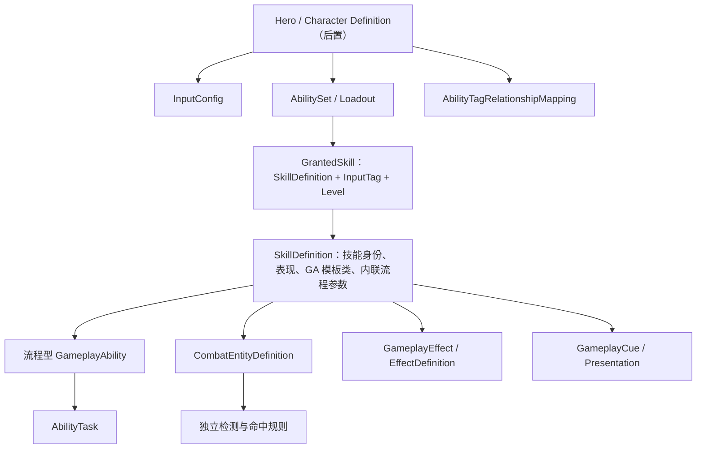

# Lyra GAS 架构定向研究与 Apex 借鉴结论

生成日期：2026-07-15
研究对象：`D:\UnrealProject\LyraStarterGame`（UE 5.8）
研究目的：为 Apex 的可复用、可扩展技能框架提供 RFC 输入，不照搬 Lyra。

> 后续校准：本文是第一轮 Lyra 源码结论。用户随后明确“不以一个配置或一个 GA 覆盖所有技能为目标”，并补充两篇参考文章。配置驱动、流程模板、Task 和特殊机制的最新综合口径见 `Agent/Research_Notes/2026-07-15_Skill_Framework_Extensibility_Synthesis.md`；若措辞存在差异，以该综合分析和用户最新确认优先。

## 1. 先给结论

Lyra 最值得 Apex 学习的不是 GameFeature、Experience 或庞大的模块化框架，而是下面六个职责边界：

1. `GameplayTag` 使用原生 Tag 命名空间声明，不另造“项目 Tag 单例”。
2. `ASC Owner` 和 `Avatar` 明确分开，并有成对的初始化、解绑流程。
3. `AbilitySet` 只是可撤销的授予包，不是单个技能的完整配置。
4. 输入经过 `InputAction -> InputTag -> AbilitySpec` 路由，Character 不保存每个技能的 IA 成员。
5. GA 基类管理 GAS 生命周期、激活策略和并发关系；具体流程由可复用 GA 子类与 AbilityTask 完成。
6. AttributeSet、GameplayEffect、GameplayCue、GameplayEvent 各自承担数值、规则、表现和事件职责。

对 Apex 最重要的修订结论是：

> 不建议在缺少代表性技能验证时，先把长期架构锁死为“一个万能 RuntimeAbility + 一个完全独立的 SkillTemplate UObject”。这不是禁止协调器或模板对象，而是避免提前自造第二套 Ability 生命周期。

更稳妥的方向是：

```text
UApexGameplayAbility              GAS 公共生命周期基类
  -> Projectile / Channel / Area  少量可复用的流程型 GA
  -> SpecialAbility               只为真正特殊的技能派生

UApexSkillDefinition              每个技能的数据组装入口
UApexAbilitySet                   技能、输入槽、等级等授予关系
AbilityTask                       GA 内部可复用的异步操作
CombatEntityDefinition            投射物、法术场等独立战斗载体配置
```

这仍然符合“少量 GA + 数据配置”的方向，但不会让一个 GA 同时承担所有互不相同的生命周期，也不会先造一套通用 Step 解释器。

## 2. Lyra 的真实配置层

### 2.1 `ULyraPawnData`：角色原型聚合层

它引用 PawnClass、AbilitySets、TagRelationshipMapping、InputConfig 和默认 CameraMode。

它回答的是“这个角色原型由什么组成”，不是“某个技能如何执行”。

### 2.2 `ULyraAbilitySet`：授予层

一个 AbilitySet 可以授予：

- GameplayAbility 类、等级和 InputTag。
- GameplayEffect 类和等级。
- AttributeSet 类。

授予时只在 Authority 执行，并记录 AbilitySpecHandle、ActiveGameplayEffectHandle 和 AttributeSet 指针，以便之后完整撤销。

因此，AbilitySet 的本质是：

```text
可撤销的能力包 / 装备包 / 角色初始能力包
```

它不是技能编辑器的单技能资产，也不包含 Montage、目标规则、伤害参数等完整技能内容。

### 2.3 GameplayAbility 类：流程与 GAS 语义层

Lyra 的具体技能仍主要由 GA 类或 GA 蓝图表达。GA 类自身拥有：

- Ability AssetTags。
- Cost / Cooldown。
- ActivationRequiredTags / ActivationBlockedTags。
- ActivationPolicy。
- ActivationGroup。
- 具体执行流程和扩展事件。

Lyra 本身并不以“所有技能都只保存一个配置资产、不创建每技能 GA 类”为目标。Apex 也不把这个结果当作硬指标；我们需要学习的是如何让公共流程数据化，同时允许特殊技能拥有专用实现。AbilitySet 仍不等于 SkillDefinition。

### 2.4 `ULyraAbilityTagRelationshipMapping`：技能关系层

关系映射资产按 AbilityTag 统一配置：

- 阻塞哪些 AbilityTag。
- 取消哪些 AbilityTag。
- 激活时额外要求哪些 Owner Tag。
- 激活时被哪些 Owner Tag 阻止。

它把角色或玩法规则的共性关系从每个 GA 中抽离，避免在几十个技能里重复维护“眩晕时不能释放”“大招会取消普通施法”等规则。

## 3. GameplayTag：Lyra 没有项目 Tag 单例

Lyra 的稳定 C++ Tag 使用：

```cpp
namespace LyraGameplayTags
{
    UE_DECLARE_GAMEPLAY_TAG_EXTERN(...);
}

UE_DEFINE_GAMEPLAY_TAG_COMMENT(...);
```

`UGameplayTagsManager::Get()` 是 UE 引擎提供的管理器。Lyra 只在 `FindTagByString` 工具函数里访问它，并没有再创建一个 `FLyraGameplayTags::Get()` 项目单例。

### Apex 建议

采用两级来源：

| 来源 | 适用范围 |
| --- | --- |
| Native GameplayTag | C++ 直接引用、启动早期必须存在、跨系统长期稳定的 Tag。 |
| Config GameplayTag | 仅由资产配置使用、不需要 C++ 符号、允许内容迭代的 Tag。 |

规则：

- 不创建 `FApexGameplayTags::Get()` 和手动 `InitializeNativeGameplayTags()`。
- 使用 `namespace ApexGameplayTags` + Native GameplayTags 宏。
- 不为每个技能强制建立身份 Tag；单技能稳定身份优先用 PrimaryAssetId。
- `Ability.*` 更适合表示可参与规则匹配的能力类别，而不是资产数据库主键。
- `SetByCaller.*` 若被 C++ 使用，技术上也可以是 Native Tag；但它仍只是 GE 数值键，不是角色状态或技能分类。没有实际 GE 需求时不预建。

### 对 Aura 旧经验的修正

Aura 的 Tag 单例写法并非完全不能工作，但它引入了额外初始化顺序、集中式扩张和职责混淆。Apex 应直接使用 UE 的 Native GameplayTag 注册机制。

## 4. ASC：Owner 与 Avatar 的生命周期

Lyra 把玩家 ASC 放在 PlayerState：

```text
OwnerActor  = PlayerState
AvatarActor = 当前 Pawn / Character
```

好处：

- Pawn 死亡、重生或切换时，玩家的能力容器仍可存在。
- PlayerState 天然由服务器创建并复制给相关客户端。
- 装备、经验、长期 Buff 或跨 Pawn 状态有稳定归属。

注意：ASC 放在 PlayerState 不代表 Health 必须跨重生保留。Lyra 的 HealthSet 也在 PlayerState，但 HealthComponent 初始化时会重置当前生命。

Lyra 的 PawnExtension 在绑定新 Avatar 时会：

1. 处理旧 Avatar 尚未解绑的情况。
2. 调用 `InitAbilityActorInfo(Owner, Pawn)`。
3. 设置 TagRelationshipMapping。
4. 广播 ASC 已初始化。

解绑时会：

1. 取消不应跨死亡存活的 Ability。
2. 清空输入缓存。
3. 移除 GameplayCue。
4. 清除 Avatar 或整个 ActorInfo。

### Apex 建议

- 玩家：ASC 放在未来的 `AApexPlayerState`。
- AI / 普通敌人：ASC 可由敌人 Character 自己拥有。
- `AApexCharacterBase` 只负责暴露或转发 ASC，不强制所有角色用同一种 Owner。
- 实现明确的 Bind / Unbind 对称流程，但暂不照搬 Lyra 四级 InitState 和 ModularGameplay。
- 玩家端至少在服务端 Possess 路径和客户端 `OnRep_PlayerState` 路径初始化 ActorInfo。

## 5. 输入：三个映射层，不把技能 IA 塞进 Character

Lyra 的技能输入链路是：

```text
IMC: 物理按键 -> InputAction
InputConfig: InputAction -> InputTag
AbilitySet: InputTag -> AbilitySpec
ASC: 缓存 Pressed / Held / Released -> 尝试激活或转发输入事件
```

ASC 不使用 `bReplicateInputDirectly`。当技能已经激活时，它通过 GAS Generic Replicated Event 转发 Press / Release，使 `WaitInputRelease` 等 AbilityTask 能按预测键工作。

`ProcessAbilityInput()` 在 PlayerController 的 `PostProcessInput()` 统一执行，避免同一帧的 Press 和 Held 重复激活。

### Apex 建议

- 保留当前 Move / Look / Jump 的原生输入绑定。
- 技能输入改为 `UApexInputConfig` 数据资产，不再给 `AApexPlayerCharacter` 连续增加 `Skill1Action`、`Skill2Action` 成员。
- InputTag 表示输入槽，例如 `InputTag.Ability.Primary`、`InputTag.Ability.Skill1`，不是具体技能身份。
- **把 InputTag 从 SkillDefinition 移到 AbilitySet / Loadout 的授予条目。** 同一技能因此可以被不同英雄或不同玩家绑定到不同槽位。

## 6. GA 基类：策略、并发和扩展点

Lyra 的 ActivationPolicy 有三种：

| Policy | 含义 |
| --- | --- |
| `OnInputTriggered` | 按下时尝试激活一次。 |
| `WhileInputActive` | 按住期间持续尝试激活。 |
| `OnSpawn` | Avatar 就绪后自动激活，适合被动监听。 |

ActivationGroup 有三种：

| Group | 含义 |
| --- | --- |
| `Independent` | 与排他技能并行。 |
| `Exclusive_Replaceable` | 新的排他技能可取消它。 |
| `Exclusive_Blocking` | 运行期间阻止其他排他技能。 |

这两个维度不能替代技能流程类型：

- Policy 回答“何时尝试激活”。
- Group 回答“与同时运行的其他技能是什么关系”。
- Projectile / Channel / Area 回答“激活后如何执行”。

### Apex 建议

在 RFC 中设计轻量等价物，并重新审阅命名。不要用“主动 / 被动”作为唯一分类轴。

建议的类层级概念是：

```text
UApexGameplayAbility
  公共 ActorInfo、失败原因、配置读取、生命周期保护

UApexGameplayAbility_ProjectileCast
  播放施法表现 -> 等待时机 -> 解析施法目标 -> 生成投射物

UApexGameplayAbility_ChannelCast
  进入引导 -> 监听输入/移动/受控 -> 计算 Full/Partial/Cancelled -> 结算

UApexGameplayAbility_AreaCast
  解析落点 -> 生成法术场 -> 结束 GA 或等待场结束
```

这些名字只是架构示例，正式创建 C++ 前仍需用户审阅。

### 特殊技能如何扩展

流程型 GA 应提供受保护的扩展钩子，例如：

```text
ValidateSkillConfig
ResolveCastTarget
OnCastTimingReached
CreateCombatEntity
OnTargetDataReady
OnSkillCommitted
OnSkillEnded
```

普通技能只选择 GA 模板并填写配置。真正特殊的技能才继承最近的流程型 GA，覆写少数钩子。

这比“所有技能手写 Steps”更易理解，也比“一个万能 GA 解释所有配置”更符合 GAS 原生生命周期。

## 7. 一个必须提前处理的冲突：共享 GA 与 AbilityTags

这是本次研究最重要的技术发现。

UE 5.8 的 GAS 原生阻塞、取消、按 Tag 查找 Ability 时，使用的是：

```text
Spec.Ability->GetAssetTags()
```

也就是 GA 类 / CDO 的 AssetTags。AbilitySpec 上的 `DynamicSpecSourceTags` 会复制，并可进入 GE SourceTags，但 GAS 原生 `CancelAbilities()` 和 `ApplyAbilityBlockAndCancelTags()` 不会把它当作 GA AssetTags。

Lyra 没有遇到我们的核心矛盾，因为它的具体技能通常仍是不同 GA 类或 GA 蓝图，可以各自设置 AssetTags。

如果 Apex 让火球术和治疗术都共享同一个万能 GA 类，那么：

- 原生 GAS 会认为它们拥有同一组 Ability AssetTags。
- 无法仅靠 SkillDefinition 的 SkillTag 正确阻塞或取消其中一个。
- Aura 后期为此遍历 SourceObject 并自定义取消逻辑，正是这个冲突的补丁。

### Apex 的长期解决口径

1. 不使用一个万能 GA，先按稳定流程建立少量 GA 模板类。
2. GA 类 AssetTags 承担模板级、生命周期级的粗粒度关系。
3. SkillDefinition 可保存稳定的技能类别标签，但不假装它们自动进入 GAS 原生 AbilityTags。
4. 若未来确实需要“同一 GA 模板下，不同 SkillDefinition 有不同阻塞/取消关系”，实现一个 **Spec-aware Policy 层**：它从 AbilitySpec 的 SourceObject / DynamicSpecSourceTags 取得当前技能语义，并在激活、结束时成对登记和解除关系。
5. 这一层必须有多人测试，不能再次用临时遍历和 Loose Tag 拼接完成。

V1 不需要立即实现完整 Spec-aware Policy，但 RFC 必须把这个差异写清楚。

## 8. AbilityTask：可复用异步操作，不是配置表中的每一个 Step

Lyra 的自定义 AbilityTask 例子包括持续扫描附近可交互目标。它具备：

- 由 OwningAbility 创建。
- `Activate()` 启动计时器或异步监听。
- `OnDestroy()` 清理计时器和委托。
- 随 GA 结束自动进入清理生命周期。

因此 AbilityTask 适合：

- 等待 Montage / GameplayEvent。
- 等待输入释放。
- 持续目标检测。
- 客户端收集 TargetData 并等待服务器。
- 引导计时、中断监听、技能 Timeline 片段。

AbilityTask 不适合仅仅为了把一个同步函数“配置化”而创建。`ApplyEffect`、读取一个数值、简单生成 Actor 不必机械地各建一个 Task。

### 对 Apex 旧 Step 讨论的收束

我们可以用 Step 语言分析技能生命周期，但 V1 不保存一串任意 Steps 让解释器运行。

```text
GA 模板 = 固定、可读、可测试的流程骨架
AbilityTask = 流程中的可复用异步节点
配置结构 = 为模板和 Task 提供参数
虚函数/事件 = 特殊技能的扩展点
```

## 9. 目标选择与网络预测

Lyra 远程武器能力展示了一条成熟的 TargetData 路径：

1. 本地控制端执行瞄准 Trace。
2. 将 HitResult 封装成 `FGameplayAbilityTargetDataHandle`。
3. 使用当前 AbilitySpecHandle 和 ActivationPredictionKey 发送给服务器。
4. 服务器接收、验证、CommitAbility。
5. 具体 GA 通过 `OnRangedWeaponTargetDataReady` 扩展点应用效果。
6. 消费 TargetData 并解除委托。

Lyra 的实现不是通用技能编辑器流程，但它证明了两个边界：

- “如何收集目标”可以沉淀为 Target Resolver / AbilityTask。
- “拿到目标后做什么”留给具体 GA 模板或扩展钩子。

### Apex 目标分层

| 层 | 回答的问题 |
| --- | --- |
| Skill Cast Target | 技能释放围绕谁或在哪里发生：Self、Actor、GroundPoint、Direction。 |
| CombatEntity Spawn | 投射物 / 法术场从哪里生成。 |
| CombatEntity Detection | 衍生物生成后检测哪些目标、使用什么阵营和过滤规则。 |

例如伤害光环：Cast Target 是 Self；CombatEntity Detection 是范围内敌人。两者不能合并成一个万能 TargetConfig。

## 10. Attribute、GE、Execution 与 HealthComponent

Lyra 的数值链路分为：

```text
CombatSet.BaseDamage / BaseHeal
  -> DamageExecution / HealExecution
  -> HealthSet.Damage / Healing 元属性
  -> PostGameplayEffectExecute
  -> Health 改变并广播
  -> HealthComponent 处理死亡状态和 GameplayEvent.Death
```

值得 Apex 借鉴的边界：

- AttributeSet 保存和约束数值真相。
- GameplayEffect 描述持续时间、Modifier、Tag 和复制语义。
- ExecutionCalculation 处理需要 Source / Target 属性、距离、阵营等参与的公式。
- HealthComponent 作为角色侧门面，提供生命变化、死亡开始/结束等事件。
- Death Ability 负责死亡流程，而不是把整套死亡表现塞进 AttributeSet。

### SetByCaller 的真实位置

Lyra 为调试、自毁或通用动态 GE 保留 `SetByCaller.Damage` / `Heal`。但正常武器伤害执行读取的是 Source 的 `BaseDamage` 属性，并非“所有伤害都必须 SetByCaller”。

这支持 Apex 已确认的口径：

- SetByCaller 是少量通用技术数值槽。
- 没有实际动态注入需求时不创建。
- 后续正式公式应优先读取技能等级、配置曲线和 Source / Target Attribute。

### Apex V1

- 先建立 Health / MaxHealth、Mana / MaxMana 和 IncomingDamage / IncomingHealing 最小闭环。
- 物理、法术、防御、穿透先定义职责，复杂公式后置。
- 服务端负责最终伤害、治疗和状态应用。
- UI 和 Cue 观察结果，不参与计算。

## 11. GameplayEffectContext 与 CombatEntity 来源

Lyra 扩展 `FGameplayEffectContext`，用于携带 AbilitySource、、物理材质等结算上下文。它通过自定义 `UAbilitySystemGlobals::AllocGameplayEffectContext()` 创建。
HitResult
这和“Tag 单例”不是一回事：

- 自定义 AbilitySystemGlobals 是为了让 GAS 分配项目自定义 EffectContext。
- Native GameplayTag 仍由 NativeGameplayTags 机制注册。

### Apex 建议

V1 先使用标准 EffectContext。只有以下信息确实需要跨 GE 链路或网络传递时再扩展：

- SkillDefinition / SkillId。
- CombatEntity 来源。
- 命中序号、同一次施法实例 ID。
- 特殊表面或命中区域数据。

不要因为 Lyra 有自定义 Context 就在冷启动第一批代码中照搬。

## 12. GameplayCue：采用职责，不采用重型管理器

Lyra 的 `ULyraGameplayCueManager` 主要处理 Cue 资产的异步加载、预加载和 GameFeature 路径扩展。这是大型内容项目的加载优化，不是技能运行正确性的前置条件。

Apex V1 建议：

- 使用 GAS 标准 GameplayCue 路径和管理器。
- Cue 只负责 Niagara、音效、材质、镜头、UI 和飘字。
- 命中、伤害、治疗、Buff、目标选择仍由服务器权威玩法路径决定。
- 等 Cue 数量和加载开销真实出现后，再考虑自定义 CueManager。

## 13. Apex 建议的配置资产关系



### 每个资产回答一个问题

| 资产 / 类型 | 负责 | 不负责 |
| --- | --- | --- |
| SkillDefinition | 这个技能是什么、用哪个 GA 模板、模板参数和资源是什么。 | 玩家把它绑在哪个键。 |
| AbilitySet / Loadout | 给谁授予哪些技能、等级和输入槽。 | 技能内部完整执行逻辑。 |
| InputConfig | IA 对应哪个 InputTag。 | 哪个技能当前占用该槽。 |
| GA 模板类 | 激活后流程如何推进和清理。 | 保存每个技能的所有美术资产。 |
| CombatEntityDefinition | 衍生物的 Actor、移动、检测、命中、生命周期。 | 角色如何施法。 |
| TagRelationshipMapping | 技能类别之间通用的阻塞、取消、要求关系。 | 每技能临时特殊分支。 |
| GameplayEffect | 属性、持续时间、周期、Stack、GrantedTags。 | 播放主要表现或决定目标。 |
| GameplayCue | 表现。 | 权威玩法结果。 |

## 14. 采用、轻量化、暂不采用

### 直接采用思想

- Native GameplayTags 命名空间。
- PlayerState Owner / Pawn Avatar 分离。
- 可撤销的 AbilitySet 授予句柄。
- InputAction -> InputTag -> AbilitySpec。
- ActivationPolicy 和轻量并发组。
- TagRelationshipMapping 的集中规则思想。
- Instanced Ability 和成对清理。
- TargetData + PredictionKey 的多人路径。
- AttributeSet / HealthComponent / Death Ability 分层。

### 轻量化采用

- PawnData：以后做 Apex HeroDefinition，但不现在实现完整聚合。
- PawnExtension：只保留 ASC Bind / Unbind 和回调，不引入四级 InitState。
- AdditionalCost：先使用 GAS 原生 Cost GE；弹药、生命消耗、命中后扣费出现时再加内联 Cost Fragment。
- 自定义 EffectContext：等有真实上下文字段再做。
- GameplayCue：使用标准能力，不做 Lyra 预加载管理器。

### 当前不采用

- Experience System。
- GameFeature 动态激活 / 卸载。
- ModularGameplay 全套 ComponentManager 与 InitState。
- Lyra Equipment / Inventory / Weapon Instance 全链路。
- GlobalAbilitySystem 给所有 ASC 动态加能力或 GE。
- 自定义 GameplayCueManager 和资源 Bundle 预加载。
- CommonUI、消息总线、队伍系统等与第一版技能闭环无关的部分。

## 15. 对 Apex 原有架构描述的修订建议

### 保留

- SkillDefinition 是技能组装入口，不是万能字段表。
- CombatEntity 独立配置。
- GameplayCue 只做表现。
- Effect / State 分层。
- 先做少量稳定流程模板，再逐个技能验证。

### 修订

| 原描述 | 建议修订 |
| --- | --- |
| 一个 SkillRuntimeAbility 承接所有技能，流程委托给 SkillTemplate UObject | `UApexGameplayAbility` 是公共基类；Projectile / Channel / Area 等流程模板本身优先是 GA 子类。 |
| InputTag 是 SkillDefinition 的固有字段 | InputTag 属于 AbilitySet / Loadout 的授予条目。 |
| SkillTag 同时当资产身份和 GAS AbilityTag | 资产身份使用 PrimaryAssetId；AbilityTag 只表达需要参与玩法关系的稳定类别。 |
| 所有关系都可由 GAS 原生 AbilityTags 处理 | 共享 GA 模板下的 per-skill 关系需要 Spec-aware Policy，不能假装 DynamicSpecSourceTags 等于 AssetTags。 |
| ExecutionPlan.Steps 是技能运行时核心 | V1 以 GA 模板固定流程为核心；Step 仅作为分析和未来 Timeline 的概念。 |

## 16. 写 Apex GAS RFC 前建议确认（用户已于 2026-07-15 全部确认）

1. 玩家 ASC 放在 PlayerState，AI ASC 放在自身 Character。
2. Native Tag 采用 `namespace ApexGameplayTags`，不创建项目 Tag 单例。
3. SkillDefinition 不保存固定 InputTag；输入槽由 AbilitySet / Loadout 分配。
4. 流程模板优先实现为 GA 子类，不先实现万能 RuntimeAbility + 独立解释器。
5. V1 引入 ActivationPolicy、三态并发组和独立 TagRelationshipMapping 的轻量版本。
6. V1 先让关系映射服务模板级 AbilityTags；Spec-aware per-skill Policy 明确预留，但按真实技能需求实施。
7. 不采用 Experience / GameFeature / 完整 ModularGameplay 初始化链。
8. 第一批 GAS 闭环只做标准 GameplayCueManager 和标准 EffectContext。

这些基础取舍已经确认。配置驱动边界和特殊技能扩展方式仍在讨论，最新口径见 `Agent/Research_Notes/2026-07-15_Skill_Framework_Extensibility_Synthesis.md`；讨论完成后再编写 Apex GAS 基础 RFC，而不是立即让子代理写完整技能代码。

## 17. 源码索引

| 主题 | Lyra 源码 |
| --- | --- |
| Native Tags | `Source/LyraGame/LyraGameplayTags.h:7`、`LyraGameplayTags.cpp:9` |
| AbilitySet 结构 | `Source/LyraGame/AbilitySystem/LyraAbilitySet.h:20` |
| AbilitySet 授予和撤销 | `Source/LyraGame/AbilitySystem/LyraAbilitySet.cpp:32`、`:73` |
| PlayerState 创建 ASC | `Source/LyraGame/Player/LyraPlayerState.cpp:30` |
| Pawn / ASC 绑定解绑 | `Source/LyraGame/Character/LyraPawnExtensionComponent.cpp:105`、`:152` |
| InputConfig | `Source/LyraGame/Input/LyraInputConfig.h:14` |
| 输入绑定与 ASC 路由 | `Source/LyraGame/Input/LyraInputComponent.h:53`、`Character/LyraHeroComponent.cpp:283` |
| 输入帧处理 | `Source/LyraGame/AbilitySystem/LyraAbilitySystemComponent.cpp:186`、`:216` |
| GA 激活策略与并发组 | `Source/LyraGame/AbilitySystem/Abilities/LyraGameplayAbility.h:34`、`:53` |
| Tag 关系映射 | `Source/LyraGame/AbilitySystem/LyraAbilityTagRelationshipMapping.h:12` |
| TargetData 与预测 | `Source/LyraGame/Weapons/LyraGameplayAbility_RangedWeapon.cpp:440`、`:477`、`:552` |
| AbilityTask 生命周期 | `Source/LyraGame/Interaction/Tasks/AbilityTask_GrantNearbyInteraction.cpp:23`、`:31`、`:39` |
| Damage Execution | `Source/LyraGame/AbilitySystem/Executions/LyraDamageExecution.cpp:36` |
| Health 元属性结算 | `Source/LyraGame/AbilitySystem/Attributes/LyraHealthSet.cpp:108` |
| Health / Death 门面 | `Source/LyraGame/Character/LyraHealthComponent.cpp:52`、`:148` |
| 自定义 EffectContext | `Source/LyraGame/AbilitySystem/LyraGameplayEffectContext.h:15` |
| 自定义 AbilitySystemGlobals | `Source/LyraGame/AbilitySystem/LyraAbilitySystemGlobals.cpp:16` |

### UE 5.8 GAS 关键核对

| 结论 | 引擎源码 |
| --- | --- |
| AbilitySpec 的动态标签会复制并进入 GE SourceTags | `Engine/Plugins/Runtime/GameplayAbilities/Source/GameplayAbilities/Public/GameplayAbilitySpec.h:241` |
| Ability 激活时阻塞/取消使用 GA AssetTags | `.../Private/Abilities/GameplayAbility.cpp:988`、`:999` |
| `CancelAbilities` 按 GA AssetTags 匹配 | `.../Private/AbilitySystemComponent_Abilities.cpp:1329` |

## 18. 内部实现习惯附录（无需逐项审阅）

后续写代码时应吸收这些 Lyra 实践：

- 构造函数中用 `CreateDefaultSubobject` 建立长期组件和 AttributeSet。
- 所有授予、移除、结算先判断 Authority。
- 授予资源必须保存 Handle，确保能对称撤销。
- Ability 使用 Instanced 策略；避免依赖已弃用的 NonInstanced 行为。
- ASC 初始化和解绑必须幂等，委托、计时器、TargetData、Cue 都要成对清理。
- 输入 Tag 使用 exact match；类别关系再决定是否允许父子匹配。
- 失败原因使用稳定 Tag，便于 UI、日志和自动化测试观察。
- 网络技能先定义“本地预测什么、服务器确认什么、结果如何复制”，再写表现。
